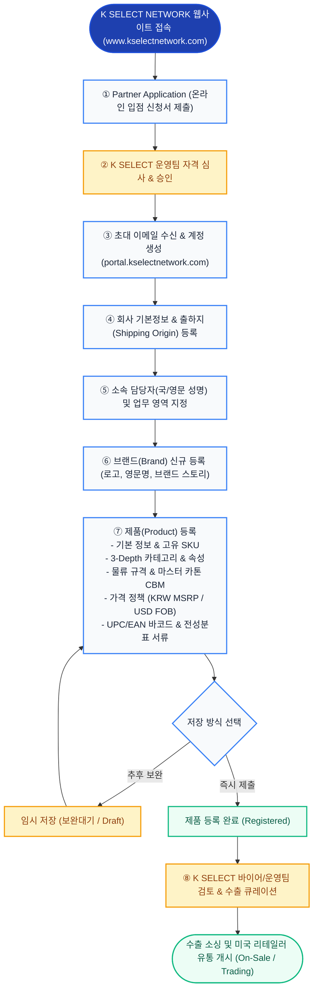

# K SELECT Brand Onboarding — Official Journey & Flow Diagram

이 문서는 K SELECT NETWORK 한국 브랜드 파트너사의 실제 가입, 입점, 회사/브랜드/제품 등록 및 검토까지의 **공식 User Journey**와 단계별 프로세스 흐름을 정의합니다. Claude Design에서 Onboarding Manual의 Overview Flow Diagram으로 활용할 수 있도록 구성되었습니다.

---

## 1. High-Level Onboarding Flowchart

---

## 2. 단계별 상세 User Action 요약

| 단계 | 화면 (Screen) | 주요 입력/수행 작업 | 필수 요구 사항 | 산출물 / 상태 |
| :--- | :--- | :--- | :--- | :--- |
| **01. Entry** | SCREEN 01 | `www.kselectnetwork.com` 접속 후 `PARTNER WITH US` 클릭 | 회사명, 담당자 한/영 성명, 연락처, 브랜드명, 자가진단 | 입점 신청서 접수 (`APP-YYYYMMDD-XXXX`) |
| **02. Sign Up** | SCREEN 02 | 승인 초대장 수신 후 포털 계정 가입 및 로그인 | 업무용 이메일, 보안 비밀번호 (대소문자/숫자/특수문자) | 포털 계정 활성화 |
| **03. Company** | SCREEN 03 | 회사 기본 정보(사업자등록번호, 대표자) 및 출하지(Shipping Origin) 주소 등록 | 사업자등록번호, 영문/국문 출하지 주소, 대표 담당자 | 회사 프로필 완성 |
| **04. Contacts** | SCREEN 03-B | 실무 담당자 목록 및 제품/물류/정산/법무 영역별 주 담당자 매핑 | 담당자 한글명, 영문 First/Last Name, 직책, 이메일 | 업무 알림 라우팅 체계 구축 |
| **05. Brand** | SCREEN 04 | 취급 브랜드 등록 (국문명, 영문명, 공식 사이트 URL, 브랜드 소개, 로고 이미지) | 브랜드 국문/영문명, 브랜드 로고 | 브랜드 카탈로그 생성 |
| **06. Product** | SCREEN 05 ~ 07 | 제품 등록: ① 기본 정보 & 제조사 SKU ② 3-Depth 카테고리 및 맞춤 속성 ③ 단품 규격 & 마스터 카톤 입수량/CBM ④ 가격 (소비자가 KRW / FOB 공급가 USD) ⑤ UPC/EAN 바코드 & 전성분/인증서류 | 제조사 SKU (사내 중복 불가), 3-Depth 카테고리, 마스터 카톤 입수량, 소비자가, 수출 공급가 | 제품 데이터베이스 생성 |
| **07. Submit** | SCREEN 08 | `임시 저장 후 나중에 등록` (Draft) 또는 `제품 등록 및 계속` (Registered) 클릭 | 실시간 필드 유효성 검사 통과 | `등록완료 (Registered)` / `보완대기 (Draft)` |
| **08. Review** | SCREEN 09 | 등록된 제품 상세 확인, 속성 검토, 1:1 문의 연동, 상태 모니터링 | 바이어 검토 및 샘플/선적 큐레이션 | `Selected` / `On Sale` / `Trading Active` |

---

## 3. 핵심 규칙 및 가이드라인
1. **Authoritative SKU**: 제조사 고유 SKU는 회사 내부에서 고유해야 합니다.
2. **Standardized Names**: 모든 담당자 이름은 한글 성명과 여권 기준 영문 First Name / Last Name이 함께 관리됩니다.
3. **Logistics Precision**: 마스터 카톤 규격 입력 시 가로, 세로, 높이를 입력하면 CBM이 자동 산출되며, 물류 견적의 기준이 됩니다.
4. **Barcode Assistance**: 바코드가 없는 경우 식별 관리 번호 섹션의 1:1 지원 문의를 통해 K SELECT 표준 바코드 지원을 받을 수 있습니다.
