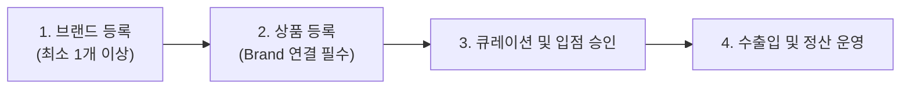

# K SELECT 브랜드 등록 및 관리 정책 매뉴얼
### K SELECT Brand Registration & Management Policy (MAN-B-BRAND-001 v1.0)

---

## 1. 개요 및 매뉴얼 목적 (Introduction & Purpose)

본 매뉴얼은 **K SELECT NETWORK 파트너 포털(Brand Portal)**을 이용하는 모든 파트너사(브랜드 원소유사, 제조사, 공식 총판, 유통사, 셀러)가 브랜드를 올바르게 등록하고 효율적으로 관리할 수 있도록 수립된 표준 운영 가이드입니다.

K SELECT의 상품 큐레이션, 바이어 발주, 물류 풀필먼트, 미국 현지 통관 및 정산 시스템은 포털에 등록된 authoritative 브랜드 정보를 기반으로 유기적으로 동작합니다. 본 가이드를 통해 브랜드 등록 절차와 핵심 원칙을 명확히 이해하고 원활한 상품 운영을 진행하시기 바랍니다.

---

## 2. 브랜드 관리 6대 핵심 정책 (Core Policies)

### 📌 Policy 01 — 상품 등록 전 브랜드 등록 필수
* **원칙**: 모든 상품(Product)은 반드시 등록된 활성(Active) 브랜드에 귀속되어 등록됩니다.
* **프로세스**: `[회사 온보딩] → [브랜드 등록] → [상품 등록]`
* **동작 방식**:
  - 회사 계정에 등록된 유효한 브랜드가 0개인 경우, 신규 상품 등록 화면(`/portal/products/new`)으로 진입 시 자동으로 브랜드 생성 화면(`/portal/brands/new`)으로 리다이렉트됩니다.
  - 상품 등록 폼의 1단계 '제품 기본 정보'에서 등록된 브랜드 목록 중 하나를 반드시 선택해야 저장이 가능합니다.

---

### 📌 Policy 02 — 브랜드 등록과 상표권(Trademark) 등록은 별개의 개념
* **원칙**: K SELECT 시스템 내에서의 '브랜드 등록'은 제품 카탈로그 및 서비스 분류를 위한 등록이며, 특허청의 '법적 상표권 등록'을 필수 전제로 요구하지 않습니다.
* **세부 사항**:
  - 대한민국 특허청(KIPO)이나 미국 특허청(USPTO)에 상표권이 등록되어 있지 않거나 현재 출원 중인 브랜드라도 K SELECT에 자유롭게 등록하고 상품을 판매할 수 있습니다.
  - 상표권을 보유한 경우 등록번호와 증빙서류(상표등록증 PDF/이미지)를 등록할 수 있으며, 이는 바이어 신뢰도 확보 및 공식 인증에 활용됩니다.

| 구분 | K SELECT 포털 브랜드 등록 | 법적 상표권 (Trademark) 등록 |
|---|---|---|
| **목적** | K SELECT 플랫폼 내 상품 분류 및 카탈로그 관리 | 국가 특허청을 통한 독점 배타적 법적 권리 확보 |
| **필수 여부** | **필수 (상품 등록의 선행 조건)** | **선택 (미등록/출원 중이어도 입점 가능)** |
| **증빙 서류** | 브랜드 기본 정보 및 로고 (선택) | 상표등록증 사본 (보유 시 제출) |
| **효력 범위** | K SELECT 네트워크 생태계 내 운영 | 대한민국(KIPO) / 미국(USPTO) 등 관할 국가 |

---

### 📌 Policy 03 — 동일 브랜드를 여러 회사가 취급 가능 (Multi-Company Support)
* **원칙**: 글로벌 B2B 유통 생태계의 특성을 반영하여, 동일한 브랜드의 상품을 여러 독립된 파트너사가 취급·유통할 수 있습니다.
* **구조 예시**:
  - `제조사 (Company A)` → 브랜드 `NIKE` 등록 및 공급
  - `공식 총판 (Company B)` → 브랜드 `NIKE` 등록 및 미국 유통
  - `전문 셀러 (Company C)` → 브랜드 `NIKE` 등록 및 온라인 판매
* 각 회사는 자사 포털 계정에서 독립적으로 브랜드와 상품 사양, 견적(FOB)을 관리합니다.

---

### 📌 Policy 04 — Brand Owner는 원칙적으로 단 하나
* **원칙**: 동일 브랜드를 여러 유통 파트너가 취급할 수 있으나, 해당 브랜드의 권리를 원천 보유한 **Brand Owner(브랜드 원소유사)**는 시스템상 1개사로 정의됩니다.
* **파트너 유형별 관계**:
  1. **Brand Owner (브랜드 원소유사 / 제조사)**: 상표권 및 지식재산권을 직접 보유하고 원천 생산하는 주체
  2. **Authorized Distributor (공식 독점/인가 유통사)**: Brand Owner로부터 정식 유통 권한을 위임받은 파트너
  3. **Distributor / Wholesaler (일반 유통/도매사)**: 상품을 유통·공급하는 파트너
  4. **Seller / Retailer (입점 판매사)**: 소매 채널에 공급하는 파트너

---

### 📌 Policy 05 — 상품이 연결된 브랜드는 물리 삭제 절대 불가
* **원칙**: 브랜드에 단 1건이라도 상품(Product)이 등록되어 연결된 경우, 해당 브랜드는 영구 물리 삭제(Hard Delete)할 수 없습니다.
* **보호 사유**:
  - 기존 등록된 상품 데이터, 바이어 발주 이력, 인보이스, 수출입 선적 서류의 무결성(Data Integrity)과 운영 히스토리를 영구적으로 보존하기 위함입니다.

---

### 📌 Policy 06 — 사용하지 않는 브랜드는 '비활성화(사용 중단)' 처리
* **원칙**: 더 이상 취급하지 않는 브랜드는 삭제 대신 **'사용 중단(Inactive)'** 처리(논리 삭제)를 진행합니다.
* **비활성화 후 시스템 영향**:
  1. **과거 데이터 보존**: 기존 등록된 상품의 브랜드 정보 및 운영 히스토리는 안전하게 유지됩니다.
  2. **목록 제외**: 파트너 포털 메인 목록 및 신규 상품 등록 시 브랜드 선택 드롭다운에서 자동 제외됩니다.
  3. **재활성화 가능**: 필요 시 관리자(Admin)를 통해 언제든지 다시 활성화할 수 있습니다.

---

## 3. 포털 화면별 실무 가이드 (Step-by-Step Walkthrough)

### 1단계 : 브랜드 관리 메인 (`/portal/brands`)
- **기능**: 회사에 등록된 모든 활성 브랜드 목록 카드 조회 및 관리
- **표시 항목**:
  - 브랜드 로고 썸네일 (미등록 시 기본 플레이스홀더)
  - 브랜드명
  - 대한민국 특허청 상표권 보유 여부 배지 (`보유` / `미보유`)
  - 미국 USPTO 상표권 보유 여부 배지 (`보유` / `미보유`)
- **액션 버튼**:
  - `[새 브랜드 추가]` : 상단 우측 버튼 클릭 시 신규 등록 페이지로 이동
  - `[브랜드 수정]` : 기존 등록 정보 수정 페이지로 이동
  - `[사용 중단]` : 해당 브랜드를 비활성화 처리 (확인 팝업 노출)

---

### 2단계 : 신규 브랜드 등록 (`/portal/brands/new`)
- **입력 필드 안내**:
  1. **브랜드명 (필수)** : 파트너사에서 취급할 브랜드의 공식 국문 또는 영문 명칭을 입력합니다.
  2. **브랜드 소개 (선택)** : 브랜드의 컨셉, 철학, 타겟 고객층 등 간략한 소개글을 입력합니다.
  3. **로고 이미지 (선택)** : JPG, PNG, WEBP 포맷 (10MB 이하) 로고 파일을 업로드합니다.
  4. **대한민국 특허청 상표권 등록 여부**:
     - `예 (등록됨)` 선택 시 : **상표권 등록 번호** 입력란과 **증빙서류 첨부**(PDF/이미지) 필드가 활성화됩니다.
     - `아니오 (미등록 / 출원 중)` 선택 시 : 추가 입력 없이 다음 단계로 진행합니다.
  5. **미국 USPTO 상표권 등록 여부**:
     - `예 (등록됨)` 선택 시 : **미국 상표권 등록 번호** 및 **증빙서류 첨부** 필드가 활성화됩니다.
     - `아니오 (미등록 / 출원 중)` 선택 시 : 기본 설정으로 저장됩니다.
  6. **저장** : `[브랜드 추가]` 버튼을 클릭하여 등록을 완료합니다.

---

### 3단계 : 브랜드 정보 수정 (`/portal/brands/[id]`)
- 기등록된 브랜드의 이름, 소개글, 로고 이미지를 교체할 수 있습니다.
- 상표권 등록 여부 변경 및 증빙 서류 파일의 다운로드/삭제/재업로드가 가능합니다.

---

### 4단계 : 상품 등록 시 브랜드 연계 (`/portal/products/new`)
- 상품 등록 화면 1단계 '제품 기본 정보'에서 **브랜드** 항목 드롭다운을 클릭하여 연결할 브랜드를 선택합니다.
- 만약 추가할 브랜드가 목록에 없는 경우, 드롭다운 하단의 `+ 브랜드 추가` 옵션을 선택하면 브랜드 관리 페이지로 즉시 이동할 수 있습니다.

---

### 5단계 : 브랜드 사용 중단(비활성화) 실행
- 브랜드 카드 하단의 `[사용 중단]` 버튼을 클릭하면 확인 알림이 나타납니다:
  > *"정말 이 브랜드를 사용 중단하시겠습니까? (사용 중단된 브랜드는 신청서 및 제품 목록에서 비활성화됩니다.)"*
- 확인 시 안전하게 비활성화(`is_active: false`) 처리됩니다.

---

## 4. 자주 묻는 질문 (FAQ)

**Q1. 아직 특허청에 상표 등록을 하지 않았는데, K SELECT에 브랜드를 등록할 수 있나요?**  
**A1.** 네, 가능합니다. K SELECT는 상표권 미보유 브랜드 및 상표 출원 중인 브랜드도 정상 등록 및 상품 판매가 가능합니다. 상표권 등록 여부 항목에서 '아니오'를 선택하고 진행하시면 됩니다.

**Q2. 저희 회사가 A 브랜드를 등록했는데, 다른 회사도 동일한 A 브랜드를 등록할 수 있나요?**  
**A2.** 네, 글로벌 유통 및 리셀러 환경을 지원하기 위해 복수의 파트너사가 동일 브랜드를 등록하여 취급할 수 있습니다. 단, Brand Owner(원소유사)는 시스템상 1개사로 관리됩니다.

**Q3. 등록한 브랜드를 삭제하고 싶은데 삭제 버튼이 보이지 않습니다.**  
**A3.** 해당 브랜드에 등록된 상품이 존재하는 경우 데이터 무결성 보호 정책에 따라 물리 삭제가 제한됩니다. 대신 `[사용 중단]` 버튼을 통해 비활성화하시면 신규 상품 등록 및 목록에서 제외됩니다.

---

## 5. 핵심 원칙 퀵 레퍼런스 체크리스트 (Quick Reference Summary)

* [x] **상품 등록 전 브랜드 등록 필수** (브랜드 0개 시 상품 생성 불가)
* [x] **상표권 미등록 상태여도 브랜드 등록 가능** (선택적 증빙 제출)
* [x] **동일 브랜드를 여러 유통사/셀러가 각각 등록 가능**
* [x] **동일 브랜드의 Brand Owner는 원칙적으로 단 하나**
* [x] **상품이 연결된 브랜드는 물리 삭제 불가**
* [x] **운영 중단 브랜드는 '사용 중단(비활성화)'으로 데이터 안전 보존**
