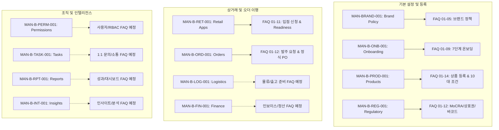
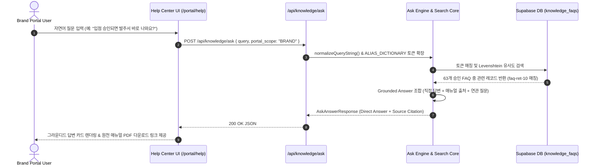

# MAN-B-FAQ-001: Knowledge Center FAQ Boundary Map & Domain Governance Matrix

**문서 번호:** `MAN-B-FAQ-001-MAP`  
**문서 명칭:** FAQ Boundary Map & Cross-Domain Isolation Matrix  
**작성 일자:** 2026-10-02  
**도메인 범위:** K SELECT 12대 업무 영역 (BRAND, ONB, PROD, REG, RET, ORD, LOG, FIN, PERM, TASK, RPT, INT)  

---

## 1. 매뉴얼 ↔ FAQ 소유권 토폴로지 (Manual-to-FAQ Ownership Topology)

K SELECT 전체 지식 시스템에서 각 FAQ는 오직 **단 하나의 Authoritative Knowledge Item**에 귀속되며, 도메인 간의 책임과 비즈니스 로직을 명확히 분리합니다.



---

## 2. 6대 핵심 도메인 경계 원칙 (Canonical Cross-Domain Isolation Rules)

### 2.1 ORD vs LOG vs FIN 원칙
```
┌────────────────────────────────────────────────────────────────────────────────────────┐
│                        CRITICAL ORDER / LOGISTICS / FINANCE RULE                       │
├────────────────────────────────────────────────────────────────────────────────────────┤
│ 1. ARRIVED ≠ RECEIVED ≠ COMPLETED ≠ PAID                                               │
│ 2. Shipping Complete(물류 완료) ≠ Settlement Complete(정산 완료)                       │
│ 3. Step 6: COMPLETED = 오더/실물입고 종결 (지급/정산은 FIN 모듈에서 독립 관리)         │
│ 4. 발주 확정(PO Confirm) 이후 물류(LOG)와 정산(FIN)은 병렬 독립 트랙으로 진행됨      │
└────────────────────────────────────────────────────────────────────────────────────────┘
```
- **FAQ 적용 지침**: `faq-ord-10` 및 `faq-ord-11`에서 명문화되어 있으며, 오더 완료가 정산 완료를 의미하거나 자동으로 대금이 지급된다고 서술하는 것은 엄격히 금지됩니다.

### 2.2 RET vs ORD 원칙
```
┌────────────────────────────────────────────────────────────────────────────────────────┐
│                           CRITICAL RETAIL / ORDER RULE                                 │
├────────────────────────────────────────────────────────────────────────────────────────┤
│ 1. Retail Placement Approval ≠ Automatic PO Creation                                  │
│ 2. 입점 신청 승인은 유통 자격 획득이며 실물 발주서/출고/정산을 자동 생성하지 않음     │
│ 3. 실물 주문은 MAN-B-ORD-001 독립 절차(발주 요청 또는 정식 PO)를 거쳐야 함          │
│ 4. "협의 필요" ≠ Rejection (탈락 사유가 아니며 MD 팀과의 사전 조율 단계임)             │
└────────────────────────────────────────────────────────────────────────────────────────┘
```
- **FAQ 적용 지침**: `faq-ret-04` 및 `faq-ret-10`에 반영 완료.

### 2.3 REG vs PROD 원칙
```
┌────────────────────────────────────────────────────────────────────────────────────────┐
│                        CRITICAL REGULATORY / PRODUCT RULE                              │
├────────────────────────────────────────────────────────────────────────────────────────┤
│ 1. AI 전성분 번역 도구(Tab 1) ≠ 5대 인허가 서류 업로드 워크플로우(Tab 6)             │
│ 2. 바코드(UPC/EAN) 유효성 검증 ≠ 규제/인허가 승인 (WMS/POS 식별 번호 검증일 뿐임)     │
│ 3. 상표권 미보유 브랜드도 포털 개설 가능 (Policy 02)                                   │
└────────────────────────────────────────────────────────────────────────────────────────┘
```
- **FAQ 적용 지침**: `faq-reg-05`, `faq-reg-09`, `faq-prod-11`에 반영 완료.

### 2.4 PERM vs TASK 원칙
- **원칙**: 회사 운영 담당업무(6대 Task Assignment) 지정은 시스템 RBAC 권한 부여가 아니며, 고객지원 1:1 Support Case 티켓팅과 완전히 별개 시스템입니다.

### 2.5 RPT vs Operational Domains 원칙
- **원칙**: 리포트 & 퍼포먼스(RPT) 모듈은 트랜잭션 데이터를 실시간 집계하여 조회하는 읽기 전용 레이어이며, 하위 오더/물류/정산의 상태 전이를 발생시키지 않습니다.

### 2.6 INT (Insights) 원칙
- **원칙**: K SELECT INSIGHTS는 팩트체크 기반의 분석 리포트이며, 확인되지 않은 "AI 예측", "자동 매출 보장" 문구를 사용할 수 없습니다.

---

## 3. 중복 및 충돌 방지 매트릭스 (Duplicate & Conflict Prevention Matrix)

| 구분 | 검증 기준 | 시스템 구현 메커니즘 | 판정 결과 |
| :--- | :--- | :--- | :---: |
| **FAQ ID 고유성** | 전체 FAQ ID는 전역 고유해야 함 | DB `PRIMARY KEY` 및 등록 전 중복 ID 검사 | `PASS (0 Duplicates)` |
| **질문 문장 유사도** | 동일하거나 25% 미만 편집 거리 질문 차단 | `faq-engine.ts`의 `isDuplicateQuestion()` Levenshtein 알고리즘 | `PASS (0 Overlaps)` |
| **매뉴얼 귀속성** | 단일 질문이 복수 매뉴얼에 이중 등록 금지 | `source_knowledge_id` 외래키 무결성 | `PASS (100% Unique)` |
| **도메인 충돌** | 타 도메인 상태/규칙 재정의 금지 | 6대 도메인 격리 원칙 감사 | `PASS (0 Conflicts)` |

---

## 4. 질의 검색 및 그라운디드 응답 흐름 (Search & Retrieval Flow)


