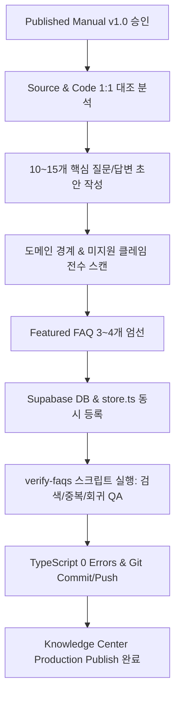

# MAN-B-FAQ-001: Knowledge Center FAQ Governance & Creation Requirements

**문서 번호:** `MAN-B-FAQ-001-GOV`  
**문서 명칭:** FAQ Quality Standard, Creation & Publishing Governance Requirements  
**작성 일자:** 2026-10-02  
**적용 대상:** 모든 향후 Knowledge Center FAQ 제작, 수정, 심사 및 배포 Task  

---

## 1. 핵심 거버넌스 철학 (Core Governance Philosophy)

> **"Published Manual이 없으면 FAQ도 없다." (No Manual, No FAQ)**  
> K SELECT Knowledge Center의 FAQ는 독립된 상상이나 미래 계획이 아니라, 이미 엄격한 심사를 거쳐 배포된 **Published Manual(정본 PDF/Source)**의 핵심 내용을 사용자가 빠르게 찾을 수 있도록 가공한 **색인형 질의응답(Indexed Knowledge)**입니다.

---

## 2. 신규 FAQ 생성 7대 필수 요건 (7 Mandatory Requirements for Future FAQs)

### 요건 1: 100% 정본 소스 근거성 (Strict Source Grounding)
- 작성할 모든 FAQ는 승인된 `01_SOURCE`, `02_CLAUDE_PACKAGE`, `03_PUBLISHED` PDF 및 실제 Production 동작에 1:1로 부합해야 합니다.
- 답변 말미에 원천 매뉴얼의 챕터/섹션(예: `(MAN-B-ORD-001 Chapter 03 · Section 3.2)`)을 필수로 명시합니다.

### 요건 2: 미지원/과대 클레임 무관용 원칙 (Zero Unsupported Claims)
다음 표현은 FAQ 작성 시 일체 포함될 수 없습니다:
1. `자동 PO 생성 (Automatic PO Creation)` — 리테일 입점 승인 등 타 도메인에서 오더가 자동 생성된다는 표현 금지.
2. `무조건 승인 / 100% 합격 보장` — 심사 기준을 거치지 않는 무조건적 승인 약속 금지.
3. `확인되지 않은 처리 시간` — "24시간 이내 처리", "3일 내 무조건 완료" 등 코드/정책에 없는 SLA 금지.
4. `미구현 소프트웨어 자동화` — "원클릭 재신청 버튼", "자동 이메일 발송" 등 구현되지 않은 기능의 기재 금지.

### 요건 3: 명확한 도메인 소유권 준수 (Strict Domain Ownership)
- 각 업무 영역의 질문은 해당 도메인 매뉴얼에만 귀속됩니다:
  - 상품 기본 스펙 / 10대 등록 조건 → `PROD`
  - 상표권 / FDA / 전성분 / 바코드 → `REG`
  - 리테일 입점 신청 / Readiness → `RET`
  - 발주 요청 / 정식 PO 이행 → `ORD`
  - 출고 준비 / 물류 송장 → `LOG`
  - 인보이스 / 결제 / 정산 → `FIN`
  - 팀원 초대 / RBAC 권한 → `PERM`
  - 1:1 지원 티켓 / 소통 → `TASK`

### 요건 4: 중복 및 충돌 방지 (Duplicate & Conflict Prevention)
- 신규 FAQ 생성 전 기존 등록된 전수 FAQ와의 질문 텍스트 및 의미적 유사도(Semantic Similarity)를 검사합니다.
- `faq-{module}-{01..nn}` 형태의 고유 ID 체계를 준수합니다.

### 요건 5: Featured FAQ 선정 기준 (Featured Selection Discipline)
- 매뉴얼당 가장 핵심적인 질문 **3~5개만 Featured(`is_featured: true`)**로 지정합니다.
- 모든 FAQ를 Featured로 지정하여 시각적 위계를 파괴하는 행위를 금지합니다.

### 요건 6: 이중언어(KO/EN) 완전성 (Bilingual Completeness)
- 국문(`question_ko`, `answer_ko`)과 영문(`question_en`, `answer_en`) 필드가 100% 작성되어야 합니다.
- 영문 답변에는 화면의 실제 국문/영문 UI 레이블(예: `[신청서 제출 (Submit Application)]`)을 병기하여 글로벌 사용자의 길찾기를 지원합니다.

### 요건 7: 사전/사후 기술 QA 검증 (Pre/Post QA Verification)
- 배포 전 `tsc --noEmit` (TypeScript 0 Errors) 검증.
- Supabase DB 등록 후 검색어(Search Keywords) 디스커버리 테스트 실행.
- 기존 등록된 다른 매뉴얼의 FAQ 수 회귀(Regression) 여부 확인.

---

## 3. FAQ 제작 및 배포 표준 워크플로우 (Standard FAQ Publish Workflow)



---

## 4. FAQ 완성 보고서 표준 스키마 (Mandatory FAQ Completion Report Schema)

향후 모든 FAQ Publish Task는 아래의 정량화된 스키마로 완료를 보고해야 합니다:

```text
TASK ID: [Task-ID]
SOURCE VERIFIED: PASS / FAIL
FAQ CREATED: [N]
FAQ PUBLISHED: [N]
FEATURED FAQ: [N]
KNOWLEDGE ITEM: [kno-id]
FAQ RELATION: PASS / FAIL
RET / ORD BOUNDARY: PASS / FAIL
APPROVAL ≠ AUTO PO: PASS / FAIL
“협의 필요” POLICY: PASS / FAIL
INFO REQUEST / REPLY: PASS / FAIL
RE-APPLICATION BOUNDARY: PASS / FAIL
SEARCH VERIFICATION: PASS / FAIL
DUPLICATE FAQ: 0 / [N]
UNSUPPORTED CLAIMS: 0 / [N]
BRAND FAQ: INTACT / REGRESSION
ONB FAQ: INTACT / REGRESSION
PROD FAQ: INTACT / REGRESSION
ORD FAQ: INTACT / REGRESSION
REG FAQ: INTACT / REGRESSION
RET KNOWLEDGE: INTACT / FAIL
TOTAL FAQ COUNT: [Total N]
TYPESCRIPT: 0 ERRORS
PRODUCTION CODE MODIFIED: NO
DATABASE SCHEMA MODIFIED: NO
GIT COMMIT: [SHA]
ORIGIN/MAIN: [SHA]
LOCAL HEAD = ORIGIN/MAIN: YES
UNRELATED FILES INCLUDED: NO
FINAL STATUS: READY FOR CHATGPT FAQ QA
```
