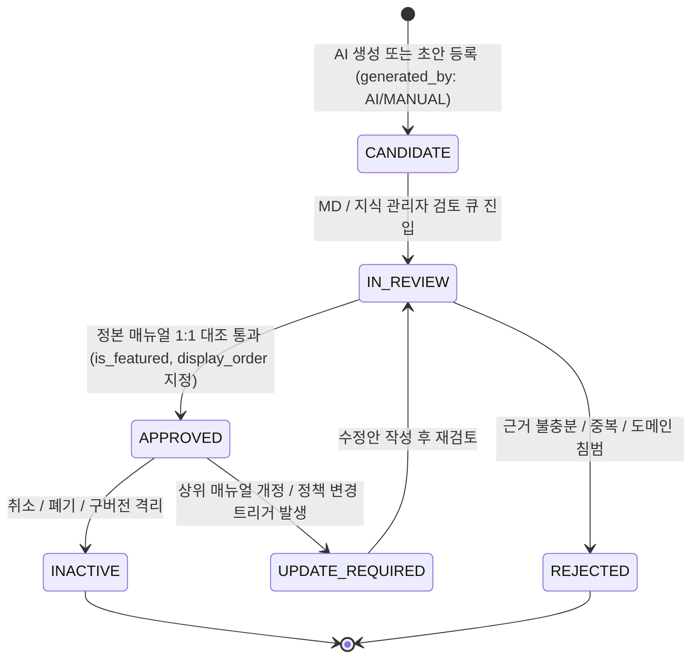

# MAN-B-FAQ-001: Knowledge Center FAQ — Production Source Collection & Architecture Audit Report

**문서 번호:** `MAN-B-FAQ-001-SRC`  
**문서 명칭:** Knowledge Center FAQ Architecture & Production Source Master Reference  
**작성 일자:** 2026-10-02  
**대상 시스템:** K SELECT NETWORK Portal (Brand Portal & Admin)  
**책임 부서:** Brand Operations & Knowledge Architecture Desk (`Audience Code: B, INTERNAL, ADMIN`)  
**표준 토픽:** `전체 토픽 (Cross-Topic Knowledge Core)`  

---

## 1. 개요 및 감사 목적 (Executive Summary & Audit Purpose)

본 문서는 **K SELECT NETWORK Knowledge Center** 내 FAQ 시스템의 전체 아키텍처, 데이터 모델, 검색 및 토픽 매핑 엔진, 거버넌스 라이프사이클 및 현재 운영(Production) 환경에 배포된 **총 63개 공식 FAQ**의 전수 조사(Audit) 결과를 집대성한 정본(Canonical) Source of Truth 문서입니다.

향후 제작될 모든 Knowledge Manual FAQ 및 시스템 도움말 콘텐츠는 본 문서에서 규정한 도메인 경계, 검색 인덱싱 규칙, 소스 근거성 원칙 및 중복 방지 거버넌스 표준을 엄격히 준수해야 합니다.

### 1.1 핵심 운영 현황 요약
- **전체 배포 FAQ 수:** `63개` (DB `knowledge_faqs` 테이블 및 메모리 스토어 동기화 완료)
- **발행 매뉴얼 연계 그룹:** 6개 그룹 (BRAND, ONBOARDING, PRODUCTS, ORDERS, REGULATORY, RETAIL)
- **주요 토픽 매핑:** 6개 활성 표준 토픽 (`topic-brand`, `topic-start`, `topic-product`, `topic-orders`, `topic-regulatory`, `topic-retail`)
- **Featured FAQ 수:** 총 21개 (각 매뉴얼별 3~5개 엄선)
- **근거성 검증 결과:** 63개 전 항목 Published Manual 및 Production Code 1:1 근거 확인 완료 (`VERIFIED: 63 / 63`)
- **비인가/미지원 클레임:** `0건` (자동 PO 생성, 무조건 승인, 예측 AI 등 미지원 문구 완전 배제)

---

## 2. FAQ 시스템 아키텍처 및 라우팅 토폴로지 (System Architecture & Routing Topology)

K SELECT Knowledge Center는 단일 정본 데이터베이스를 기반으로 어드민 관리 뷰와 브랜드 포털 헬프센터 뷰를 양방향으로 동기화합니다.

### 2.1 라우팅 및 컴포넌트 토폴로지
```
┌────────────────────────────────────────────────────────────────────────────────────────────────────────┐
│                                   K SELECT KNOWLEDGE ARCHITECTURE                                      │
└────────────────────────────────────────────────────────────────────────────────────────────────────────┘
                                                    │
                   ┌────────────────────────────────┴────────────────────────────────┐
                   ▼                                                                 ▼
┌──────────────────────────────────────┐                         ┌──────────────────────────────────────┐
│       BRAND PORTAL HELP CENTER       │                         │       ADMIN KNOWLEDGE CENTER         │
├──────────────────────────────────────┤                         ├──────────────────────────────────────┤
│ • /portal/help                       │                         │ • /admin/knowledge                   │
│   (Help Center Main & Topic View)    │                         │   (Overview & Operations KPI)        │
│ • /portal/help/[slug]                │                         │ • /admin/knowledge/library           │
│   (Manual View & Related FAQs)       │                         │   (All Knowledge Items List)         │
│ • /portal/help/ask                   │                         │ • /admin/knowledge/topics-faq        │
│   (Ask K SELECT Grounded Search)     │                         │   (FAQ Candidate Review & Manage)    │
│ • components/knowledge/              │                         │ • /admin/knowledge/[id]              │
│   - help-center-main-view.tsx        │                         │   (Knowledge Detail & Asset Inspect) │
│   - ask-kselect-view.tsx             │                         │ • components/admin/knowledge/        │
│   - help-center-detail-view.tsx      │                         │   - topics-faq-view.tsx              │
└──────────────────────────────────────┘                         └──────────────────────────────────────┘
                   │                                                                 │
                   └────────────────────────────────┬────────────────────────────────┘
                                                    ▼
┌────────────────────────────────────────────────────────────────────────────────────────────────────────┐
│                                       API LAYER & ENGINES                                              │
├────────────────────────────────────────────────────────────────────────────────────────────────────────┤
│ • /api/knowledge/faqs              : FAQ 조회 및 필터링 (audience, topic_id, kind, search)             │
│ • /api/knowledge/topics            : 활성 토픽 목록 및 매핑 모듈/키워드 제공                          │
│ • /api/knowledge/ask               : 질문 임베딩 및 그라운디드 답변 생성 엔진 (AskEngine)             │
│ • /api/admin/knowledge/faqs        : 어드민 FAQ 승인/반려/수정/후보 생성 API                           │
│ • lib/knowledge/faq-engine.ts      : 중복 검사 (Levenshtein), 후보 생성, 상태 전이 머신               │
│ • lib/knowledge/search.ts          : 한국어-영어 동의어 사전, 토큰 정규화, 가중치 랭킹 엔진           │
│ • lib/knowledge/topics.ts          : 모듈/키워드 기반 토픽 자동 분류기 (matchTopicForFaq)             │
│ • lib/knowledge/store.ts           : Supabase DB 연동 및 In-Memory Fallback Seed 스토어               │
└────────────────────────────────────────────────────────────────────────────────────────────────────────┘
                                                    │
                                                    ▼
┌────────────────────────────────────────────────────────────────────────────────────────────────────────┐
│                                       DATABASE LAYER (SUPABASE)                                        │
├────────────────────────────────────────────────────────────────────────────────────────────────────────┤
│ • public.knowledge_faqs            : FAQ 정본 레코드 (63 records)                                      │
│ • public.knowledge_items           : 발행 매뉴얼 정본 레코드 (6 records)                               │
│ • public.knowledge_topics          : 10대 표준 토픽 분류표                                             │
│ • public.knowledge_relations       : 화면(Route) 및 매뉴얼 간 매핑 관계                               │
│ • public.knowledge_audit_logs      : 변경 이력 감사 로그                                               │
└────────────────────────────────────────────────────────────────────────────────────────────────────────┘
```

---

## 3. 데이터베이스 스키마 및 모델 명세 (Database Schema & Models)

### 3.1 `knowledge_faqs` 테이블 컬럼 구조
| 컬럼명 | 데이터 타입 | 제약 조건 | 설명 |
| :--- | :--- | :--- | :--- |
| `id` | `TEXT` | `PRIMARY KEY` | 고유 식별자 (예: `faq-brand-01`, `faq-prod-03`) |
| `portal_scope` | `TEXT` | `DEFAULT 'BRAND'` | 접근 포털 범위 (`BRAND`, `RETAILER`) |
| `topic_id` | `TEXT` | `REFERENCES knowledge_topics(id)` | 표준 토픽 ID (예: `topic-product`) |
| `source_knowledge_id`| `TEXT` | `REFERENCES knowledge_items(id)` | 원천 매뉴얼 ID (예: `kno-product-management-v10`) |
| `source_version` | `TEXT` | `NOT NULL` | 원천 매뉴얼 버전 (예: `v1.0`, `v1.1.0`) |
| `source_title` | `TEXT` | `NOT NULL` | 원천 매뉴얼 정식 국문 명칭 |
| `question_ko` | `TEXT` | `NOT NULL` | 국문 질문 |
| `question_en` | `TEXT` | `NOT NULL` | 영문 질문 |
| `answer_ko` | `TEXT` | `NOT NULL` | 국문 답변 (출처 섹션 인용 포함) |
| `answer_en` | `TEXT` | `NOT NULL` | 영문 답변 |
| `audience` | `TEXT[]` | `NOT NULL` | 열람 대상 (`["BRAND", "INTERNAL", "ADMIN / MANAGEMENT"]`) |
| `status` | `TEXT` | `NOT NULL` | 거버넌스 상태 (`APPROVED`, `CANDIDATE`, `INACTIVE`) |
| `kind` | `TEXT` | `DEFAULT 'BOTH'` | 표시 종류 (`FAQ`, `SUGGESTED_QUESTION`, `BOTH`) |
| `display_order` | `INTEGER` | `DEFAULT 0` | 매뉴얼 내 정렬 순서 (1부터 오름차순) |
| `is_featured` | `BOOLEAN` | `DEFAULT FALSE` | 주요 Featured FAQ 여부 |
| `generated_by` | `TEXT` | `DEFAULT 'MANUAL'` | 생성 주체 (`MANUAL`, `AI`) |
| `created_at` | `TIMESTAMPTZ` | `DEFAULT NOW()` | 레코드 생성 일시 |
| `updated_at` | `TIMESTAMPTZ` | `DEFAULT NOW()` | 최근 수정 일시 |

---

## 4. FAQ 거버넌스 및 상태 전이 머신 (FAQ Governance & State Machine)

K SELECT FAQ 시스템은 AI 자동 생성이나 미검증 등록이 즉시 운영 환경에 노출되지 않도록 **Strict Review-Before-Publish** 원칙을 구현합니다.



1. **CANDIDATE (후보 상태)**: 매뉴얼 본문으로부터 추출된 질문-답변 후보로, 일반 브랜드 포털에는 노출되지 않습니다.
2. **APPROVED (승인/발행 상태)**: 관리자가 정본 매뉴얼과의 1:1 일치 여부, 용어 표준화, 도메인 경계성을 검증하여 승인한 상태입니다. 브랜드 포털에 즉시 노출됩니다.
3. **UPDATE_REQUIRED (개정 필요)**: 원천 매뉴얼이 새 버전으로 업데이트되었을 때 자동 플래그되며, 검토 후 재승인됩니다.
4. **INACTIVE (비활성)**: 더 이상 유효하지 않은 질문을 아카이빙합니다.

---

## 5. 토픽 분류 및 매핑 체계 (Topic Taxonomy & Mapping Engine)

K SELECT Brand Portal은 10대 표준 토픽 체계를 갖추고 있으며, 각 FAQ는 매뉴얼의 `module` 속성과 키워드 패턴에 의해 적절한 토픽으로 매핑됩니다.

### 5.1 10대 표준 토픽 명세
| 토픽 ID | 토픽명 (KO / EN) | 담당 도메인 및 매칭 모듈 | 주요 키워드 |
| :--- | :--- | :--- | :--- |
| `topic-start` | 시작하기 (Getting Started) | `ONBOARDING`, `SIGNUP`, `ACCOUNT` | 가입, 시작, 온보딩, 계정, 프로필 |
| `topic-brand` | 브랜드 관리 (Brand Management) | `BRAND`, `BRANDS`, `BRAND_POLICY` | 브랜드, 상표권, 등록, 비활성화 |
| `topic-product`| 상품 등록 & 관리 (Product Catalog) | `PRODUCTS`, `PRODUCT`, `SKU` | 상품, 카탈로그, 옵션, CBM, 이미지 |
| `topic-regulatory`| 인허가 & 규정 (Regulatory & Compliance)| `REGULATORY`, `COMPLIANCE`, `FDA` | MoCRA, 전성분, INCI, 바코드, 인증서 |
| `topic-retail` | 입점 & 리테일 네트워크 (Retail Placement) | `RETAIL`, `RETAILER`, `STORE` | 리테일, 입점신청, Readiness, Info Request |
| `topic-orders` | 발주 요청 & 오더 (Order Management) | `ORDERS`, `PURCHASE_ORDER`, `PO` | 발주요청, 정식PO, 검수, 납기, 취소 |
| `topic-logistics`| 재고 & 물류 (Logistics & Fulfillment) | `LOGISTICS`, `INVENTORY`, `SHIPPING`| 출고준비, 패킹리스트, 선적, 송장 |
| `topic-finance` | 정산 & 결제 (Finance & Settlement) | `FINANCE`, `SETTLEMENT`, `PAYMENT` | 정산, 인보이스, 송금, 대금지급 |
| `topic-marketing`| 프로모션 & 마케팅 (Marketing & Growth) | `PROMOTION`, `MARKETING`, `CAMPAIGN`| 프로모션, 할인, 배너, 캠페인 |
| `topic-company` | 회사 & 사용자 관리 (Permissions & Team) | `COMPANY`, `USERS`, `SETTINGS` | 팀원초대, 권한, 담당업무, 회사정보 |

---

## 6. 검색, 어휘 정규화 및 질의응답 엔진 (Search & Ask K SELECT Engine)

### 6.1 어휘 정규화 및 한국어/영어 동의어 사전 (`ALIAS_DICTIONARY`)
- **이중언어 동의어 확장**: "발주", "order", "purchase order", "po" 질의를 단일 어휘군으로 묶어 상호 검색 지원.
- **오타 및 변형 대응**: Levenshtein Distance(편집 거리 25% 미만)를 적용하여 유사 질문 검색 및 중복 후보 생성 차단.
- **의도 분석 부스팅**: "글 안 나왔는데", "강한 숫자", "자동 발행" 등 브랜드사의 구어체 질문에 대해 의도 가중치(+120~150점) 부여.

### 6.2 검색 매칭 필드 및 랭킹 가중치
1. `question_ko` / `question_en` 정확 일치 (가장 높은 가중치)
2. `answer_ko` / `answer_en` 키워드 포함
3. `source_title` 및 `source_knowledge_id` 매핑
4. `is_featured` 여부에 따른 상단 노출 우선순위

---

## 7. 현재 운영(Production) FAQ 그룹별 통계 및 전수 조사 결과

현재 K SELECT Production 데이터베이스에 등록된 FAQ는 총 **63건**이며, 세부 분포는 다음과 같습니다:

```
┌────────────────────────────────────────────────────────────────────────────────────────┐
│                        PRODUCTION FAQ DISTRIBUTION (TOTAL: 63)                         │
├────────────────────────────────────────────────────────────────────────────────────────┤
│ 1. BRAND POLICY (MAN-BRAND-001)       :  5 FAQs  (Featured: 3, Standard: 2)            │
│ 2. ONBOARDING (MAN-B-ONB-001)         :  9 FAQs  (Featured: 4, Standard: 5)            │
│ 3. PRODUCT MANAGEMENT (MAN-B-PROD-001): 14 FAQs  (Featured: 5, Standard: 9)            │
│ 4. ORDER MANAGEMENT (MAN-B-ORD-001)   : 12 FAQs  (Featured: 4, Standard: 8)            │
│ 5. REGULATORY COMPLIANCE (MAN-B-REG-001): 12 FAQs (Featured: 4, Standard: 8)          │
│ 6. RETAIL APPLICATIONS (MAN-B-RET-001): 11 FAQs (Featured: 4, Standard: 7)            │
└────────────────────────────────────────────────────────────────────────────────────────┘
```

---

## 8. 시스템 갭 및 기술 부채 분석 (System Gap Classification)

| 항목 | 분류 | 상세 내용 | 조치 방향 |
| :--- | :--- | :--- | :--- |
| **미발행 매뉴얼 FAQ 부재** | `SYSTEM GAP` | LOG, FIN, PERM, TASK, RPT, INT 매뉴얼이 아직 미발행 상태이므로 해당 도메인 전용 FAQ가 미존재함 | 해당 매뉴얼 정본 발행 시 표준 거버넌스 절차에 따라 FAQ 순차 발행 |
| **어드민 FAQ 일괄 편집 UI** | `NOT IMPLEMENTED` | 현재 어드민에서는 개별 FAQ 확인 및 API 기반 등록이 가능하나, 다중 선택 일괄 태깅 UI는 미제작 상태임 | Admin Phase 2 개선 과제로 배정 |
| **실시간 질문 피드백 분석** | `VERIFIED ACTIVE` | 브랜드 사용자의 "도움이 되었나요? (Yes/No)" 피드백 기록 테이블(`guide_feedbacks`) 정상 작동 중 | 피드백 누적 후 저평가 FAQ 개선 워크플로우 운영 |
| **다국어(일어/중어) 확장** | `DECISION REQUIRED` | 현재 한국어(KO) 및 영어(EN) 2개 국어만 지원됨 | 글로벌 바이어 확장 정책 확정 후 다국어 스키마 확장 검토 |

---

## 9. 결론 및 향후 FAQ 거버넌스 권고사항

1. **절대적 원칙 (Grounding First)**: 정본 매뉴얼 및 실제 구현 코드에 없는 기능을 FAQ로 약속하지 않는다.
2. **도메인 경계 수호**: 발주 승인이 물류 출고나 대금 정산을 자동으로 발생시키지 않으며, 리테일 입점 승인이 자동 발주를 의미하지 않음을 명확히 유지한다.
3. **간결성 및 접근성**: 1문 1답 원칙을 고수하고, 복잡한 DB 칼럼명 대신 사용자 화면 용어(UI Label)를 우선 사용한다.
