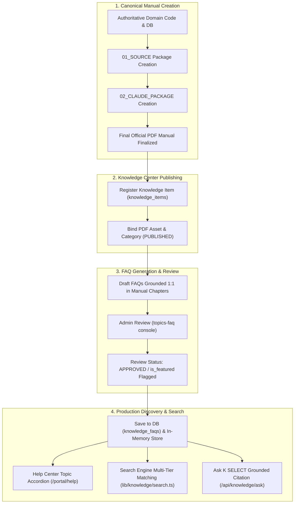
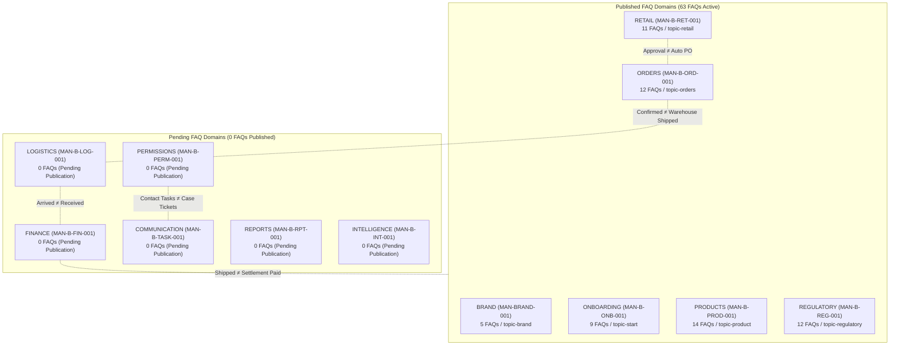
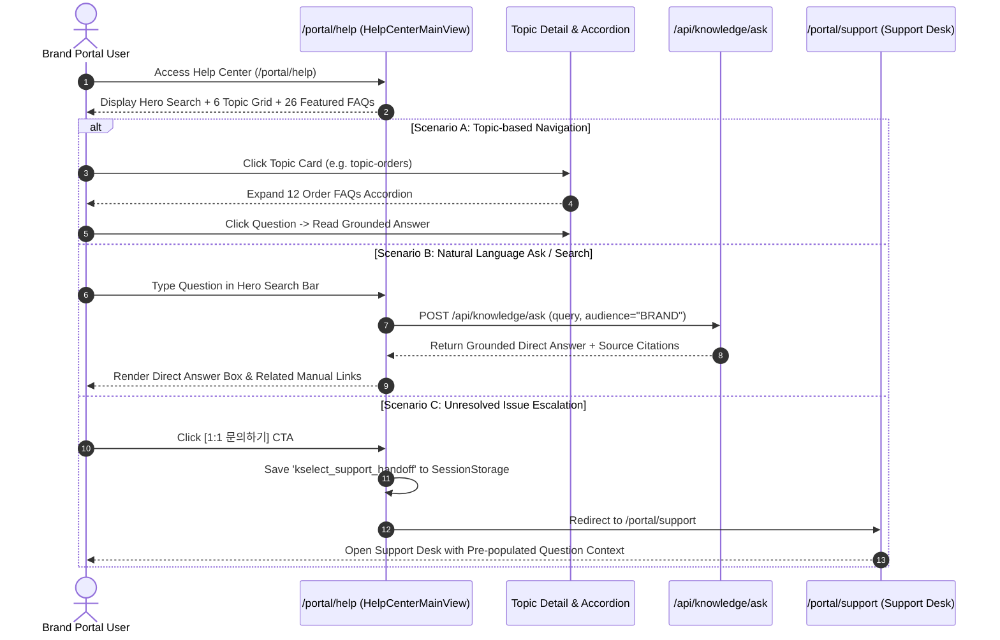
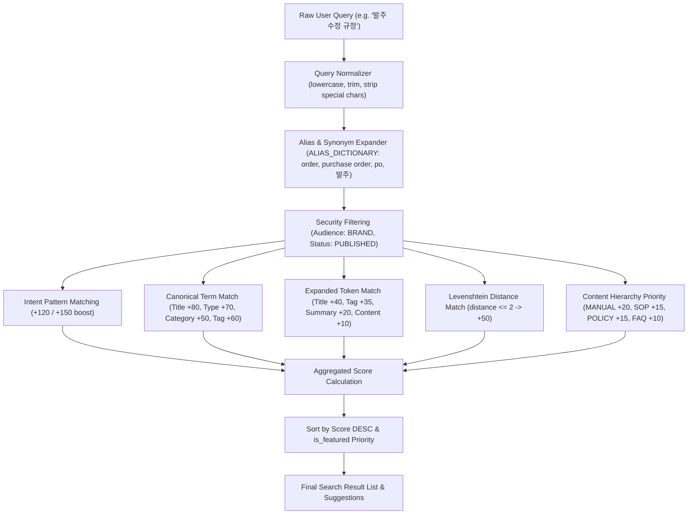

# MAN-B-FAQ-001: Knowledge Center FAQ Workflow Map & Domain Boundary Matrix

- **문서 번호:** `MAN-B-FAQ-001-WFM-001-R1`  
- **문서 명칭:** FAQ System Lifecycle Workflows & Cross-Domain Isolation Matrix  
- **작성 일자:** 2026-10-02  
- **적용 대상:** K SELECT 12대 업무 도메인 (BRAND, ONB, PROD, REG, RET, ORD, LOG, FIN, PERM, TASK, RPT, INT)  

---

## 1. 매뉴얼 ↔ FAQ 거버넌스 생명주기 (Manual-to-FAQ Lifecycle)

K SELECT 전체 지식 시스템에서 각 FAQ는 독립된 임의 정책이 아니며, 오직 **단 하나의 Authoritative Knowledge Item(발행 정본 매뉴얼)**에 귀속됩니다.

---

## 2. 12대 도메인 경계 및 비즈니스 격리 매트릭스 (12-Domain Boundary Matrix)

### 2.1 핵심 비즈니스 경계 수식 (Authoritative Boundary Formulas)

1. **`Retail Application Approval ≠ Automatic Purchase Order Creation`**:
   - 리테일러 입점 신청 승인은 바이어의 상품 취급 승인 결과이며, 발주(PO)를 자동으로 생성하거나 시작하지 않습니다. 발주는 `MAN-B-ORD-001`의 독립 절차로 생성됩니다.
2. **`ARRIVED ≠ RECEIVED ≠ COMPLETED ≠ PAID`**:
   - 물류 센터 도착(`ARRIVED`)은 입고 검수 완료(`RECEIVED`)가 아니며, 대금 정산(`COMPLETED / PAID`)과 명확히 구분됩니다.
3. **`Shipping Complete ≠ Settlement Complete`**:
   - 상품 출고 완료가 즉시 대금 지급을 의미하지 않으며, 정산 주기 및 매입전표(AP) 대조 과정을 거쳐야 합니다.
4. **`협의 필요 ≠ Rejection`**:
   - 리테일러의 '협의 필요' 피드백은 조건부 협의 요청이며 영구 반려(Reject)가 아닙니다.
5. **`PERM Operational Task Assignment ≠ TASK Support Case`**:
   - `company_task_assignments`의 6대 주 담당자 배정은 정적 라우팅이며, `partner_inquiries`의 동적 1:1 케이스 티켓과 독립적으로 동작합니다.
6. **`AI INCI Translation ≠ Regulatory Certificate Upload`**:
   - AI 영문 성분표 번역은 규제 서류 제출(MoCRA, FDA 시설등록)을 대체할 수 없습니다.
7. **`Barcode Validation ≠ Regulatory Approval`**:
   - 바코드 포맷 유효성 검증과 수출 인허가 승인은 별개의 검증 단계입니다.

---

## 3. 브랜드 포털 헬프센터 사용자 탐색 및 질의 워크플로우 (Help Center User Flow)

---

## 4. 검색 엔진 매칭 및 스코어링 파이프라인 (Search Pipeline Architecture)

---
*End of MAN-B-FAQ-001_Workflow_Map.md*
