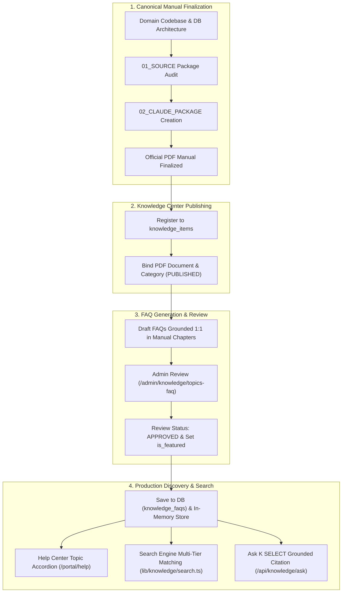
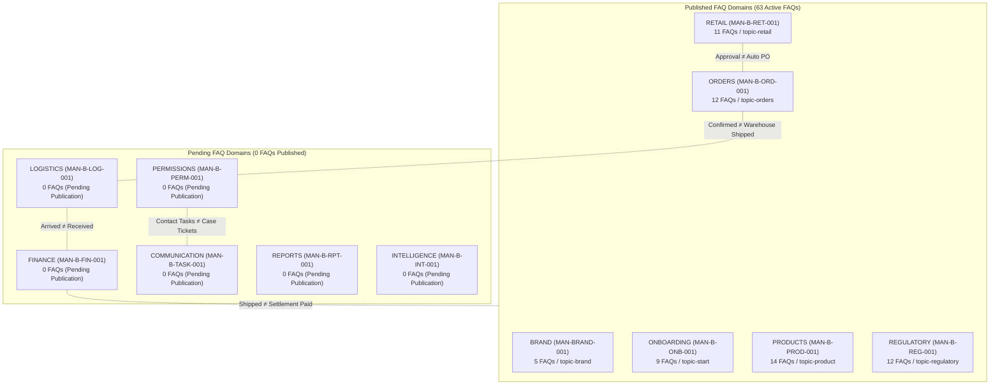
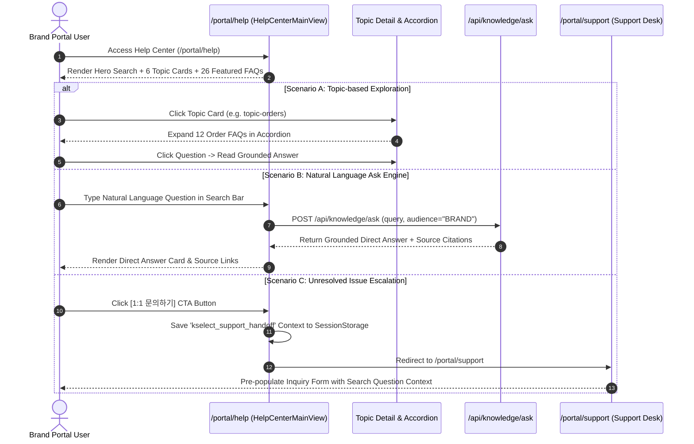
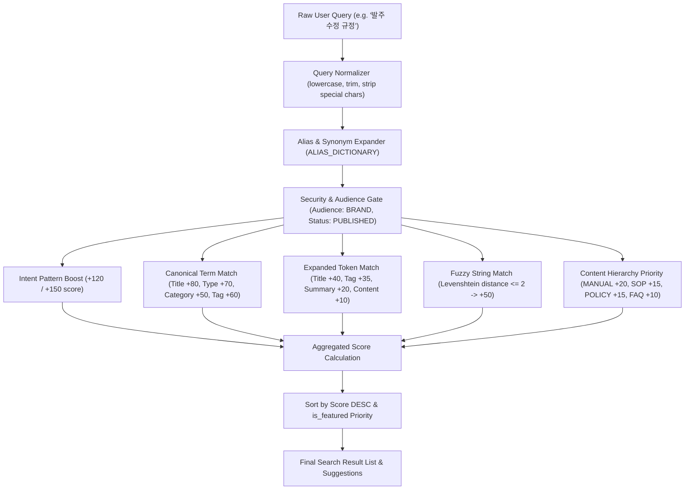
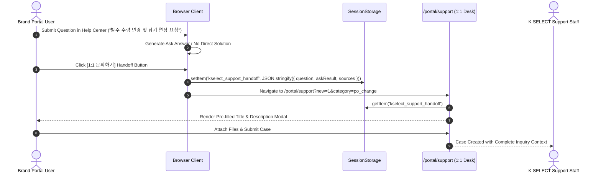

# KNOWLEDGE & FAQ ARCHITECTURE DIAGRAMS: MAN-B-FAQ-001
## K SELECT Knowledge System Architecture, Workflows & Data Pipelines

- **Manual ID:** `MAN-B-FAQ-001`
- **Topic:** `Knowledge Center FAQ (도움말 센터, 자주 묻는 질문 및 지식 검색)`
- **Audience:** `B — Brand Portal Users`
- **Authoritative Date:** 2026-10-02

---

## Diagram 1: End-to-End Manual ↔ FAQ Governance Lifecycle

---

## Diagram 2: 12-Domain Ownership & Cross-Domain Isolation Matrix

---

## Diagram 3: Help Center User Inquiry & Navigation Workflow

---

## Diagram 4: Search Engine Multi-Tier Scoring & Matching Pipeline

---

## Diagram 5: 1:1 Support Ticket Escalation Handoff Workflow

---
*End of KNOWLEDGE_FAQ_ARCHITECTURE_DIAGRAMS.md*
