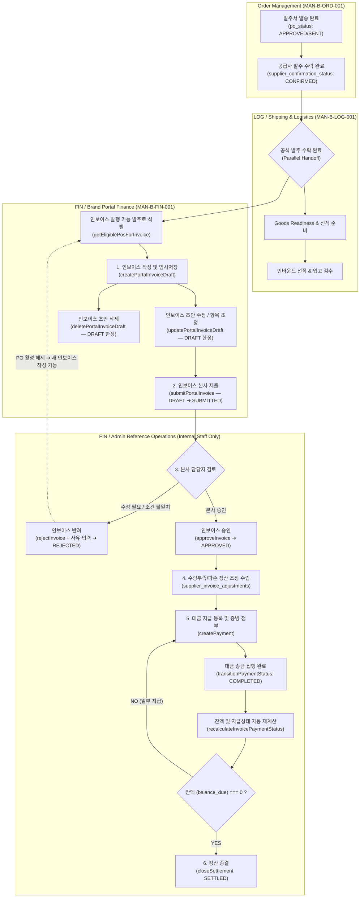

# MAN-B-FIN-001 — Workflow Map
## K SELECT Brand Portal & Admin: Finance & Settlement (프로세스 워크플로우 맵)

---

## 1. Executive Overview

본 문서는 **K SELECT Brand Portal**과 **K SELECT Admin** 간의 정산, 인보이스 발행, 조정 항목 수립, 대금 지급 및 정산 종결에 이르는 전체 정산 생애주기(Settlement Lifecycle) 워크플로우를 시각화하고 각 단계별 시스템 구동 조건을 명세한다.

---

## 2. End-to-End Parallel Domain Architecture

---

## 3. Detailed Step-by-Step Workflows

### 3.1 Step 1: ORD ➔ FIN Parallel Handoff & PO Eligibility Verification
- **도메인 경계**:
  - 발주서 수락(`supplier_confirmation_status = 'CONFIRMED'`) 완료 직후, 도메인은 **물류(LOG)**와 **정산(FIN)**으로 **병렬 분기(Parallel Handoff)**함.
  - 입고 검수(Receiving)는 결제 조건(Payment Terms)에 따라 지급 시점의 참조가 될 수 있으나, 정산(FIN) 진입 및 인보이스 작성의 필수 직렬 전제조건이 아님.
- **PO 자격 조건 (Eligibility Query)**:
  - `supplier_id = companyId`
  - `po_status IN ('APPROVED', 'SENT')`
  - `supplier_confirmation_status = 'CONFIRMED'`
  - `supplier_invoices.invoice_status NOT IN ('VOID', 'REJECTED')` 인 활성 인보이스가 존재하지 않아야 함.

---

### 3.2 Step 2: Invoice Draft Creation & Editing (Brand Portal User)
- **행위 주체**: Brand Portal User (`finance:write`)
- **서버 액션**: `createPortalInvoiceDraft` / `updatePortalInvoiceDraft`
- **수식 및 검증 알고리즘**:
  1. `subtotal = SUM(invoiced_qty * unit_price)`
  2. `adjustmentTotal = SUM(CHARGE) - SUM(CREDIT)`
  3. `invoice_total = subtotal + adjustmentTotal` (`invoice_total < 0` 일 경우 저장 차단)
  4. Single Active Invoice 검사: 해당 PO에 다른 활성 인보이스 존재 시 DB partial unique index 및 app pre-check에 의해 즉시 오류 처리.
- **허용 상태**: 오직 `invoice_status === 'DRAFT'` 상태에서만 수정(`Edit`) 및 삭제(`Delete`) 가능.

---

### 3.3 Step 3: Invoice Submission (Brand Portal User)
- **행위 주체**: Brand Portal User (`finance:write`)
- **서버 액션**: `submitPortalInvoice(invoiceId)`
- **상태 전이**: `DRAFT` ➔ `SUBMITTED` (`submitted_at` 기록)
- **영향**:
  - 제출 완료 시 브랜드 포털에서 수정/삭제 버튼이 숨겨지고 읽기 전용(Read-Only)으로 전환됨.

---

### 3.4 Step 4: Admin Audit, Approval & Rejection (Admin Reference)
- **행위 주체**: K SELECT Admin Manager (`super_admin`, `operations`, `reviewer`)
- **서버 액션**: `approveInvoice` / `rejectInvoice` / `voidInvoice`
- **승인 (Approve)**: `SUBMITTED` ➔ `APPROVED` (본사 승인 완료).
- **반려 (Reject)**: `SUBMITTED` ➔ `REJECTED` (`rejection_reason` 필수 작성).
  - REJECTED 상태의 인보이스는 브랜드 포털에서 제자리 수정/재제출이 불가함 (Terminal Status).
  - 단, REJECTED 인보이스는 더 이상 활성 인보이스가 아니므로, PO의 활성 상태가 해제되어 브랜드 포털 사용자가 **새 인보이스(/portal/finance/new)**를 정상적으로 작성할 수 있음.
- **무효 (Void)**: `SUBMITTED` / `APPROVED` ➔ `VOID` (문서 무효화).

---

### 3.5 Step 5: Adjustments & Payment Execution (Admin Reference)
- **정산 조정 (Adjustments)**: `SHORTAGE`, `DAMAGE`, `PRICE_DIFFERENCE`, `OTHER` 사유에 따라 `CREDIT` (감액) 또는 `CHARGE` (증액) 수립.
- **지급 집행 (Payment Execution)**: Admin이 `createPayment` 후 `transitionPaymentStatus(id, 'COMPLETED')` 실행.
- **지급 상태 자동 재계산 (`recalculateInvoicePaymentStatus`)**:
  - `amount_paid = SUM(supplier_payments.payment_amount WHERE status = 'COMPLETED')`
  - `balance_due = invoice_total - amount_paid`
  - `balance_due <= 0` ➔ `payment_status = 'PAID'`
  - `amount_paid > 0 && balance_due > 0` ➔ `payment_status = 'PARTIALLY_PAID'`
  - `amount_paid == 0` ➔ `payment_status = 'UNPAID'`

---

### 3.6 Step 6: Settlement Closing (Admin Reference)
- **행위 주체**: K SELECT Admin Finance Manager
- **서버 액션**: `closeSettlement(invoiceId)`
- **상태 전이**: `settlement_status = 'SETTLED'`
- **영향**: 정산 파일이 마감 종결되며, 추가 송금 및 정산 조정 생성이 동결됨.

---
