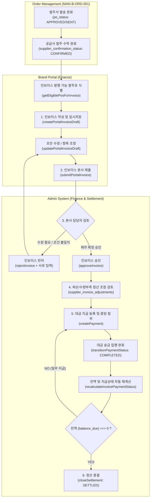

# MAN-B-FIN-001 — Workflow Map
## K SELECT Brand Portal & Admin: Finance & Settlement (프로세스 워크플로우 맵)

---

## 1. Executive Overview

본 문서는 **K SELECT Brand Portal**과 **K SELECT Admin** 간의 정산, 인보이스 발행, 조정 항목 수립, 대금 지급 및 정산 종결에 이르는 전체 정산 생애주기(Settlement Lifecycle) 워크플로우를 시각화하고 각 단계별 시스템 구동 조건을 명세한다.

---

## 2. End-to-End Finance Lifecycle Architecture

---

## 3. Detailed Step-by-Step Workflows

### 3.1 Step 1: ORD ➔ FIN Handoff & PO Eligibility Verification
- **시스템 선행 조건**:
  - `purchase_orders.po_status IN ('APPROVED', 'SENT')`
  - `purchase_orders.supplier_confirmation_status = 'CONFIRMED'`
  - `supplier_invoices.invoice_status NOT IN ('VOID', 'REJECTED')` 인 활성 인보이스가 존재하지 않아야 함.
- **동작 방식**:
  - 브랜드사가 `/portal/finance/new` 진입 시, 시스템은 자격을 갖춘 PO 목록을 조회함 (`getEligiblePosForInvoice`).
  - 자격을 갖춘 PO를 선택하면 `getPoLinesForInvoice`를 호출하여 계약 단가, 주소지, 품목 수량 정보를 자동으로 입력 폼에 바인딩함.

---

### 3.2 Step 2: Invoice Draft Creation & Amount Calculation
- **행위 주체**: Brand Portal User (`finance:write`)
- **실행 서버 액션**: `createPortalInvoiceDraft`
- **수식 및 검증 알고리즘**:
  1. 품목 소계 산출: `subtotal = SUM(invoiced_qty * unit_price)`
  2. 정산 조정 총액 산출: `adjustmentTotal = SUM(PLUS / CHARGE) - SUM(MINUS / CREDIT)`
  3. 최종 인보이스 청구 금액: `invoice_total = subtotal + adjustmentTotal`
  4. 검증: `invoice_total < 0` 일 경우 예외 발생 및 저장 거부.
  5. 단일 활성 인보이스 중복 검사: 해당 PO에 타 활성 인보이스가 존재하면 예외 처리.
- **결과**: `supplier_invoices.invoice_status = 'DRAFT'`, `payment_status = 'UNPAID'`, `settlement_status = 'OPEN'` 생성.

---

### 3.3 Step 3: Invoice Submission to Admin
- **행위 주체**: Brand Portal User (`finance:write`)
- **실행 서버 액션**: `submitPortalInvoice(invoiceId)`
- **상태 전이**:
  - `DRAFT` ➔ `SUBMITTED`
  - `submitted_at = current_timestamp`
- **제약 사항**:
  - 제출 완료된 인보이스는 브랜드 포털에서 더 이상 수정(`updatePortalInvoiceDraft`)이나 삭제(`deletePortalInvoiceDraft`)가 불가하며 읽기 전용(Read-Only)으로 전환됨.

---

### 3.4 Step 4: Admin Audit, Approval & Rejection Flow
- **행위 주체**: K SELECT Admin Manager (`super_admin`, `operations`, `reviewer`)
- **실행 서버 액션**: `approveInvoice` / `rejectInvoice`
- **승인 경로 (Approve Flow)**:
  - `supplier_invoices.invoice_status` ➔ `APPROVED`
  - 승인 완료 시 본사 매입 채무(Accounts Payable)로 공식 확정됨.
- **반려 경로 (Reject Flow)**:
  - Admin이 명확한 반려 사유(`rejection_reason`) 작성 후 반려 실행.
  - `supplier_invoices.invoice_status` ➔ `REJECTED`
  - 해당 PO는 더 이상 진행 중인 활성 인보이스가 아니므로, 브랜드사는 수정 후 재제출하거나 신규 인보이스를 발행할 수 있게 됨.

---

### 3.5 Step 5: Financial Adjustment Management Flow
- **행위 주체**: Admin / Portal User
- **조정 발생 사유**:
  - `SHORTAGE`: 입고 검수 시 실입고 수량 부족 발생 (Credit 차감)
  - `DAMAGE`: 파손 및 불량 품목 발생 (Credit 차감)
  - `PRICE_DIFFERENCE`: 단가 오기 및 가격 조정 차액 발생
  - `OTHER`: 기타 부대비용 반영
- **저장 테이블**: `supplier_invoice_adjustments`
- **영향**:
  - 인보이스 총액(`invoice_total`) 및 잔액(`balance_due`)에 즉시 반영되어 최종 송금액을 보정함.

---

### 3.6 Step 6: Payment Execution & Balance Recalculation Flow
- **행위 주체**: K SELECT Admin Finance (`admin:write`)
- **실행 서버 액션**: `createPayment` ➔ `transitionPaymentStatus(id, 'COMPLETED')`
- **자동 동기화 파이프라인 (`recalculateInvoicePaymentStatus`)**:
  1. `COMPLETED` 상태인 지급 건의 금액 합산: `amount_paid = SUM(supplier_payments.payment_amount)`
  2. 잔액 재산출: `balance_due = invoice_total - amount_paid`
  3. 지급 상태 자동 갱신:
     - `balance_due <= 0` ➔ `payment_status = 'PAID'`
     - `amount_paid > 0 && balance_due > 0` ➔ `payment_status = 'PARTIALLY_PAID'`
     - `amount_paid == 0` ➔ `payment_status = 'UNPAID'`

---

### 3.7 Step 7: Settlement Closing Flow
- **행위 주체**: K SELECT Admin Finance Manager
- **실행 서버 액션**: `closeSettlement(invoiceId)`
- **상태 전이**: `settlement_status = 'SETTLED'`
- **영향**: 해당 인보이스에 대한 정산 조회가 종결 마감 처리되며, 향후 추가 지급 및 조정 생성이 금지 동결됨.

---
