# MAN-B-FIN-001 — Manual Content
## K SELECT Brand Portal: Finance & Settlement Guide (정산 관리 & 인보이스 가이드)

> [!IMPORTANT] Master Design System Reference
> 본 매뉴얼의 모든 브랜드 디자인 규격, 컬러 시스템, 인포그래픽, 표 양식 및 캡션 레이아웃은 **`MAN-B-BRAND-001_Brand-Policy_V1.pdf`**를 준수합니다.

---

## 1. 개요 및 핵심 정산 원칙 (Executive Summary & Core Principles)

본 가이드는 **K SELECT Brand Portal**을 이용하는 파트너 브랜드사(공급사)의 재무/정산 담당자를 위한 공식 매뉴얼입니다. K SELECT 글로벌 정산 시스템은 확정된 발주서(Official Purchase Order)를 기반으로 인보이스 청구, 정산 금액 조정(Adjustments), 대금 지급 이행(Payments) 및 최종 정산 마감(Settlement Closing)을 투명하고 정확하게 처리합니다.

```
                  ┌──────────────────────────────────────────────┐
                  │    공식 발주 수락 완료 (Official PO Confirmed) │
                  └──────────────────────┬───────────────────────┘
                                         │ (Parallel Domain Handoff)
                  ┌──────────────────────┴──────────────────────┐
                  ▼                                             ▼
┌───────────────────────────────────┐       ┌───────────────────────────────────┐
│ LOG / Shipping & Logistics Domain │       │ FIN / Finance & Settlement Domain │
│ (MAN-B-LOG-001)                   │       │ (MAN-B-FIN-001)                   │
└───────────────────────────────────┘       └───────────────────────────────────┘
```

### 핵심 도메인 원칙
1. **병렬 도메인 전환 (Parallel Handoff)**:
   - 본사 승인 및 공급사 수락이 완료된 발주서(`po_status IN ('APPROVED', 'SENT')` AND `supplier_confirmation_status = 'CONFIRMED'`)는 **물류(LOG)**와 **정산(FIN)** 도메인으로 동시에 병렬 전환됩니다.
   - 정산 진입 및 인보이스 발행은 물류 입고 검수를 필수 직렬 전제조건으로 요구하지 않으며, 발주 수락 직후 청구 절차를 즉시 개시할 수 있습니다.
2. **단일 활성 인보이스 제약 (Single Active Invoice Rule — Enforcement: BOTH)**:
   - 1개의 발주서(PO)당 진행 중인 활성 인보이스(`invoice_status NOT IN ('VOID', 'REJECTED')`)는 **오직 1개만 허용**됩니다.
   - 데이터베이스 부분 유일 인덱스(`idx_supplier_invoices_one_active_per_po`)와 애플리케이션 사전 검증(`createPortalInvoiceDraft`) 양쪽에서 검증됩니다.
3. **4대 상태 도메인의 명확한 분리**:
   - `Invoice Status` (DRAFT / SUBMITTED / APPROVED / REJECTED / VOID)
   - `Payment Status` (UNPAID / PARTIALLY_PAID / PAID — 실시간 잔액 기반 동적 산출)
   - `Settlement Status` (OPEN / SETTLED — 행정적 정산 마감)
   - `PO Status` (DRAFT / APPROVED / SENT / COMPLETED / CANCELLED)
   - 네 상태는 서로 독립적이며 `PO Completed` 상태이더라도 `Invoice Status`나 `Payment Status`가 자동으로 변경되지 않습니다.

---

## 2. Chapter 1. 정산 관리 개요 & Finance Hub Navigation

브랜드 포털 메뉴의 **[정산 관리 (Finance & Invoices)]**(`https://portal.kselectnetwork.com/portal/finance`)는 공급사의 청구, 정산 조정, 대금 수령 내역을 한눈에 파악할 수 있는 통합 컨트롤 타워입니다.

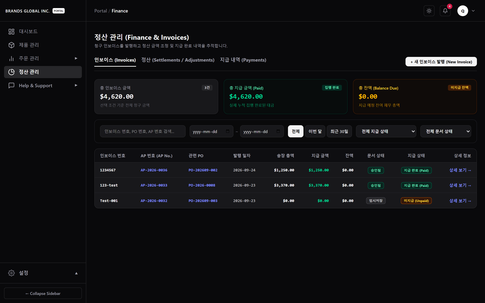

### 1.1 상단 요약 지표 카드 (Summary Cards)
- **총 인보이스 금액 (Total Invoice Amount)**: 현재 적용된 검색/필터 조건에 해당하는 인보이스 청구 총액 합계입니다.
- **총 지급 금액 (Total Paid Amount)**: 본사에서 송금집행 완료(`COMPLETED`) 처리된 대금 누적 총액입니다.
- **총 잔액 (Total Balance Due)**: 지급 만기 예정이거나 미지급 상태인 잔여 미지급 총액입니다.

### 1.2 3대 메인 탭 구조 (3 Main Tabs)
1. **인보이스 (Invoices)**: 발행된 청구 송장 목록 조회, 신규 인보이스 작성 진입, 제출 및 상세 내역 확인.
2. **정산 (Settlements / Adjustments)**: 수량 부족(`SHORTAGE`), 파손(`DAMAGE`), 단가 차액(`PRICE_DIFFERENCE`), 기타(`OTHER`) 사유로 발생한 감액/증액 조정 내역 추적.
3. **지급 내역 (Payments)**: 본사 은행 송금 완료 건의 이체 일자, 지급 수단, 마스킹 계좌 정보 확인.

---

## 3. Chapter 2. 발주 연동 & 인보이스 작성 (Invoice Creation)

### 2.1 자격 부여 발주서(PO) 선택
`+ 새 인보이스 발행` 버튼을 클릭하여 작성 페이지(`/portal/finance/new`)로 진입합니다.

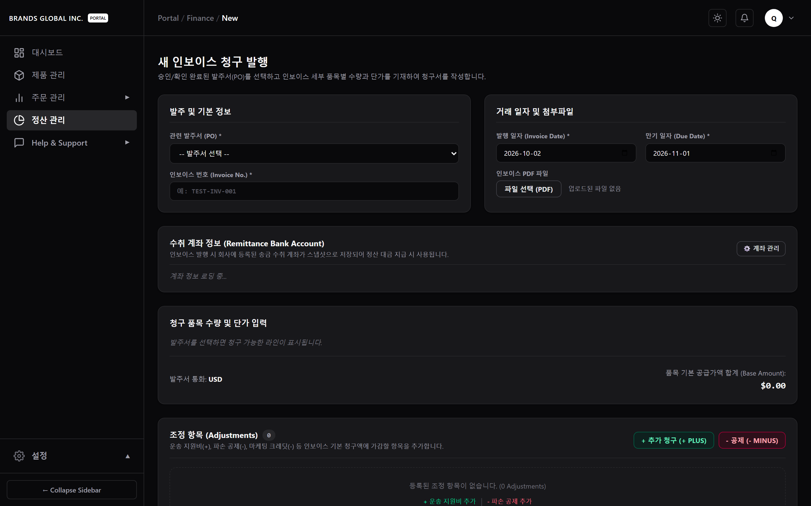

- **발주서 선택 (PO Selection)**: 공급사 수락이 확정된 발주서만 드롭다운에 노출됩니다.
- **계약 정보 자동 연동 (Snapshot Auto-Bind)**: 선택한 발주서의 결제 조건(Payment Terms), 인도 조건(Incoterms), 계약 통화(Currency)가 자동으로 화면과 데이터에 바인딩됩니다.

### 2.2 품목 청구 수량/단가 입력 및 증빙 첨부

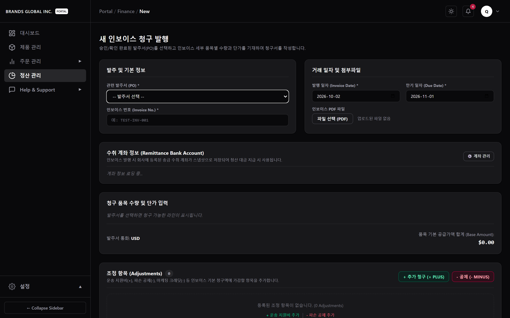

- **품목별 청구 수량/단가 (Lines)**: 확정 발주 수량 범위 내에서 실제로 청구할 수량(`invoiced_qty`)과 단가(`unit_price`)를 확인 및 입력합니다.
- **정산 조정 항목 추가 (Adjustments)**: 사전 합의된 감액(`MINUS / CREDIT`) 또는 증액(`PLUS / CHARGE`) 항목과 사유를 작성합니다.
- **최종 청구 총액 계산**: `invoice_total = subtotal + adjustmentTotal`. 산출된 최종 청구액이 0 미만일 경우 제출이 자동 차단됩니다.
- **송장 증빙 첨부 (Attachment)**: 공급사가 발행한 자체 PDF 송장 파일을 첨부합니다 (`company-uploads` 버킷에 안전하게 보관).

---

## 4. Chapter 3. 인보이스 생애주기 관리 (Invoice Lifecycle)

### 3.1 임시저장(DRAFT) 인보이스 조회, 수정 및 제출

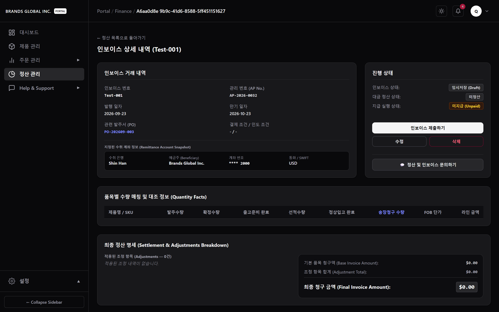

- **임시저장 (DRAFT)**: 작성 중인 인보이스는 `DRAFT` 상태로 저장되며, 언제든지 상세 페이지에서 내용을 검토할 수 있습니다.
- **초안 수정 (Edit)**: `DRAFT` 상태인 인보이스에 한하여 **[수정하기]** 버튼이 활성화되어 품목 청구액 및 첨부파일을 변경할 수 있습니다 (`updatePortalInvoiceDraft`).

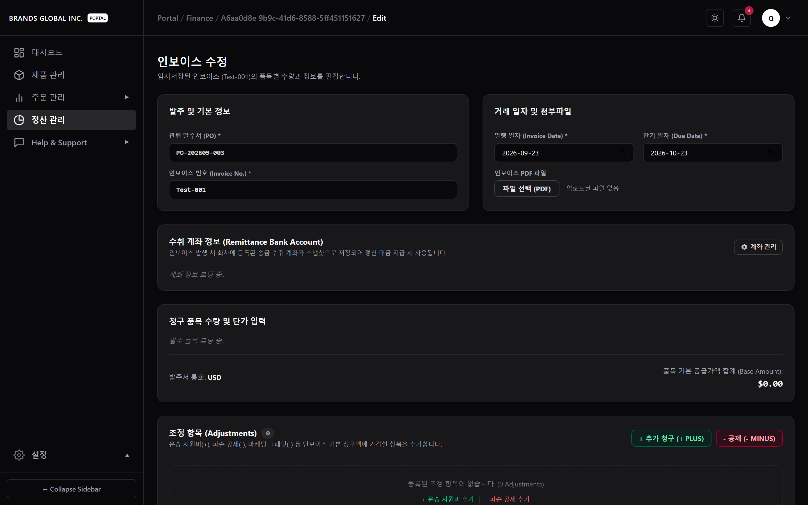

- **초안 삭제 (Delete)**: `DRAFT` 상태에서는 **[삭제]** 버튼을 통해 인보이스 작성을 취소할 수 있습니다 (`deletePortalInvoiceDraft`).
- **본사 제출 (Submit)**: **[제출하기]** 버튼 클릭 시 문서 상태가 `SUBMITTED`로 전환되며, 본사 담당자 검토 단계로 이관됩니다.

### 3.2 제출 완료(SUBMITTED) 인보이스 조회 (Read-Only)

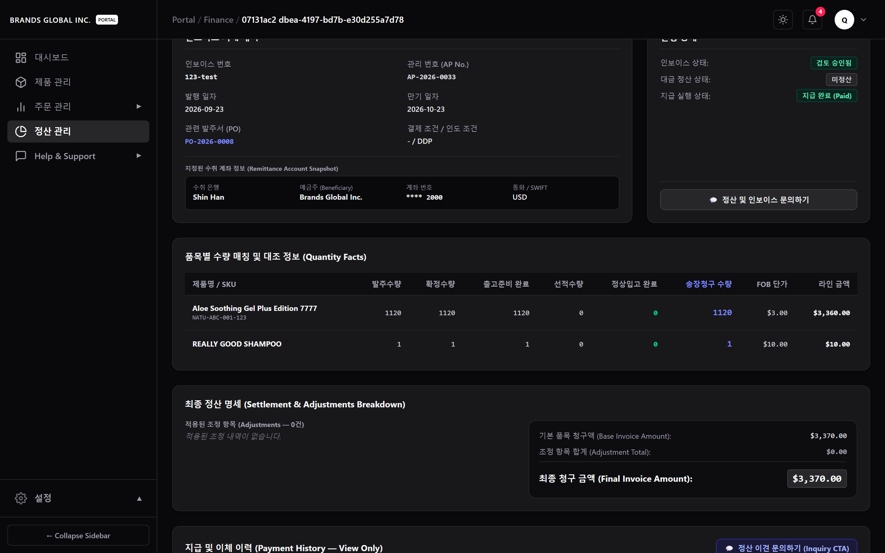

- `SUBMITTED` 상태로 전환된 인보이스는 브랜드 포털에서 수정/삭제 버튼이 숨겨지고 **읽기 전용(Read-Only)** 상태로 전환됩니다. 본사 승인 전까지 대기합니다.

---

## 5. Chapter 4. 인보이스 결재 결과 & 대금 수령

### 4.1 승인 완료(APPROVED) 및 완납(PAID) 수령 확인

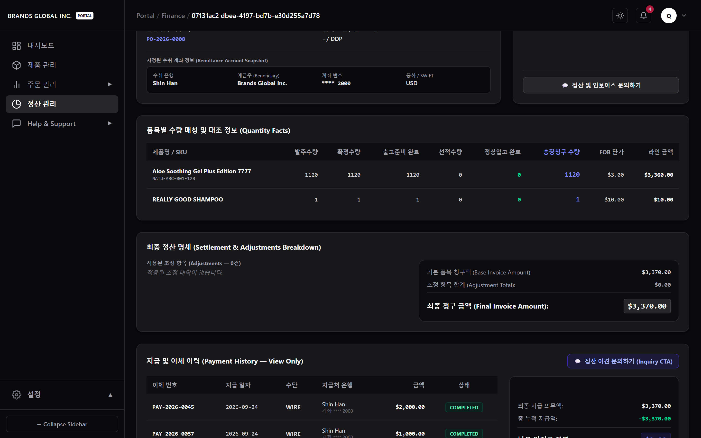

- **승인 완료 (APPROVED)**: 본사 매니저 검토 결과 승인되면 문서 상태가 `APPROVED` 상태로 전환됩니다.
- **지급 상태 (Payment Status)**: 본사 송금 집행에 따라 `UNPAID` ➔ `PARTIALLY_PAID` ➔ `PAID`로 실시간 자동 재계산되어 표시됩니다.
- **송금 이력 및 마스킹 계좌**: 본사가 대금 지급을 완료하면 송금 일자, 금액, 지급 수단(WIRE/ACH) 및 수령 계좌 뒷 4자리가 표시됩니다.

### 4.2 반려 완료(REJECTED) 인보이스 사유 확인 및 재작성

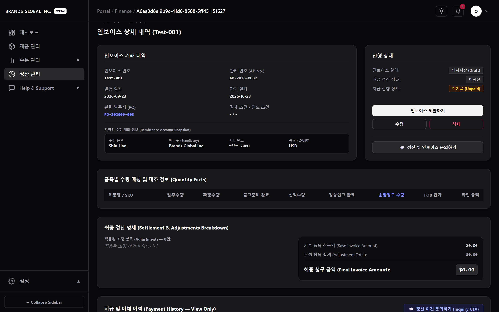

- **반려 처리 (REJECTED)**: 입력 오류나 단가 불일치로 반려된 경우 문서 상태가 `REJECTED`로 변경되며, 본사가 입력한 반려 사유(`rejection_reason`)가 상단 알림창에 노출됩니다.
- **종결 및 재작성 규칙**: `REJECTED` 인보이스는 제자리 수정이나 재제출이 불가합니다. 그러나 해당 PO의 활성 인보이스 상태가 해제되므로, 공급사는 사유를 확인한 후 **새 인보이스(/portal/finance/new)**를 발행하여 다시 제출할 수 있습니다.

---

## 6. Chapter 5. 정산 조정 & 대금 지급 추적 (Settlements & Payments)

### 5.1 정산 조정 내역 추적 (Settlements Tab)

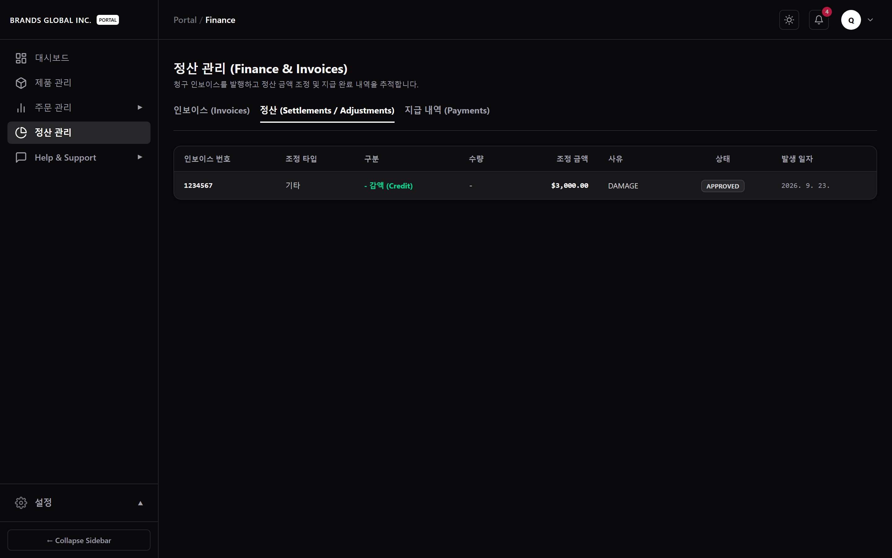

- 정산 탭에서는 수량 부족(`SHORTAGE`), 파손(`DAMAGE`), 단가 차액(`PRICE_DIFFERENCE`), 기타(`OTHER`) 원인으로 발생한 조정 내역의 발생 일자, 수량, 단위 금액, 감액(- CREDIT) / 증액(+ CHARGE) 구분을 모니터링합니다.

### 5.2 대금 송금 및 지급 완료 내역 확인 (Payments Tab)

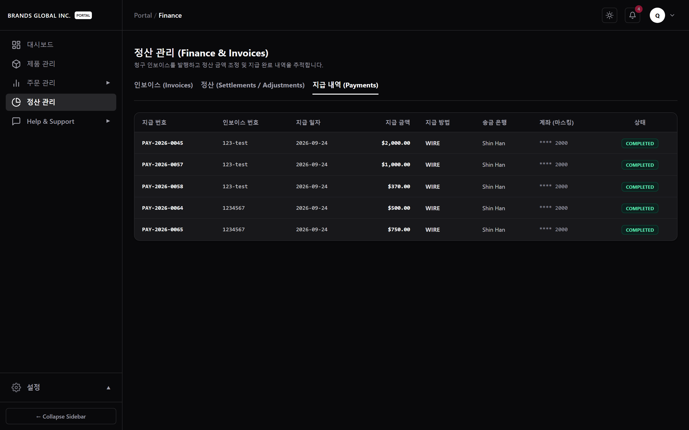

- 지급 내역 탭에서는 본사로부터 이체된 대금 건별 지급 번호, 관련 인보이스 번호, 이체 일자, 실 지급액, 송금 수단(전신환/ACH/수표), 송금 처리 은행 및 마스킹 처리된 계좌번호(`**** 1234`)를 투명하게 조회할 수 있습니다.

---

## 7. Chapter 6. 도메인 수식 및 기술 제약 사항 (Technical Rules)

> [!NOTE] 3중 정산 수식 산출 알고리즘
> - `subtotal = SUM(invoiced_qty * unit_price)`
> - `adjustmentTotal = SUM(CHARGE) - SUM(CREDIT)`
> - `invoice_total = subtotal + adjustmentTotal`
> - `amount_paid = SUM(supplier_payments.payment_amount WHERE status = 'COMPLETED')`
> - `balance_due = invoice_total - amount_paid`

> [!IMPORTANT] 단일 활성 인보이스 제약 (Enforcement: BOTH)
> - 동일 PO에 대해 `invoice_status NOT IN ('VOID', 'REJECTED')` 인 인보이스가 이미 존재하는 경우 신규 인보이스 생성이 시도되면 DB Partial Unique Index(`idx_supplier_invoices_one_active_per_po`)와 Application 사전 검증 양쪽에서 검증되어 거부됩니다.

> [!SYSTEM GAP] 현재 미구현 및 미지원 기능 (System Gaps)
> 1. **1:N 분할 인보이스 (Partial Invoicing)**: 1개 PO에 대해 수회로 나뉘어 인보이스를 청구하는 기능은 현재 지원되지 않습니다.
> 2. **포털 내 PDF 양식 자동 변환 (PDF Export)**: 입력된 데이터를 PDF로 자동 변환하는 기능은 구현되어 있지 않으며, 공급사가 외부 PDF 문서를 직접 첨부합니다.

---

## 8. Appendix A. 본사 어드민 검토 절차 [내부 참조용]

*본 아펜디크스는 본사 어드민 담당자의 검토 및 지급 집행 워크플로우를 안내하기 위한 **내부 참조용 섹션**입니다.*

### A.1 관리자 인보이스 전체 목록 조회 (`/admin/finance/invoices`)

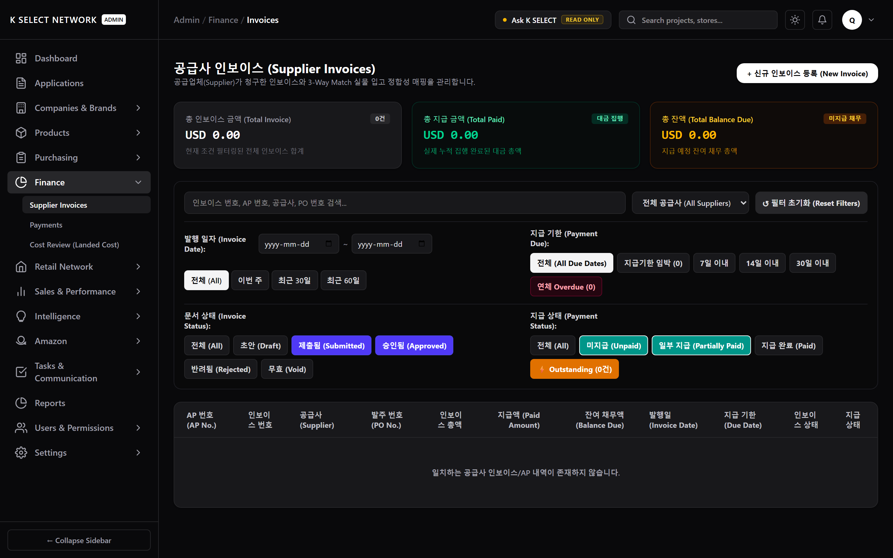

- 어드민 담당자는 전체 공급사 인보이스의 제출 현황, AP 번호 부여 상태, 문서 및 지급 상태를 종합 조회합니다.

### A.2 본사 검토 및 승인/반려 처리 (`/admin/finance/invoices/[id]`)

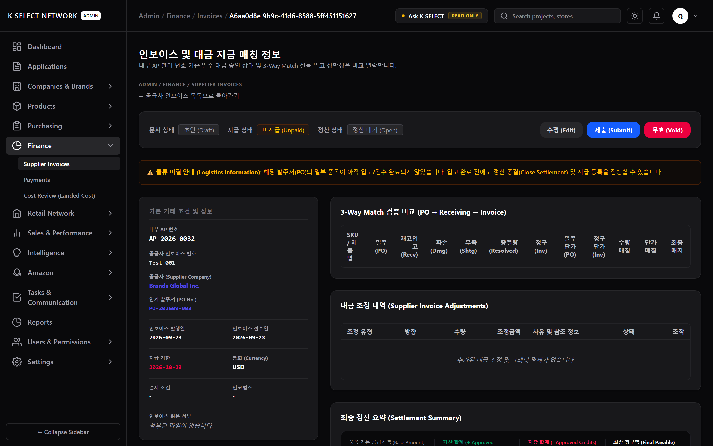

- 어드민 담당자는 품목 수량, 계약 단가, 정산 조정 항목 및 첨부파일을 검토한 후 `approveInvoice` (승인), `rejectInvoice` (반려), 또는 `voidInvoice` (무효화)를 실행합니다.

### A.3 본사 대금 송금 집행 및 지급 확정 (`/admin/finance/payments/new`)

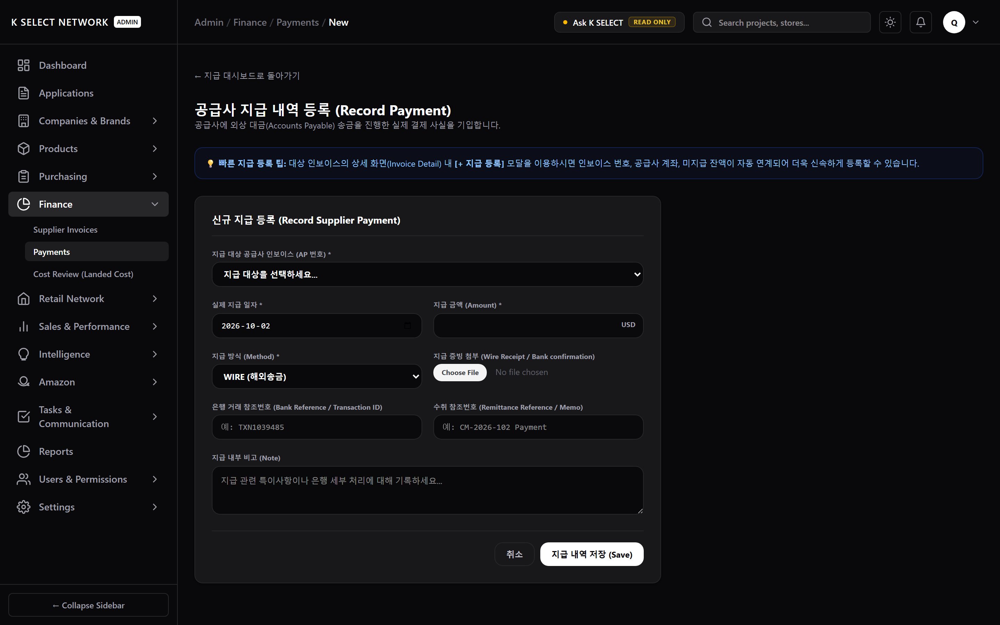

- 어드민 재무 담당자는 송금 완료 후 `createPayment`를 통해 대금 이체 건을 등록하고 `transitionPaymentStatus('COMPLETED')`를 실행하여 인보이스 잔액(`balance_due`)을 차감 반영합니다.

---
