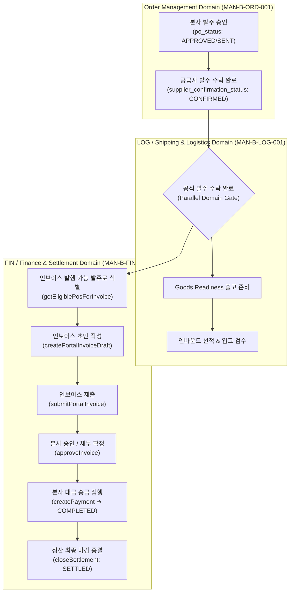
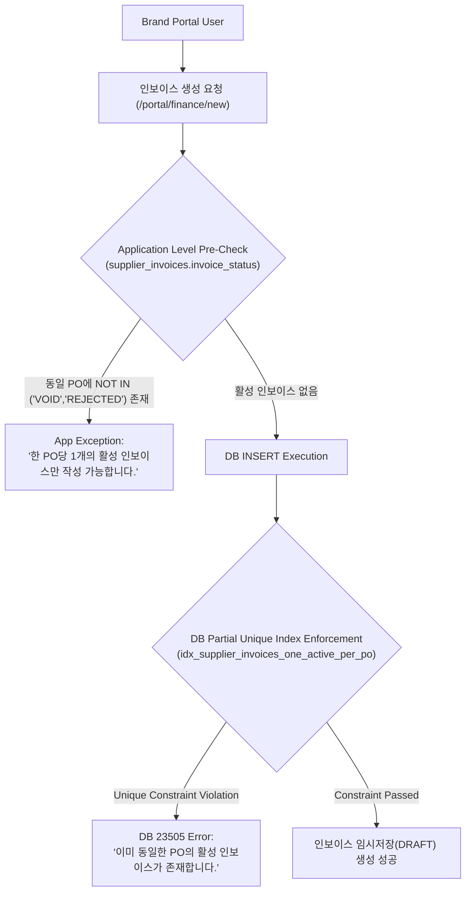
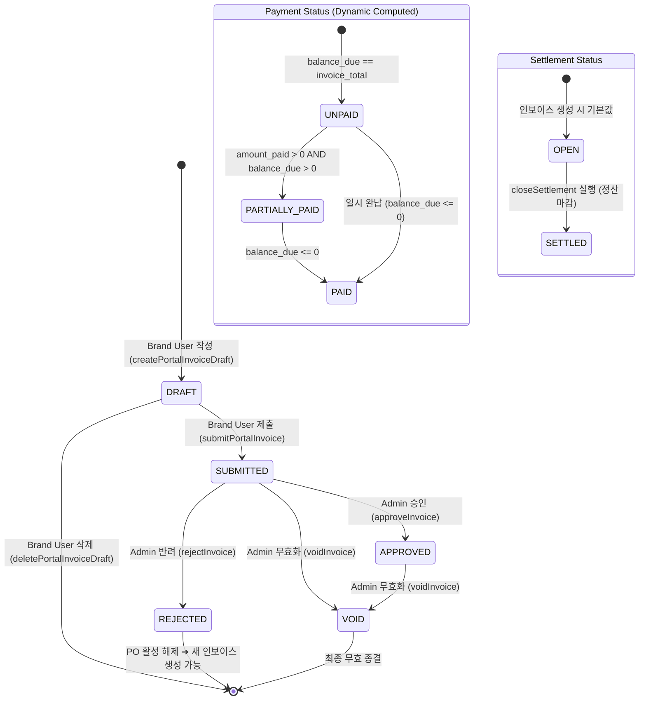
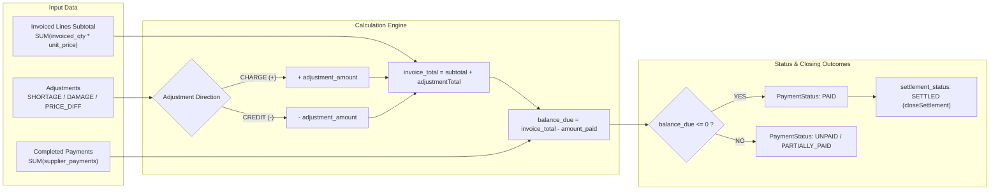

# MAN-B-FIN-001 — Finance Architecture Diagrams
## K SELECT Brand Portal & Admin: Finance & Settlement (아키텍처 다이어그램 모음)

---

## 1. Parallel Domain Handoff Architecture

---

## 2. Single Active Invoice Dual Enforcement Engine

---

## 3. Disambiguated Status Domain State Machine

---

## 4. Financial Math & Adjustment Calculation Flow

---
