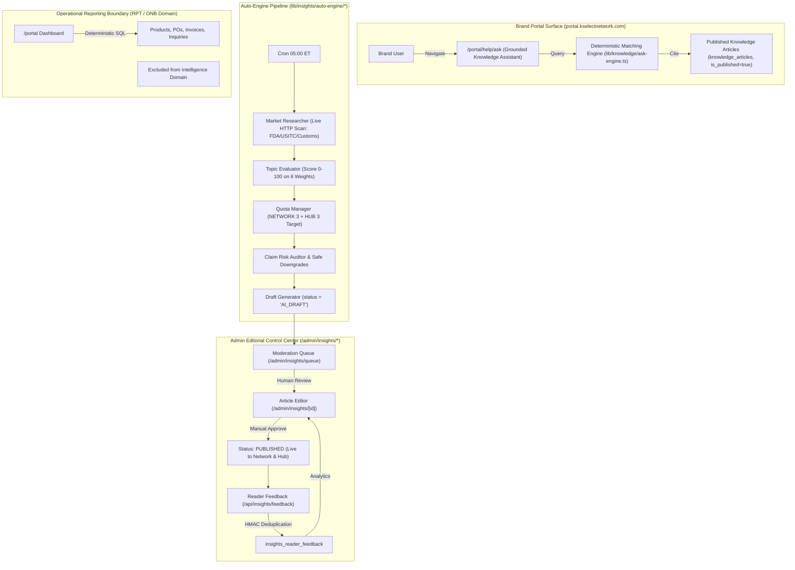
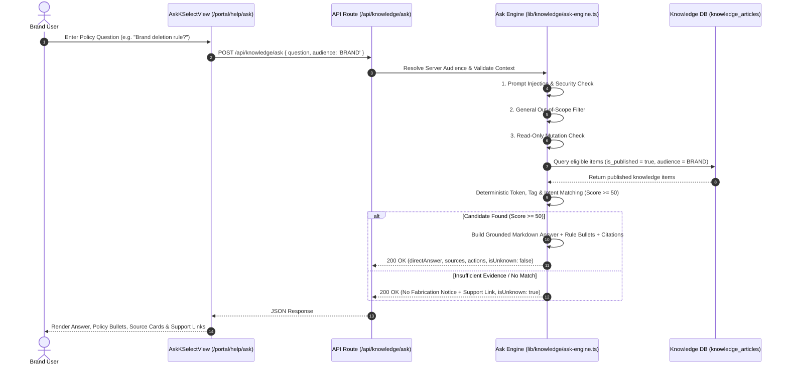
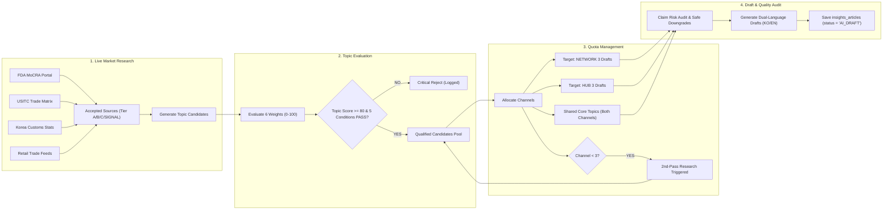
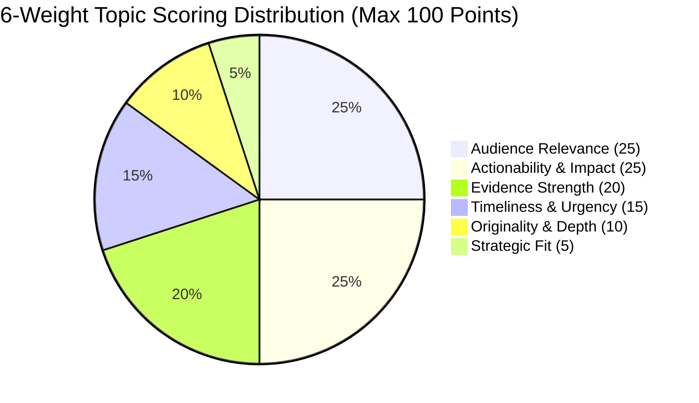
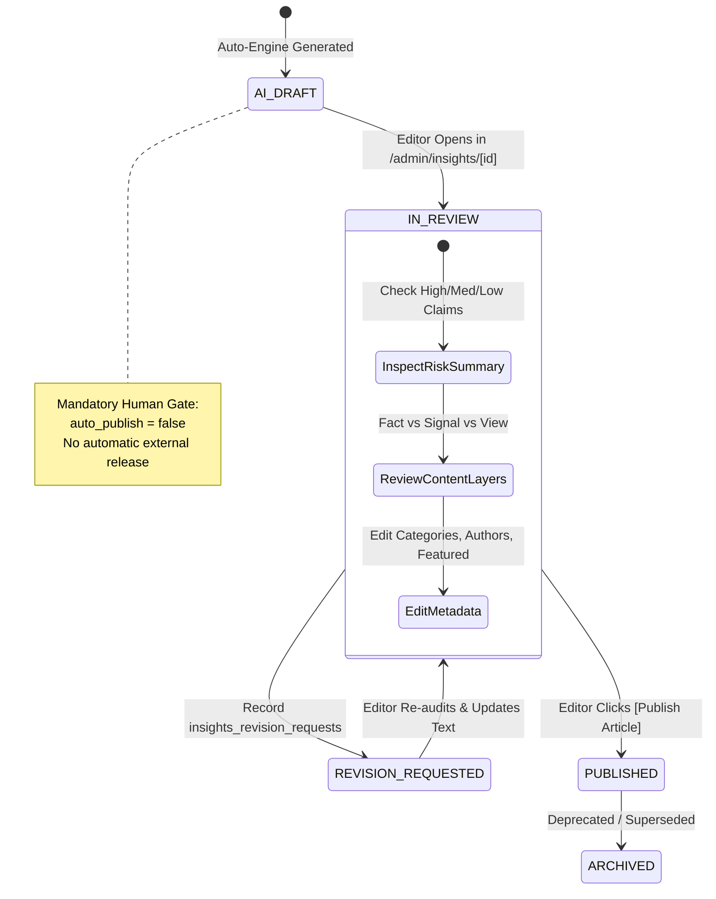
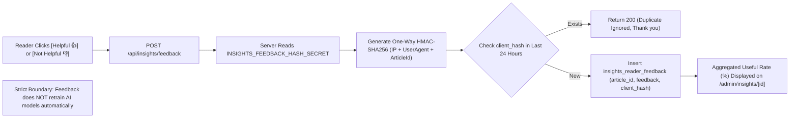

# MAN-B-INT-001 — Intelligence & Insights Architecture Diagrams
## Production Architecture, Data Flows, Quota Rules & Security Guardrails

---

## Diagram 1: Three-Surface Intelligence Architecture Overview



---

## Diagram 2: Grounded Knowledge Assistant Request Flow & Security Guardrails



---

## Diagram 3: Auto-Engine 4-Stage Pipeline & 3+3 Quota Rule



---

## Diagram 4: 6-Weight Topic Scoring Architecture



---

## Diagram 5: Claim Risk Auditing & Safe Downgrade Flow

```mermaid
flowchart TD
    A["Raw Extracted Claims"] --> B{"Classify Claim Risk"}
    
    B -->|HIGH: Regulatory, %, $, Profit Guarantee| C{"Check Source Tier"}
    C -->|Tier A (Gov) or Tier B (Media)| D["Status: VERIFIED / Risk: HIGH / Action: PASS"]
    C -->|Tier C or Signal| E["Action: DOWNGRADE / Status: SIGNAL"]
    E --> F["Safe Phrasing: Convert to Moderated Tone ('Signals suggest...')"]

    B -->|MEDIUM: Market Trend, Category Surge| G{"Check Signal Source"}
    G -->|Tier B Media| H["Status: VERIFIED / Risk: MEDIUM / Action: PASS"]
    G -->|Search/Social Signal| I["Status: SIGNAL / Risk: MEDIUM / Action: DOWNGRADE"]

    B -->|LOW: K SELECT Advice, Checklist| J["Status: INTERNAL / Risk: LOW / Action: PASS"]

    D & F & H & I & J --> K["Check Universal Critical Failures (Fabricated URL, False FDA Approval)"]
    K -->|Detected| L["fact_check_status = 'NEEDS_ATTENTION'"]
    K -->|Clean| M["fact_check_status = 'PASS'"]

    L & M --> N["Assemble 4 Content Layers (market_facts, market_signals, k_select_views, k_select_actions)"]
```

---

## Diagram 6: Editorial Moderation & Mandatory Human Approval Gate



---

## Diagram 7: Reader Usefulness Feedback Collection & HMAC Deduplication



---
*End of INTELLIGENCE_ARCHITECTURE_DIAGRAMS.md*
