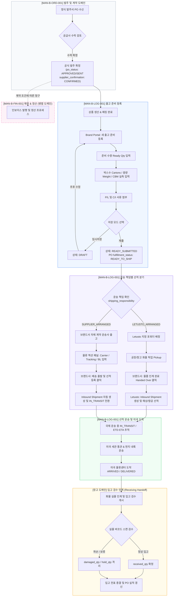
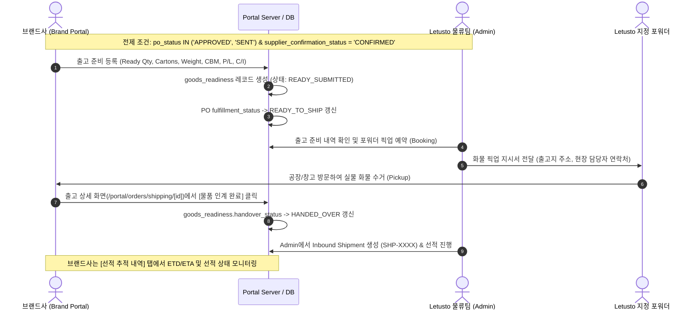
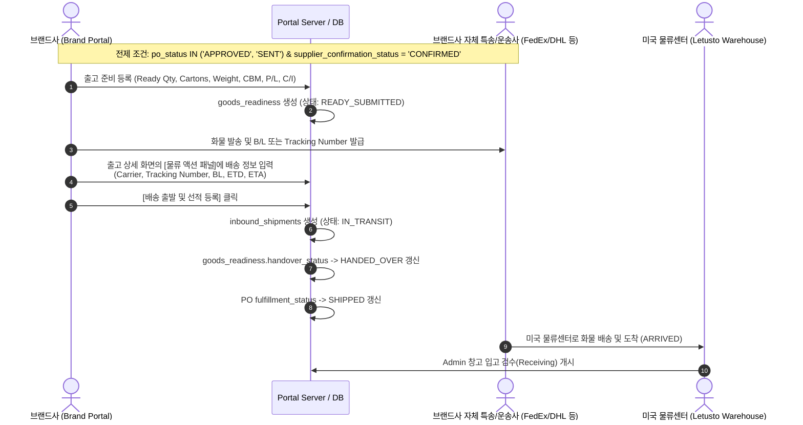
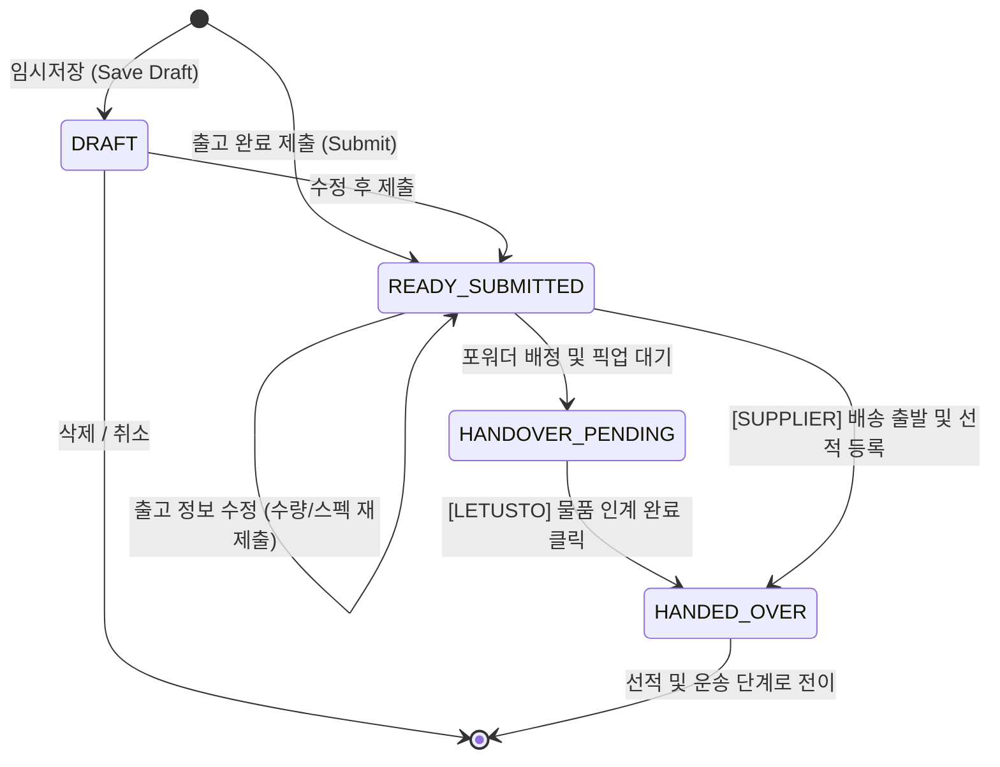
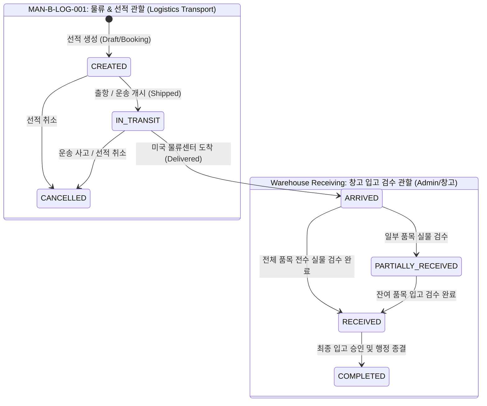
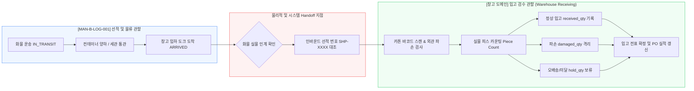
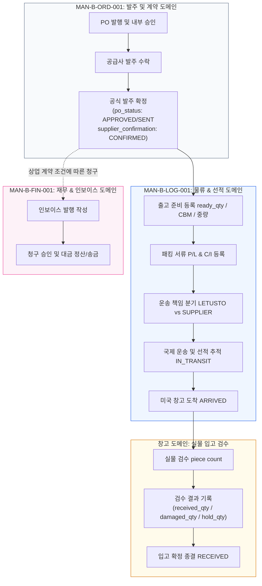

# LOGISTICS ARCHITECTURE DIAGRAMS: MAN-B-LOG-001
## K SELECT Brand Portal Shipping & Logistics Manual

본 문서는 `MAN-B-LOG-001` 공식 매뉴얼에 수록될 **7개의 공식 아키텍처 및 워크플로우 다이어그램 명세서**입니다.
모든 다이어그램은 프로덕션 시스템 검증을 마쳤으며, Claude Design에서 현대적인 고대비 카드형 다이어그램으로 렌더링하도록 작성되었습니다.

---

## Diagram 1. End-to-End International Logistics Process (전체 국제 물류 라이프사이클)

---

## Diagram 2. Track 1: `LETUSTO_ARRANGED` (본사 지정 운송 / FOB) Detailed Flow

---

## Diagram 3. Track 2: `SUPPLIER_ARRANGED` (공급사 자체 운송 / DDP) Detailed Flow

---

## Diagram 4. Goods Readiness State Machine (출고 준비 상태 전이도)

---

## Diagram 5. Inbound Shipment State Machine (선적 추적 상태 전이도)

---

## Diagram 6. Shipping to Warehouse Receiving Handoff Boundary (물류 ↔ 창고 입고 경계)

---

## Diagram 7. Multi-Manual Architecture & Domain Relationship (`MAN-B-ORD-001` $\leftrightarrow$ `MAN-B-LOG-001` $\leftrightarrow$ `MAN-B-FIN-001`)

