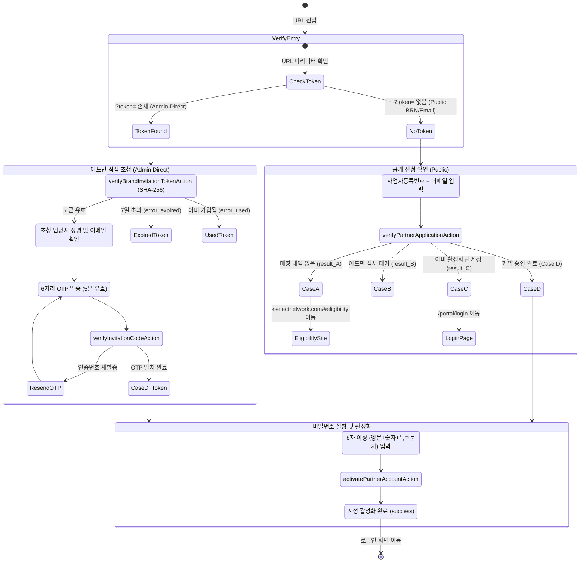
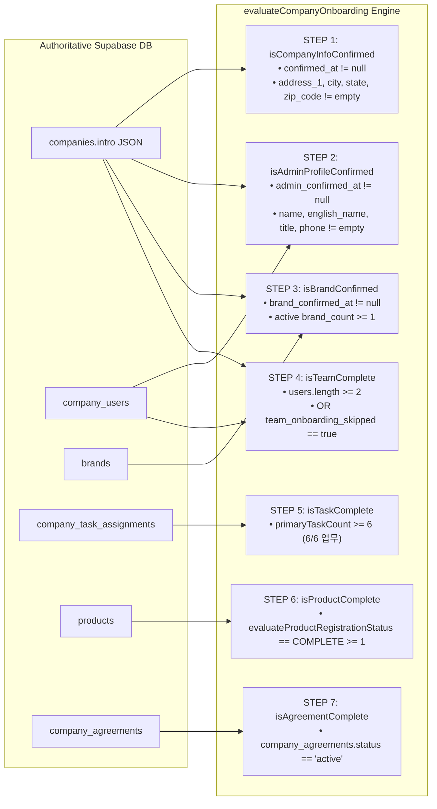

# MAN-B-ONB-001: Brand Portal Onboarding Workflow Map

**Manual ID:** `MAN-B-ONB-001`  
**Document:** `Onboarding Architecture & State Transition Workflow Map`  
**Portal:** `K SELECT Brand Portal (portal.kselectnetwork.com)`  

---

## 1. High-Level Onboarding Roadmap

```mermaid
flowchart TD
    Start([시작: 파트너십 가입 / 초청]) --> SignupRoute{가입 경로 확인}
    
    SignupRoute -->|공개 신청 파트너| PublicSignup["/portal/signup<br>사업자등록번호 + 이메일 대조"]
    SignupRoute -->|어드민 직접 초청| InviteSignup["/portal/signup?token=...<br>보안 토큰 + 이메일 OTP(6자리) 인증"]
    
    PublicSignup --> PasswordSet["비밀번호 설정<br>(8자 이상, 영문/숫자/특수문자)"]
    InviteSignup --> PasswordSet
    
    PasswordSet --> Login["/portal/login<br>로그인 완료"]
    Login --> Dashboard["/portal<br>Brand Portal 대시보드"]
    
    Dashboard --> ModeCheck{계정 승인 상태}
    ModeCheck -->|심사 진행 중| PreApprovalMode["[Pre-Approval Mode]<br>신청 심사 타임라인 & 추가 정보 요청 대응"]
    ModeCheck -->|승인 완료| OperationalMode["[Operational Mode]<br>7단계 온보딩 체크리스트"]
    
    subgraph Checklist [7단계 온보딩 체크리스트 (병렬/순차 수행 가능)]
        direction TB
        S1["STEP 1: 회사 정보 확인<br>(/portal/company/info)<br>• 법인명, 대표연락처, 필수 4대 주소, 로고"]
        S2["STEP 2: 관리자 프로필 확인<br>(/portal/account)<br>• 국문 성명, 영문 성명, 직함, 연락처"]
        S3["STEP 3: 브랜드 정보 확인<br>(/portal/brands)<br>• 대표 브랜드, 로고, KIPO/USPTO 상표권"]
        S4["STEP 4: 팀원 초대 (선택)<br>(/portal/company/users)<br>• 팀원 추가 또는 '나중에 하기' 건너뛰기"]
        S5["STEP 5: 6대 담당업무 주 담당자 지정<br>(/portal/company/info?tab=tasks)<br>• 회사신청, 계약, 제품, 가격, 물류, 정산"]
        S6["STEP 6: 최소 1개 상품 등록 완료<br>(/portal/products)<br>• SKU, FOB/Retail가, 3단 규격, 바코드, 이미지"]
        S7["STEP 7: 공급계약 전자서명 체결<br>(/portal/company/info?tab=agreements)<br>• 기본공급계약서 검토 및 전자서명"]
    end
    
    OperationalMode --> Checklist
    S1 --> CompletedCheck{"모든 7개 단계 완료?"}
    S2 --> CompletedCheck
    S3 --> CompletedCheck
    S4 --> CompletedCheck
    S5 --> CompletedCheck
    S6 --> CompletedCheck
    S7 --> CompletedCheck
    
    CompletedCheck -->|100% 완료| AllComplete["🎉 온보딩 완료<br>글로벌 유통 및 발주/정산 운영 개시"]
```

---

## 2. Signup & Verification State Machine



---

## 3. 7-Step Evaluation Matrix & Data Dependencies



---

## 4. Operational Transition (Post-Onboarding)

```text
[온보딩 7단계 100% 완료]
         │
         ├── 1. 상품 승인 및 채널 매칭 (Admin 선정 검토: UNREVIEWED → SELECTED)
         ├── 2. 견적 및 공급단가 확정 (FOB / DDP 협의)
         ├── 3. 발주(Purchase Order) 수신 및 생산/출고 준비
         ├── 4. 물류 선적 및 미국 현지 입고 (ASN / Tracking)
         └── 5. 판매 데이터 모니터링 및 정산(Invoice) 지급
```
