# K SELECT Brand Portal Onboarding Workflow Diagram

**Manual ID:** `MAN-B-ONB-001`  
**Package Folder:** `03_DIAGRAMS/`  
**Audience:** `Claude Design & End Users`  

---

## 1. High-Level 7-Step Onboarding Flowchart

```mermaid
flowchart LR
    subgraph S1 ["STEP 1"]
        D1["🏢 회사 정보 확인<br>• 법인명/국가<br>• 필수 4대 주소<br>• 회사 로고"]
    end

    subgraph S2 ["STEP 2"]
        D2["👤 관리자 정보 확인<br>• 국문/영문 성명<br>• 직함 (Job Title)<br>• 대표 연락처"]
    end

    subgraph S3 ["STEP 3"]
        D3["🏷️ 브랜드 정보 확인<br>• 대표 브랜드명<br>• 브랜드 로고<br>• KIPO/USPTO 상표권"]
    end

    subgraph S4 ["STEP 4"]
        D4["👥 팀원 초대 (선택)<br>• 사내 동료 초대<br>• 포털 권한 설정<br>• (나중에 하기 가능)"]
    end

    subgraph S5 ["STEP 5"]
        D5["📋 6대 업무 지정<br>• 회사, 계약, 제품<br>• 가격, 물류, 정산<br>• 주 담당자 매칭"]
    end

    subgraph S6 ["STEP 6"]
        D6["📦 상품 등록 완료<br>• 대표 상품 1개 이상<br>• 3단 규격 & FOB가<br>• 바코드 & 이미지"]
    end

    subgraph S7 ["STEP 7"]
        D7["✍️ 기본계약 체결<br>• 공급계약서 검토<br>• 자필 전자서명<br>• 사본 PDF 수신"]
    end

    subgraph Done ["COMPLETE"]
        D8["🎉 온보딩 완료<br>(100% 달성)<br>글로벌 유통 활성화"]
    end

    S1 --> S2 --> S3 --> S4 --> S5 --> S6 --> S7 --> Done

    classDef stepCard fill:#F8FAFC,stroke:#CBD5E1,stroke-width:1.5px,color:#0F172A,font-size:12px;
    classDef doneCard fill:#ECFDF5,stroke:#10B981,stroke-width:2px,color:#065F46,font-size:12px,font-weight:bold;
    
    class D1,D2,D3,D4,D5,D6,D7 stepCard;
    class D8 doneCard;
```



---

## 2. ASCII Onboarding Road Map (For Quick Text Reference)

```text
+-----------------------------------------------------------------------------------+
|                           BRAND PORTAL ONBOARDING ROADMAP                         |
+-----------------------------------------------------------------------------------+
|                                                                                   |
|  [ STEP 1 ] 🏢 회사 정보 확인     (법인명, 필수 4대 주소, 로고 등록)              |
|        │                                                                          |
|        ▼                                                                          |
|  [ STEP 2 ] 👤 관리자 정보 확인   (대표 관리자 국문/영문 프로필, 직함)            |
|        │                                                                          |
|        ▼                                                                          |
|  [ STEP 3 ] 🏷️ 브랜드 정보 확인   (대표 브랜드 및 KIPO/USPTO 상표권 검토)         |
|        │                                                                          |
|        ▼                                                                          |
|  [ STEP 4 ] 👥 팀원 초대 (선택)   (사내 동료 초대 또는 '나중에 하기' 건너뛰기)    |
|        │                                                                          |
|        ▼                                                                          |
|  [ STEP 5 ] 📋 6대 업무 지정      (회사, 계약, 제품, 가격, 물류, 정산 주 담당자) |
|        │                                                                          |
|        ▼                                                                          |
|  [ STEP 6 ] 📦 상품 등록 완료     (최소 1개 상품 3단 규격, FOB가, 바코드 완성)    |
|        │                                                                          |
|        ▼                                                                          |
|  [ STEP 7 ] ✍️ 기본계약 체결      (기본공급계약서 검토 및 전자서명 체결)          |
|        │                                                                          |
|        ▼                                                                          |
|  [ COMPLETE ] 🎉 온보딩 100% 완료 (글로벌 유통망 제안 및 발주/정산 개시)         |
|                                                                                   |
+-----------------------------------------------------------------------------------+
```
