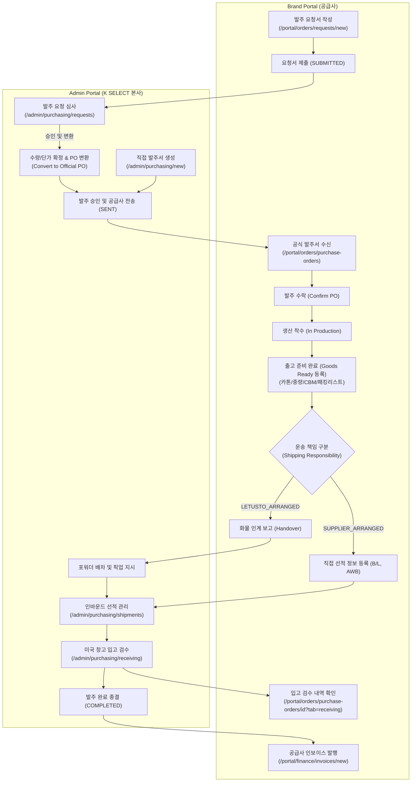
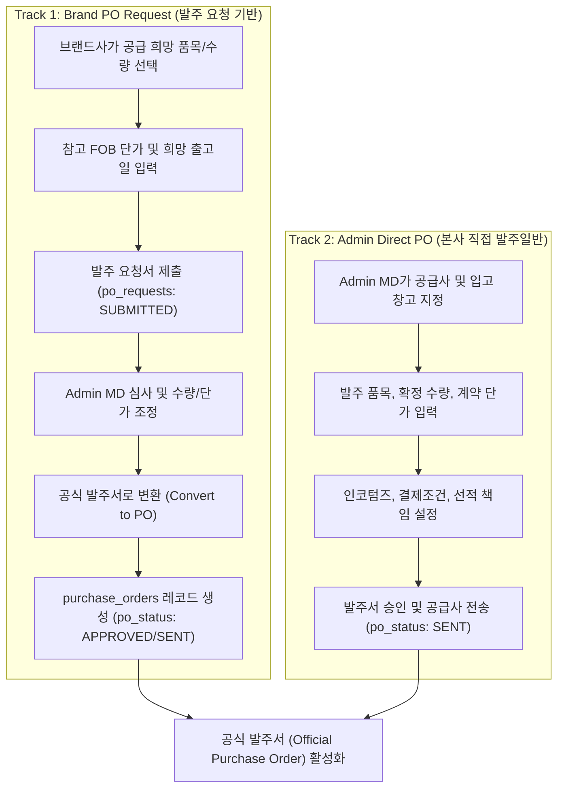
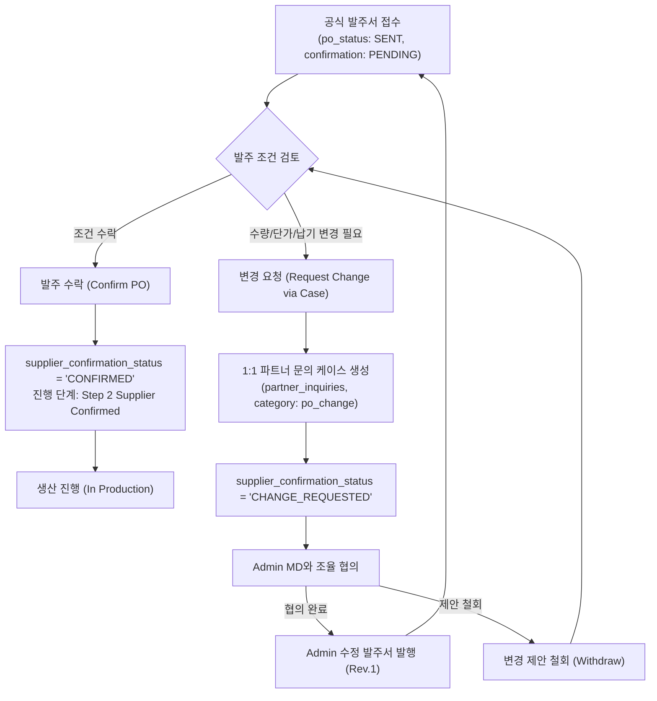
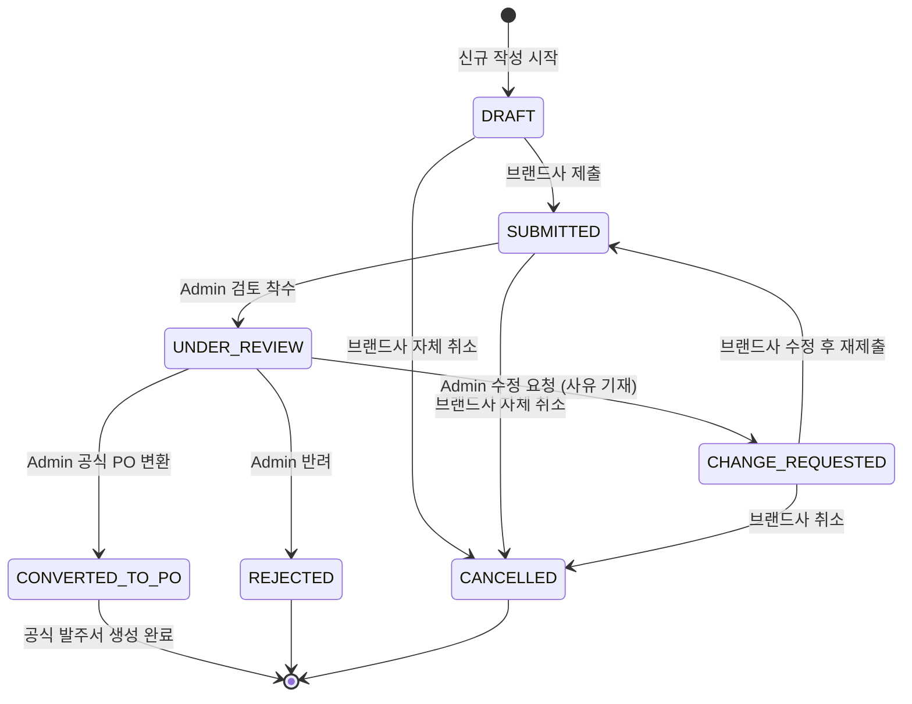
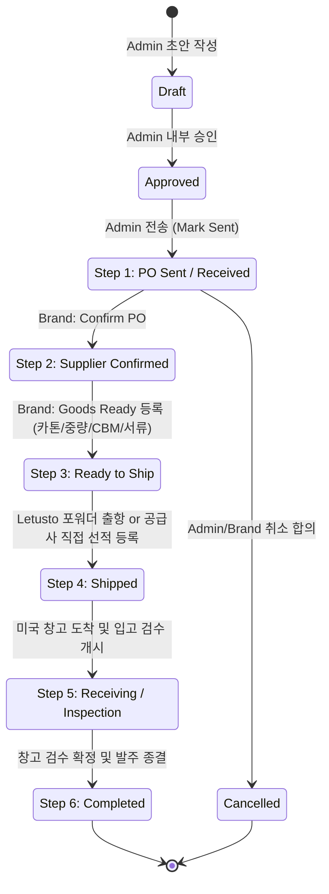
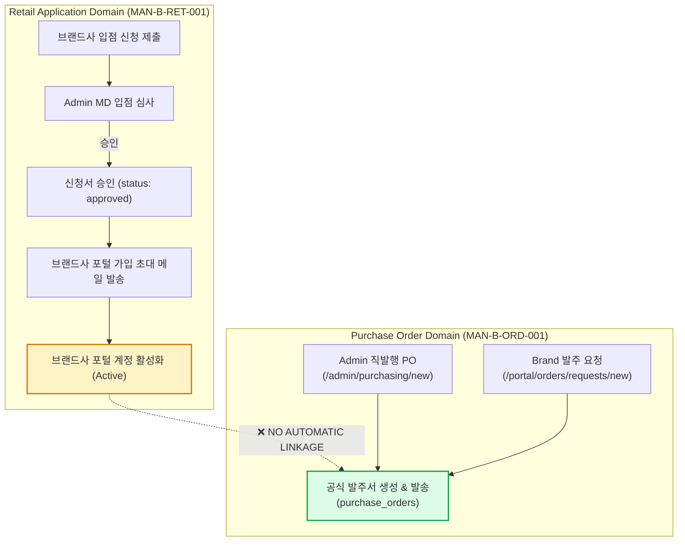
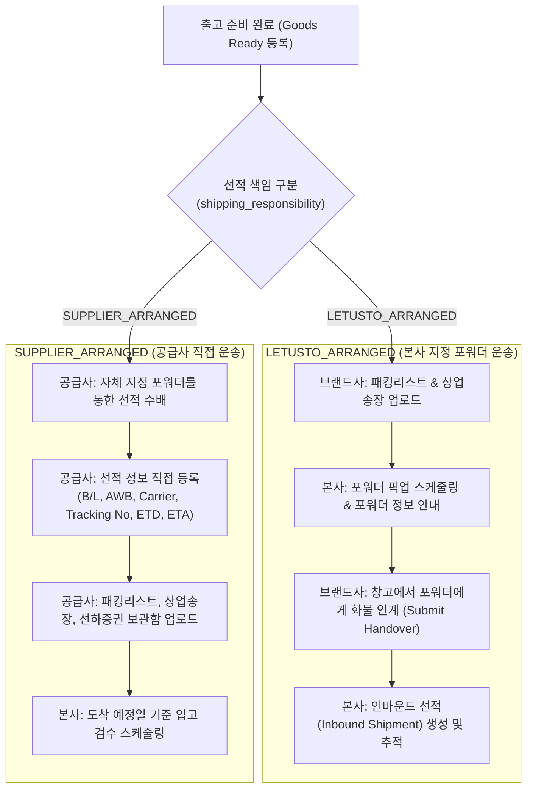
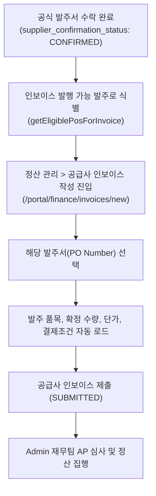

# MAN-B-ORD-001 — Workflow Map
## K SELECT Brand Portal: Purchase Orders & Order Management (비즈니스 워크플로우 맵)

---

## 1. End-to-End Order & Purchasing Lifecycle

---

## 2. PO Creation & Dual-Track Origin Flow

---

## 3. Brand PO Response & Collaboration Flow

---

## 4. Status Lifecycle State Machine

### 4.1 PO Request State Machine (`po_requests.status`)

### 4.2 Purchase Order 6-Step Stepper State Machine

---

## 5. Retail Application & PO Independence (Verification Result)

> **검증 결론**: 입점 신청 승인(`approved`) 시 자동 발주서 생성을 트리거하는 DB Trigger 또는 Server Action은 프로덕션에 존재하지 않음 (**NOT VERIFIED / INDEPENDENT**).

---

## 6. Logistics Responsibility & Handoff Flow

---

## 7. Finance & Invoice Handoff Flow

