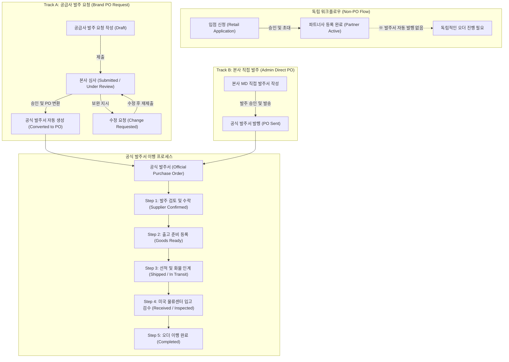
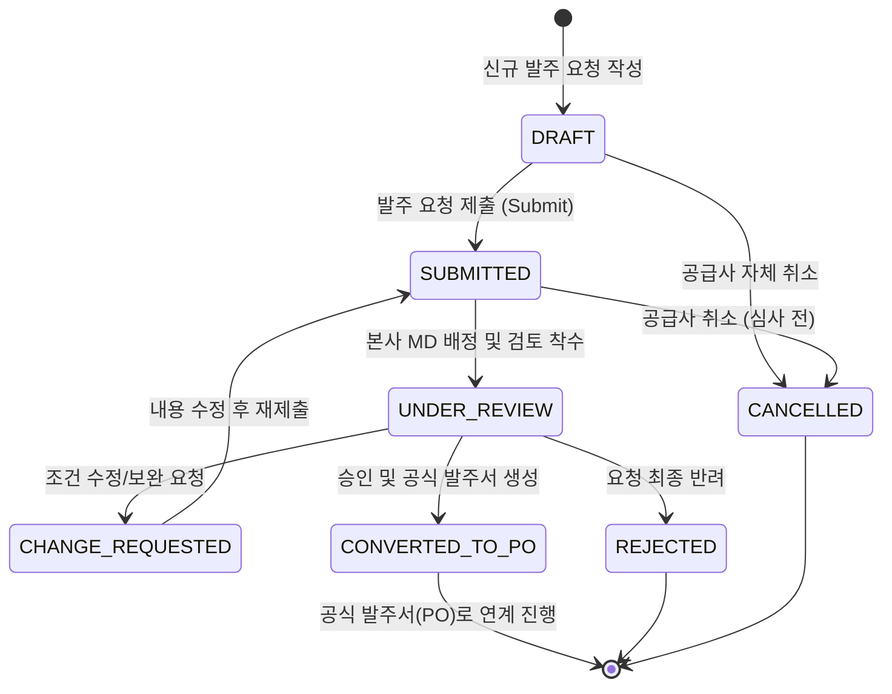
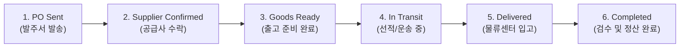
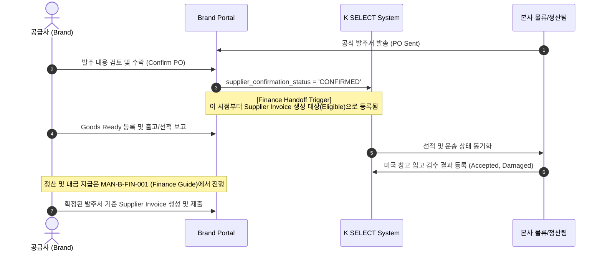

# MAN-B-ORD-001: Order Architecture & Workflow Diagrams

---

## 1. Dual-Track Purchase Order Architecture

K SELECT 플랫폼의 모든 발주는 단일한 **공식 발주서 (Official Purchase Order)** 체계로 수렴되며, 생성 경로는 2가지 트랙으로 운영됩니다.



> **[핵심 경계 원칙]**
> - **Retail Application Approval ≠ Automatic Purchase Order Creation**: 입점 신청 승인은 브랜드와 상품의 판매 적격성을 승인하는 절차이며, 발주서(PO)를 자동으로 발행하지 않습니다.
> - **Official Purchase Order Single Source**: 발주 요청(Track A)이 승인되거나 본사가 직접 발주(Track B)할 때 생성되는 발주서는 완전히 동일한 `purchase_orders` 엔티티로 관리됩니다.

---

## 2. PO Request Lifecycle State Machine (발주 요청 상태 전이도)



---

## 3. Official Purchase Order 6-Step Integrated Lifecycle

공식 발주서(`purchase_orders`)는 생성부터 정산/완료까지 6단계 라이프사이클로 추적됩니다.



---

## 4. Logistics Responsibility Split (선적 책임별 물류 처리 분기)

발주서에 지정된 `shipping_responsibility`에 따라 공급사의 출고 처리 방식이 달라집니다.

```mermaid
flowchart TD
    GR["공급사 출고 준비 등록 (Goods Ready)<br/>실측 CBM, 중량, 카톤수, P/L, C/I 업로드"] --> CHECK_RESP{"선적 책임 구분<br/>(shipping_responsibility)"}

    CHECK_RESP -->|LETUSTO_ARRANGED<br/>(본사/포워더 지정 운송)| LETUSTO_FLOW["1. 본사 지정 포워더 픽업 예약<br/>2. 포워더 화물 인계 보고 (Submit Handover)<br/>3. 본사 물류팀 B/L 및 운송 추적 관리"]
    
    CHECK_RESP -->|SUPPLIER_ARRANGED<br/>(공급사 자체 운송)| SUPPLIER_FLOW["1. 공급사 운송사 직접 섭외<br/>2. 선적 정보 입력 (선사, B/L, 추적번호, ETD/ETA)<br/>3. 선적 완료 보고 및 서류 등록"]

    LETUSTO_FLOW --> INBOUND["미국 물류센터 입고 검수 진행"]
    SUPPLIER_FLOW --> INBOUND
```

---

## 5. Finance Handoff Sequence Diagram (정산 연계 흐름)


