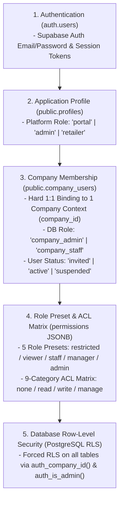

# MAN-B-PERM-001: Source Collection & Technical Audit Report
## Permissions & User Management Guide (사용자, 역할 및 권한 관리 가이드)

**Manual ID:** `MAN-B-PERM-001`  
**Topic:** Permissions, Roles, User Lifecycle & Tenant Isolation (사용자, 역할 및 권한 관리)  
**Audience:** Brand Portal Company Owner / Admin / Authorized Brand Users (`B — Brand Portal User`)  
**Phase:** `01_SOURCE — SOURCE AUDIT & COLLECTION ONLY`  
**Authoritative Reference:** Production Codebase, Database Schema, Server Actions, RLS Policies & Live UI

---

## 1. Executive Summary & Audit Scope

This document establishes the verified **Source of Truth** for User Management, Access Control Lists (ACL), Role-Based Access Control (RBAC), Team Invitation Lifecycles, and Multi-Tenant Security across the K SELECT NETWORK platform.

### Audited Surfaces & Components
1. **Brand Portal User Management**:
   - `/portal/company/users` (`app/portal/company/users/page.tsx`, `components/company/company-users-manager.tsx`, `components/company/invite-user-form.tsx`, `components/company/company-acl-matrix-editor.tsx`)
2. **Brand Portal Self-Service Account & Profile**:
   - `/portal/account` (`app/portal/account/page.tsx`, `components/portal/my-account-view.tsx`, `lib/portal/account-actions.ts`)
3. **Invitation Acceptance & Password Onboarding**:
   - `/portal/invite/accept` (`app/portal/invite/accept/page.tsx`, `lib/company/invite-actions.ts`)
4. **Access Control Layer & Security Enforcement**:
   - `lib/company/permissions.ts`, `lib/permissions/brand-portal-acl.ts`, `lib/company/dal.ts`, `lib/auth/dal.ts`, `lib/auth/impersonation.ts`
5. **6 Official Operational Task Assignments**:
   - `lib/company/task-actions.ts`, `lib/company/task-constants.ts`, `public.company_task_assignments`
6. **Admin Brand Company User Management Boundary**:
   - `/admin/companies/[id]` (`app/admin/companies/[id]/page.tsx`, `components/admin/company-detail-manager.tsx`, `lib/company/admin-actions.ts`)
7. **Database Migrations & Security Policies**:
   - `0001_init_auth_profiles.sql`, `0002_companies.sql`, `0017_unified_company_users_permissions.sql`, `0036_company_task_assignments.sql`, `0120_brand_portal_invitation_template.sql`, `0122_company_users_english_name.sql`, `0125_admin_invite_brand_activation_guard.sql`

---

## 2. Authentication, Membership, Role & ACL Layer Separation

In K SELECT NETWORK, access control is divided into **5 distinct architectural layers**:



| Layer | System Entity | Primary Responsibility | Rejection/Bypass Behavior |
| :--- | :--- | :--- | :--- |
| **1. Authentication** | `auth.users` | Verify email credentials and issue JWT / secure session cookies. | Redirects to `/portal/login?reason=session_expired`. |
| **2. Profile & Role** | `public.profiles` | Distinguish platform partition (`role: 'portal' \| 'admin' \| 'retailer'`). | Rejects cross-partition access (`/portal/login?reason=role_mismatch`). |
| **3. Company Membership** | `public.company_users` | Bind user to exactly one `company_id`. Status check (`active`). | Rejects inactive/unbound users (`/portal/login?reason=membership_inactive`). |
| **4. Role Presets & ACL Matrix** | `permissions` JSONB | Define granular permissions for 9 portal menu categories across 4 access levels. | UI hides/locks menus; Server Actions throw `requirePortalPermission` error. |
| **5. Database RLS** | PostgreSQL RLS | Kernel-level data isolation so SQL queries only return tenant's own records. | Returns empty set or raises RLS violation if queried directly. |

---

## 3. Verified Role & Permission Model

### 3.1 Database Membership Enum (`company_users.company_role`)
The relational database layer enforces two membership roles:
- `company_admin`: Company Owner / Administrator with unrestricted management rights over the company's portal and users.
- `company_staff`: Company Member / Staff whose access is governed by the granular `permissions` JSONB payload.

### 3.2 5 Canonical Role Presets (`BrandPortalRole`)
Defined authoritatively in `lib/permissions/brand-portal-acl.ts`:

```typescript
export type BrandPortalRole = "restricted" | "viewer" | "staff" | "manager" | "admin";
```

1. **`restricted` (접근 제한 / Access Restricted)**:
   - All 9 business categories set to `none`.
   - Cannot view products, orders, applications, finance, or company details.
   - Only `/portal/account` (My Account) can be accessed.
2. **`viewer` (조회 사용자 / Viewer)**:
   - Operational categories (`application`, `brands`, `products`, `orders`, `finance`, `support`, `company_info`) set to `read`.
   - Sensitive categories (`bank_info`, `agreements`) set to `none`.
   - **Default preset when inviting a new team member**.
3. **`staff` (담당자 / Staff)**:
   - Operational categories (`application`, `brands`, `products`, `orders`, `support`) set to `write`.
   - `finance` and `company_info` set to `read`.
   - Sensitive categories (`bank_info`, `agreements`) set to `none`.
4. **`manager` (매니저 / Manager)**:
   - `products`, `orders`, `support` set to `manage`.
   - `application`, `brands`, `finance`, `company_info` set to `write`.
   - `bank_info` and `agreements` set to `read`.
5. **`admin` (관리자 / Admin)**:
   - All 9 categories set to `manage`.
   - Full authority to create, edit, delete, invite users, configure ACLs, and assign tasks.

### 3.3 4 ACL Levels (`AclLevel`)
```typescript
export type AclLevel = "none" | "read" | "write" | "manage";

export const ACL_LEVEL_NUMERIC: Record<AclLevel, number> = {
  none: 0,    // 접근불가 (No Access)
  read: 1,    // 조회전용 (Read Only)
  write: 2,   // 생성/수정 (Create/Edit)
  manage: 3,  // 생성/수정/삭제 (Create/Edit/Delete)
};
```

### 3.4 9 Canonical ACL Categories (`AclCategory`)
1. `application` (입점 신청서 / Partnership Application): 입점 신청 내역 및 심사 진행 상태 조회/관리.
2. `brands` (브랜드 관리 / Brand Management): 브랜드 등록, 로고 및 상표권/프로필 관리.
3. `products` (제품 관리 / Product Management): 제품 등록, 속성, 바코드(UPC/EAN) 및 규제 정보 관리.
4. `orders` (주문 관리 / Order Management): 발주서(PO) 조회, PO 요청 및 선적/배송 현황 관리.
5. `finance` (정산 / 인보이스 / Finance & Invoices): 공급사 정산 내역 및 인보이스(Invoice) 발행/조회.
6. `support` (문의 지원 / 1:1 Support): 1:1 문의 접수 및 답변 확인.
7. `company_info` (회사 기본 정보 / Company Basic Info): 회사 기본 정보, 사업자등록번호, 주소 및 주요 담당자 정보 관리.
8. `bank_info` (송금 계좌 정보 / Remittance Bank Info): 정산 대금 입금용 은행 계좌 정보 관리.
9. `agreements` (계약 및 문서 / Agreements & Documents): 체결된 전자 기본계약서 및 법적 서류 확인/다운로드.

### 3.5 Role Preset vs 9-Category Default ACL Matrix
| ACL Category | Restricted (`restricted`) | Viewer (`viewer`, Default) | Staff (`staff`) | Manager (`manager`) | Admin (`admin`) |
| :--- | :---: | :---: | :---: | :---: | :---: |
| **`application`** (입점 신청서) | `none` (0) | `read` (1) | `write` (2) | `write` (2) | `manage` (3) |
| **`brands`** (브랜드 관리) | `none` (0) | `read` (1) | `write` (2) | `write` (2) | `manage` (3) |
| **`products`** (제품 관리) | `none` (0) | `read` (1) | `write` (2) | `manage` (3) | `manage` (3) |
| **`orders`** (주문 관리) | `none` (0) | `read` (1) | `write` (2) | `manage` (3) | `manage` (3) |
| **`finance`** (정산 / 인보이스) | `none` (0) | `read` (1) | `read` (1) | `write` (2) | `manage` (3) |
| **`support`** (문의 지원) | `none` (0) | `read` (1) | `write` (2) | `manage` (3) | `manage` (3) |
| **`company_info`** (회사 기본 정보) | `none` (0) | `read` (1) | `read` (1) | `write` (2) | `manage` (3) |
| **`bank_info`** (송금 계좌 정보) | `none` (0) | `none` (0) | `none` (0) | `read` (1) | `manage` (3) |
| **`agreements`** (계약 및 문서) | `none` (0) | `none` (0) | `none` (0) | `read` (1) | `manage` (3) |

> [!NOTE]
> Company Admin은 `CompanyAclMatrixEditor`를 통해 특정 프리셋을 선택한 후, 9개 카테고리 라디오 버튼을 개별적으로 오버라이드하여 사용자 맞춤 권한을 커스텀 부여할 수 있습니다.

---

## 4. 6 Official Operational Task Assignments Data Model

Defined authoritatively in `lib/company/task-constants.ts` and managed via `public.company_task_assignments`:

| Task Code | Korean Label | Description & Scope | Primary Enforcement | Email Notify Option |
| :--- | :--- | :--- | :---: | :---: |
| `company_apply` | 회사·신청 | 회사 정보, 브랜드 등록, 입점 신청, 보완 및 심사 관련 업무 | Unique per company | Supported (Boolean) |
| `contract` | 계약 | 계약서 확인, 계약 조건 검토, 서명 및 갱신 관련 업무 | Unique per company | Supported (Boolean) |
| `product_cert` | 제품·콘텐츠·인증 | 제품 정보, 콘텐츠, 이미지, 성분, 인증 및 규제 서류 관련 업무 | Unique per company | Supported (Boolean) |
| `pricing_quote` | 가격·견적 | 공급가격, 원가, 견적, 가격 검토 및 승인 관련 업무 | Unique per company | Supported (Boolean) |
| `logistics_inventory` | 발주·물류·재고 | 발주, 생산, 선적, 입고, 물류 및 재고 관련 업무 | Unique per company | Supported (Boolean) |
| `settlement_inquiry` | 정산·문의 | 인보이스, 지급, 정산, 일반 문의 및 이슈 대응 업무 | Unique per company | Supported (Boolean) |

- **Primary Assignment Constraint**: `company_task_assignments_unique_primary` unique partial index enforces that only **one active primary user** can be designated per task code per company.
- **Suspension Safety Check**: When a user is suspended (`status: 'suspended'`), `handleUserSuspensionTaskCheck()` automatically clears their primary designations to avoid orphan primary tasks.

---

## 5. End-to-End User Invitation & Lifecycle Workflow

### 5.1 Invitation Lifecycle States
```typescript
export type CompanyUserStatus = "invited" | "active" | "suspended";
```
- **`invited` (초대 대기중)**: Invitation email sent; pending password setup. Valid for 7 days (`INVITE_EXPIRY_DAYS = 7`).
- **`active` (정상 이용 / 가입완료)**: Password set; user can log in and perform actions according to ACL.
- **`suspended` (이용 일시정지)**: Login session deactivated; blocked at DAL layer (`membership_inactive`).

### 5.2 Invitation Step-by-Step Flow
1. **Initiation**: Company Admin enters Invitee details (English First/Last Name required, Korean names optional, Email required, Role Preset & ACL Matrix) on `/portal/company/users`.
2. **Email Duplicate Verification**: `checkUserEmailDuplicate(email, companyId)` verifies that the email is not already bound to another company or active in the same company.
3. **Auth User Creation & Token Generation**: `admin.auth.admin.generateLink({ type: 'invite' | 'magiclink', redirectTo: '/portal/invite/accept' })` creates the authentication user and secure single-use token.
4. **Company Users Record Creation**: `company_users` row inserted with `status = 'invited'`, `company_role`, `permissions`, and `invited_at = now()`.
5. **Branded Email Dispatch**: Custom HTML email dispatched via Resend (`renderEmailHtml` with `key: 'portal_signup_request'`) containing secure CTA button link.
6. **Invitee Acceptance**: Invitee opens email link $\rightarrow$ `/portal/invite/accept` $\rightarrow$ sets password conforming to `passwordSchema` (min 8 chars, uppercase, lowercase, number, special char).
7. **Activation & Mandatory Re-Login**: `completeInviteAcceptance()` sets `company_users.status = 'active'`, `joined_at = now()`, terminates temporary setup session, and redirects to `/portal/login?reason=invited_activated`.

### 5.3 Re-invite, Cancel & Member Removal
- **Re-invite (`reinviteCompanyUser`)**: For expired invitations (>7 days) or lost emails, Admin triggers a new token link and resets `invited_at = now()`.
- **Cancel Invite (`cancelCompanyUserInvite`)**: Deletes `company_users` row and pending `auth.users` identity before acceptance.
- **Member Removal (`removeCompanyMember`)**:
  - Removes company membership (`company_users` row) and task assignments.
  - **Owner Protection**: Initial Owner / earliest created admin cannot be removed.
  - **Last Admin Protection**: Cannot remove the last remaining active admin.
  - **Self-Removal Protection**: User cannot remove their own account.
  - Does NOT hard-delete the global `auth.users` account to preserve audit integrity.

---

## 6. Tenant Security & Database Isolation (RLS Audit)

### 6.1 Strict 1:1 Company Binding
- `company_users.id` primary key directly references `public.profiles(id)` (which references `auth.users(id)`).
- A single user account can belong to **exactly one brand company** at any time. Multi-company membership for a single email is structurally impossible and prevented by database foreign key and email uniqueness constraints.

### 6.2 PostgreSQL Row-Level Security (RLS) Helper Functions
1. `public.auth_is_admin()`: Returns `true` if `auth.uid()` has `profiles.role = 'admin'` (Letusto internal staff).
2. `public.auth_company_id()`: Returns the calling user's `company_id` from `public.company_users`.

### 6.3 Security Policy Enforcement Pattern
All multi-tenant business tables (`companies`, `brands`, `products`, `applications`, `purchase_orders`, `supplier_invoices`, `company_task_assignments`) enforce:
```sql
ALTER TABLE public.<table_name> ENABLE ROW LEVEL SECURITY;
ALTER TABLE public.<table_name> FORCE ROW LEVEL SECURITY;

CREATE POLICY "<table_name>_select"
  ON public.<table_name> FOR SELECT
  TO authenticated
  USING (company_id = public.auth_company_id() OR public.auth_is_admin());
```
- Brand users can **never** query or modify rows belonging to another `company_id`.
- Server Actions additionally invoke `requireCompanyMembership()` and `requirePortalPermission()` before executing business logic.

---

## 7. Answers to Critical Audit Questions (Section 15)

1. **Brand Company에서 누가 사용자를 초대할 수 있는가?**  
   $\rightarrow$ `company_admin` 권한을 가진 사용자만 팀원을 초대할 수 있습니다 (`requireCompanyAdmin()` 강제).
2. **누가 Role을 변경할 수 있는가?**  
   $\rightarrow$ `company_admin` 권한자 또는 K SELECT 어드민 직원만 팀원의 Role 및 ACL 권한을 수정할 수 있습니다.
3. **Permission은 Role 기반인가, User 개별 기반인가, 둘 다인가?**  
   $\rightarrow$ **둘 다 지원하는 하이브리드 모델**입니다. 5가지 Role Preset(`restricted`, `viewer`, `staff`, `manager`, `admin`)을 선택하면 기본 ACL이 자동 세팅되며, 9개 카테고리별로 개별 오버라이드가 가능합니다.
4. **한 User가 여러 Company에 속할 수 있는가?**  
   $\rightarrow$ **불가능합니다 (1 User = 1 Company)**. `company_users.id`가 `profiles.id`와 1:1 PK-FK 관계로 바인딩되어 있습니다.
5. **Company Owner 개념이 실제로 존재하는가?**  
   $\rightarrow$ 네, 존재합니다. 최초 가입자(또는 가장 먼저 생성된 `company_admin`)는 Initial Owner로 식별되며 삭제/비활성화가 보호됩니다.
6. **Owner를 제거하거나 비활성화할 수 있는가?**  
   $\rightarrow$ **제거 및 비활성화 불가**합니다. `removeCompanyMember()`에서 Initial Owner 삭제 시 에러를 반환합니다.
7. **Pending Invitation은 만료되는가?**  
   $\rightarrow$ 네, 발송 후 7일(`INVITE_EXPIRY_DAYS = 7`)이 지나면 UI에 `초대만료`로 표시되며 토큰이 무효화됩니다.
8. **Invitation resend/revoke가 구현되어 있는가?**  
   $\rightarrow$ 네, `재초대`(`reinviteCompanyUser`) 및 `초청 취소`(`cancelCompanyUserInvite`)가 완전히 구현되어 있습니다.
9. **User deactivation 시 기존 데이터 ownership은 어떻게 되는가?**  
   $\rightarrow$ 데이터(제품, 발주, 인보이스)는 유저 개인이 아닌 `company_id` 단위로 귀속되므로 유저가 비활성화/제거되어도 회사 데이터는 그대로 보존됩니다. 단, 담당 업무 주 담당자 지정은 해제됩니다.
10. **Permission 변경은 즉시 적용되는가?**  
    $\rightarrow$ 네, 다음 요청 또는 페이지 이동 시 `getPortalUserAcl()`이 `company_users.permissions`를 즉시 조회하므로 실시간 반영됩니다. Role 변경 또는 계정 비활성화 시 `deactivateUserSessions()`를 통해 기존 세션이 즉시 무효화됩니다.
11. **Server Action에서도 permission 검사가 이루어지는가?**  
    $\rightarrow$ 네, 모든 핵심 Server Action 최상단에서 `requirePortalPermission(category, level)`을 호출하여 권한 부족 시 에러를 발생시킵니다.
12. **RLS가 company isolation을 강제하는가?**  
    $\rightarrow$ 네, PostgreSQL `FORCE ROW LEVEL SECURITY` 정책과 `auth_company_id()`를 통해 DB 커널 레벨에서 타사 데이터 조회가 원천 차단됩니다.
13. **Admin은 Brand tenant data에 어떤 방식으로 접근하는가?**  
    $\rightarrow$ Letusto 내부 직원은 `auth_is_admin()` RLS 정책을 통해 관리자 화면에서 전체 조회가 가능하며, 필요 시 `Impersonation`(지원 세션)을 통해 브랜드 포털 화면을 동일하게 검토할 수 있습니다.
14. **Audit Log에 User/Permission 변경이 기록되는가?**  
    $\rightarrow$ 담당 업무 배정 변경은 `company_task_assignment_logs` 테이블에 자동 기록됩니다.
15. **현재 구현되지 않은 Permission 기능은 무엇인가?**  
    $\rightarrow$ 사용자 정의 커스텀 카테고리 생성 기능, IP 기반 접속 제한, 사외 2차 인증(MFA) 강제 정책은 현재 지원되지 않습니다 (SYSTEM GAP).

---

## 8. Source Classification & Audit Summary

- **VERIFIED SYSTEM BEHAVIOR**:
  - 5 Role Presets (`restricted`, `viewer`, `staff`, `manager`, `admin`)
  - 4 ACL Levels (`none`, `read`, `write`, `manage`)
  - 9 ACL Categories (`application`, `brands`, `products`, `orders`, `finance`, `support`, `company_info`, `bank_info`, `agreements`)
  - 6 Assigned Tasks (`company_apply`, `contract`, `product_cert`, `pricing_quote`, `logistics_inventory`, `settlement_inquiry`)
  - 7-day invitation expiration, re-invite, cancel invite, member removal protection
  - Self-service My Account profile & password change
  - PostgreSQL RLS tenant isolation (`auth_company_id()`, `auth_is_admin()`)
- **SYSTEM GAP / NOT IMPLEMENTED**:
  - MFA / 2-Factor Authentication enforcement for brand users
  - Custom user-created permission categories
  - IP-based access allowlisting

---
*End of MAN-B-PERM-001 Source Collection Report*
