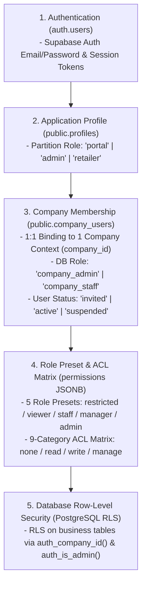

# MAN-B-PERM-001: Source Collection & Technical Audit Report
## Permissions & User Management Guide (사용자, 역할 및 권한 관리 가이드)

**Manual ID:** `MAN-B-PERM-001`  
**Topic:** Permissions, Roles, User Lifecycle & Tenant Isolation (사용자, 역할 및 권한 관리)  
**Audience:** Brand Portal Company Owner / Admin / Authorized Brand Users (`B — Brand Portal User`)  
**Phase:** `01_SOURCE — FINAL SOURCE INTEGRITY REVIEW (R1)`  
**Authoritative Reference:** Production Codebase, Database Schema, Server Actions, RLS Policies & Live UI

---

## 1. Executive Summary & Audited Surfaces

This document establishes the verified technical **Source of Truth** for User Management, Access Control Lists (ACL), Role-Based Access Control (RBAC), Team Invitation Lifecycles, and Multi-Tenant Security across the K SELECT NETWORK platform.

### Verified Surfaces & Components
1. **Brand Portal User Management**:
   - `/portal/company/users` (`app/portal/company/users/page.tsx`, `components/company/company-users-manager.tsx`, `components/company/invite-user-form.tsx`, `components/company/company-acl-matrix-editor.tsx`)
2. **Brand Portal Self-Service Account & Profile**:
   - `/portal/account` (`app/portal/account/page.tsx`, `components/portal/my-account-view.tsx`, `lib/portal/account-actions.ts`)
3. **Invitation Acceptance & Password Setup**:
   - `/portal/invite/accept` (`app/portal/invite/accept/page.tsx`, `lib/company/invite-actions.ts`)
4. **Access Control Layer & Security Enforcement**:
   - `lib/company/permissions.ts`, `lib/permissions/brand-portal-acl.ts`, `lib/company/dal.ts`, `lib/auth/dal.ts`, `lib/auth/impersonation.ts`
5. **6 Operational Task Assignments**:
   - `lib/company/task-actions.ts`, `lib/company/task-constants.ts`, `public.company_task_assignments`
6. **Admin Brand Company User Management Boundary**:
   - `/admin/companies/[id]` (`app/admin/companies/[id]/page.tsx`, `components/admin/company-detail-manager.tsx`, `lib/company/admin-actions.ts`)
7. **Database Migrations & Security Policies**:
   - `0001_init_auth_profiles.sql`, `0002_companies.sql`, `0017_unified_company_users_permissions.sql`, `0036_company_task_assignments.sql`, `0120_brand_portal_invitation_template.sql`, `0122_company_users_english_name.sql`, `0125_admin_invite_brand_activation_guard.sql`

---

## 2. Authentication, Membership, Role & ACL Layer Separation

Access control in K SELECT NETWORK is structured into **5 distinct architectural layers**:



| Layer | System Entity | Primary Responsibility | Rejection/Bypass Behavior |
| :--- | :--- | :--- | :--- |
| **1. Authentication** | `auth.users` | Verify email credentials and issue JWT / secure session cookies. | Redirects to `/portal/login?reason=session_expired`. |
| **2. Application Profile** | `public.profiles` | Distinguish platform partition (`role: 'portal' \| 'admin' \| 'retailer'`). | Rejects cross-partition access (`/portal/login?reason=role_mismatch`). |
| **3. Company Membership** | `public.company_users` | Bind user to single `company_id`. Status check (`status: 'active'`). | Rejects inactive/unbound users (`/portal/login?reason=membership_inactive`). |
| **4. Role Presets & ACL Matrix** | `permissions` JSONB | Define granular permissions for 9 portal menu categories across 4 access levels. | UI hides/locks menus; Server Actions throw `requirePortalPermission` error. |
| **5. Database RLS** | PostgreSQL RLS | Kernel-level data isolation so SQL queries return tenant's own records. | Returns empty set or raises RLS violation if queried directly with user client. |

---

## 3. Verified Role & Permission Architecture

### 3.1 Two Distinct Role Layers

```text
┌────────────────────────────────────────────────────────────────────────┐
│ Layer A: Database Membership Role (company_users.company_role)          │
│ - Value: 'company_admin' | 'company_staff'                             │
│ - Storage: Relational DB column (Enforced via check constraint)        │
│ - Scope: System-level admin rights vs staff membership                 │
└────────────────────────────────────────────────────────────────────────┘
                                    │
                                    ▼
┌────────────────────────────────────────────────────────────────────────┐
│ Layer B: Brand Portal Role Presets (BrandPortalRole)                   │
│ - Value: 'restricted' | 'viewer' | 'staff' | 'manager' | 'admin'       │
│ - Storage: permissions->preset JSONB property (or runtime resolution)  │
│ - Scope: Pre-populates default ACL levels across 9 menu categories     │
│ - Final Effective Permissions: Determined by individual category levels │
└────────────────────────────────────────────────────────────────────────┘
```

- **`company_admin`**: Automatically bypasses category-level ACL checks at runtime, granting full `manage` access to all categories for their own company (`lib/company/permissions.ts`).
- **`company_staff`**: Governed by the resolved 9-category ACL matrix stored in `company_users.permissions`.

### 3.2 5 Canonical Role Presets (`BrandPortalRole`)
Defined in `lib/permissions/brand-portal-acl.ts`:

```typescript
export type BrandPortalRole = "restricted" | "viewer" | "staff" | "manager" | "admin";
```

1. **`restricted` (접근 제한 / Access Restricted)**:
   - All 9 business categories set to `none`.
   - Cannot view products, orders, applications, finance, or company details.
   - Only `/portal/account` (My Account) can be accessed.
2. **`viewer` (조회 사용자 / Viewer)**:
   - Operational categories (`application`, `brands`, `products`, `orders`, `finance`, `support`, `company_info`) set to `read`.
   - Sensitive categories (`bank_info`, `agreements`) set to `none`.
   - **Default preset when inviting a new team member**.
3. **`staff` (담당자 / Staff)**:
   - Operational categories (`application`, `brands`, `products`, `orders`, `support`) set to `write`.
   - `finance` and `company_info` set to `read`.
   - Sensitive categories (`bank_info`, `agreements`) set to `none`.
4. **`manager` (매니저 / Manager)**:
   - `products`, `orders`, `support` set to `manage`.
   - `application`, `brands`, `finance`, `company_info` set to `write`.
   - `bank_info` and `agreements` set to `read`.
5. **`admin` (관리자 / Admin)**:
   - All 9 categories set to `manage`.
   - Maps to `company_admin` membership role upon save.

### 3.3 4 ACL Levels (`AclLevel`)
```typescript
export type AclLevel = "none" | "read" | "write" | "manage";

export const ACL_LEVEL_NUMERIC: Record<AclLevel, number> = {
  none: 0,    // 접근불가 (No Access)
  read: 1,    // 조회전용 (Read Only)
  write: 2,   // 생성/수정 (Create/Edit)
  manage: 3,  // 생성/수정/삭제 (Create/Edit/Delete)
};
```

### 3.4 9 Canonical ACL Categories (`AclCategory`)
1. `application` (입점 신청서 / Partnership Application): 입점 신청 내역 및 심사 진행 상태 조회/관리.
2. `brands` (브랜드 관리 / Brand Management): 브랜드 등록, 로고 및 상표권/프로필 관리.
3. `products` (제품 관리 / Product Management): 제품 등록, 속성, 바코드(UPC/EAN) 및 규제 정보 관리.
4. `orders` (주문 관리 / Order Management): 발주서(PO) 조회, PO 요청 및 선적/배송 현황 관리.
5. `finance` (정산 / 인보이스 / Finance & Invoices): 공급사 정산 내역 및 인보이스(Invoice) 발행/조회.
6. `support` (문의 지원 / 1:1 Support): 1:1 문의 접수 및 답변 확인.
7. `company_info` (회사 기본 정보 / Company Basic Info): 회사 기본 정보, 사업자등록번호, 주소 및 주요 담당자 정보 관리.
8. `bank_info` (송금 계좌 정보 / Remittance Bank Info): 정산 대금 입금용 은행 계좌 정보 관리.
9. `agreements` (계약 및 문서 / Agreements & Documents): 체결된 전자 기본계약서 및 법적 서류 확인/다운로드.

### 3.5 Role Preset vs 9-Category Default ACL Matrix
| ACL Category | Restricted (`restricted`) | Viewer (`viewer`, Default) | Staff (`staff`) | Manager (`manager`) | Admin (`admin`) |
| :--- | :---: | :---: | :---: | :---: | :---: |
| **`application`** (입점 신청서) | `none` (0) | `read` (1) | `write` (2) | `write` (2) | `manage` (3) |
| **`brands`** (브랜드 관리) | `none` (0) | `read` (1) | `write` (2) | `write` (2) | `manage` (3) |
| **`products`** (제품 관리) | `none` (0) | `read` (1) | `write` (2) | `manage` (3) | `manage` (3) |
| **`orders`** (주문 관리) | `none` (0) | `read` (1) | `write` (2) | `manage` (3) | `manage` (3) |
| **`finance`** (정산 / 인보이스) | `none` (0) | `read` (1) | `read` (1) | `write` (2) | `manage` (3) |
| **`support`** (문의 지원) | `none` (0) | `read` (1) | `write` (2) | `manage` (3) | `manage` (3) |
| **`company_info`** (회사 기본 정보) | `none` (0) | `read` (1) | `read` (1) | `write` (2) | `manage` (3) |
| **`bank_info`** (송금 계좌 정보) | `none` (0) | `none` (0) | `none` (0) | `read` (1) | `manage` (3) |
| **`agreements`** (계약 및 문서) | `none` (0) | `none` (0) | `none` (0) | `read` (1) | `manage` (3) |

> [!NOTE]
> **Per-Category Override Verification**:
> Role Preset은 초기 템플릿 역할을 수행합니다. 사용자가 UI에서 특정 카테고리의 라디오 버튼(예: `bank_info`를 `read`로 변경)을 수정하면, 변경된 레벨이 `company_users.permissions` JSONB에 저장되고 `normalizePermissions()`를 통해 런타임에 최종 유효 권한으로 적용됩니다.

---

## 4. Server-Side Authorization Enforcement Coverage

Server-side authorization is implemented through modular checks rather than a single uniform wrapper:

1. **Company Membership Validation (`requireCompanyMembership`)**:
   - Executed across all Brand Portal Server Actions to verify that the session user has an active record in `company_users` and resolve `companyId`.
2. **Company Admin Enforcement (`requireCompanyAdmin`)**:
   - Enforced on administrative actions including inviting users (`inviteCompanyUser`), re-inviting (`reinviteCompanyUser`), canceling invitations (`cancelCompanyUserInvite`), removing members (`removeCompanyMember`), and updating user roles/permissions (`updateCompanyUser`).
3. **Category ACL Enforcement (`requirePortalPermission` / `hasPortalPermission`)**:
   - Explicitly called in permission-sensitive mutation actions:
     - `lib/product/actions.ts`: `requirePortalPermission("products", "write")` / `requirePortalPermission("products", "manage")`
     - `lib/brand/actions.ts`: `requirePortalPermission("brands", "write")`
     - `lib/application/actions.ts`: `requirePortalPermission("application", "write")`
     - `lib/purchase-order/request-actions.ts`: `requirePortalPermission("orders", "write")`
     - `lib/purchase-order/document-actions.ts`: `requirePortalPermission("orders", "write")`
     - `lib/company/portal-actions.ts`: `requirePortalPermission("company_info", "write")`
     - `lib/company/task-actions.ts`: `requirePortalPermission("company_info", "write")`
     - `lib/agreement/actions.ts`: `requirePortalPermission("agreements", "read")`
4. **Data Query Filtering & RLS**:
   - Portal page loaders and read queries evaluate `hasPortalPermission(category, "read")` for UI rendering and rely on PostgreSQL RLS (`company_id = auth_company_id()`) to scope returned records.

---

## 5. 6 Operational Task Assignments vs Roles & Permissions

Defined in `lib/company/task-constants.ts` and stored in `public.company_task_assignments`:

| Task Code | Korean Label | Description & Scope | Primary Constraint | Email Notify Option |
| :--- | :--- | :--- | :---: | :---: |
| `company_apply` | 회사·신청 | 회사 정보, 브랜드 등록, 입점 신청, 보완 및 심사 관련 업무 | 1 Primary per company | Boolean |
| `contract` | 계약 | 계약서 확인, 계약 조건 검토, 서명 및 갱신 관련 업무 | 1 Primary per company | Boolean |
| `product_cert` | 제품·콘텐츠·인증 | 제품 정보, 콘텐츠, 이미지, 성분, 인증 및 규제 서류 관련 업무 | 1 Primary per company | Boolean |
| `pricing_quote` | 가격·견적 | 공급가격, 원가, 견적, 가격 검토 및 승인 관련 업무 | 1 Primary per company | Boolean |
| `logistics_inventory` | 발주·물류·재고 | 발주, 생산, 선적, 입고, 물류 및 재고 관련 업무 | 1 Primary per company | Boolean |
| `settlement_inquiry` | 정산·문의 | 인보이스, 지급, 정산, 일반 문의 및 이슈 대응 업무 | 1 Primary per company | Boolean |

> [!IMPORTANT]
> **Task Assignment $\neq$ Role $\neq$ ACL Permission**:
> 6대 담당 업무 배정은 **업무별 실무 책임자 지정 및 이메일 알림 수신 라우팅 메타데이터**입니다. 메뉴 접근 권한(ACL)이나 Server Action 실행 권한을 제어하지 않습니다.

---

## 6. User Lifecycle & Invitation Workflow

### 6.1 Invitation Lifecycle States
```typescript
export type CompanyUserStatus = "invited" | "active" | "suspended";
```
- **`invited` (초대 대기중)**: Invitation dispatched; pending password setup.
- **`active` (정상 이용 / 가입완료)**: Password configured; regular portal access.
- **`suspended` (이용 일시정지)**: Session deactivated; login blocked at DAL verification.

### 6.2 7-Day Expiration Enforcement
- **Application Logic (`isInviteExpired`)**: Compares `Date.now() > new Date(invited_at).getTime() + 7 * 24 * 60 * 60 * 1000`.
- **UI State**: Displays `초대만료` badge in red when expired.
- **Auth Provider**: Supabase Auth OTP/magic link expires according to token lifetime.
- **Re-invite Action (`reinviteCompanyUser`)**: Admin can re-issue a fresh token link, resetting `invited_at = now()`.

### 6.3 Account Protections during Member Removal & Downgrade
In `lib/company/invite-actions.ts`:
1. **Self-Removal Protection**: `targetUserId === userId` is blocked with an error.
2. **Initial Owner Protection**: Evaluated as `(!target.invited_by && target.company_role === "company_admin") || target.id === earliestAdminId`. Initial Owner removal is prevented.
3. **Last Admin Protection**: If removing or downgrading an admin, system checks `activeAdmins.length <= 1`. If only one admin remains, action is blocked.
4. **Data Ownership**: Products, orders, and documents are bound to `company_id`, not user UUIDs. User removal deletes membership without deleting company business records.

---

## 7. Multi-Tenant Security, Single-Company Constraint & RLS Scope

### 7.1 Single-Company Membership Enforcement Mechanism
- **Schema Level**: `public.company_users.id` is the Primary Key and Foreign Key referencing `public.profiles(id)` (which references `auth.users(id)`). A user UUID can only have one row in `company_users`, enforcing a single company context per account.
- **Application Level**: `checkUserEmailDuplicate(email, targetCompanyId)` queries both `company_users` and `auth.users` to prevent an email from being invited into multiple companies.

### 7.2 PostgreSQL RLS Policies Scope
Multi-tenant isolation is enforced via RLS helper functions:
- `public.auth_company_id()`: Resolves `company_id` from `company_users` for the logged-in user.
- `public.auth_is_admin()`: Returns `true` for Letusto internal staff (`profiles.role = 'admin'`).

**Tables with Verified RLS Policies**:
`companies`, `company_users`, `brands`, `products`, `applications`, `purchase_orders`, `supplier_invoices`, `supplier_payments`, `company_task_assignments`, `company_task_assignment_logs`, `login_attempts`.

### 7.3 Admin Impersonation (Support Sessions)
- Implemented in `lib/auth/impersonation.ts` and rendered in `components/shared/impersonation-banner.tsx`.
- Letusto Staff can start a verified support session to view Brand Portal data as a target user.
- Uses `createAdminClient()` (Service Role) to bypass RLS while binding queries to `targetCompanyId`.
- A persistent visible banner displays active impersonation status with an "Exit Session" control.

---

## 8. Answers to Section 15 Questions

1. **Brand Company에서 누가 사용자를 초대할 수 있는가?**  
   $\rightarrow$ `company_admin` 권한을 가진 사용자만 초대할 수 있습니다 (`requireCompanyAdmin()` 적용).
2. **누가 Role을 변경할 수 있는가?**  
   $\rightarrow$ `company_admin` 또는 Letusto 어드민 직원만 수정할 수 있습니다.
3. **Permission은 Role 기반인가, User 개별 기반인가, 둘 다인가?**  
   $\rightarrow$ **하이브리드 구조**입니다. Role Preset 선택으로 9개 카테고리 기본값이 지정되며, 카테고리별 개별 라디오 버튼 오버라이드가 지원됩니다.
4. **한 User가 여러 Company에 속할 수 있는가?**  
   $\rightarrow$ **단일 회사 소속만 가능합니다**. `company_users.id` PK-FK 구조 및 `checkUserEmailDuplicate()`에 의해 단일 `company_id`로 제한됩니다.
5. **Company Owner 개념이 실제로 존재하는가?**  
   $\rightarrow$ 별도의 DB enum role이 아니며, `(!invited_by && company_role === 'company_admin') || id === earliestAdminId` 조건으로 판별되는 **도출된 보호 상태(Derived State)**입니다.
6. **Owner를 제거하거나 비활성화할 수 있는가?**  
   $\rightarrow$ `removeCompanyMember()`에서 Initial Owner 삭제가 차단됩니다.
7. **Pending Invitation은 만료되는가?**  
   $\rightarrow$ 발송 후 7일(`INVITE_EXPIRY_DAYS = 7`) 경과 시 애플리케이션 및 UI에서 `초대만료`로 처리됩니다.
8. **Invitation resend/revoke가 구현되어 있는가?**  
   $\rightarrow$ `reinviteCompanyUser` (재초대) 및 `cancelCompanyUserInvite` (초청 취소)가 구현되어 있습니다.
9. **User deactivation 시 기존 데이터 ownership은 어떻게 되는가?**  
   $\rightarrow$ 데이터는 `company_id`에 귀속되므로 보존되며, 해당 사용자의 주 담당자 지정만 해제됩니다.
10. **Permission 변경은 즉시 적용되는가?**  
    $\rightarrow$ 다음 요청 시 `getPortalUserAcl()`을 통해 최신 `permissions` JSONB가 조회되어 즉시 반영됩니다.
11. **Server Action에서도 permission 검사가 이루어지는가?**  
    $\rightarrow$ 네, 권한 민감 Server Action에서 `requirePortalPermission` 또는 `requireCompanyAdmin`이 호출됩니다.
12. **RLS가 company isolation을 강제하는가?**  
    $\rightarrow$ 네, `companies`, `brands`, `products`, `applications`, `purchase_orders` 등 주요 비즈니스 테이블에 RLS가 적용되어 있습니다.
13. **Admin은 Brand tenant data에 어떤 방식으로 접근하는가?**  
    $\rightarrow$ 관리자 콘솔(`/admin/*`) 직접 조회 및 `Impersonation`(지원 세션) 배너 모드를 통해 접근합니다.
14. **Audit Log에 User/Permission 변경이 기록되는가?**  
    $\rightarrow$ 담당 업무 배정 변경 이력은 `company_task_assignment_logs`에 기록됩니다.
15. **현재 구현되지 않은 기능은 무엇인가?**  
    $\rightarrow$ 2단계 인증(MFA) 강제 정책, 사용자 정의 커스텀 ACL 카테고리 추가, 접속 IP 화이트리스트는 현재 시스템 범위 외(Out of Scope)입니다.

---

## 9. Source Classification Summary

- **VERIFIED**:
  - 2 DB Membership Roles (`company_admin`, `company_staff`)
  - 5 Brand Portal Role Presets (`restricted`, `viewer`, `staff`, `manager`, `admin`)
  - 4 ACL Levels (`none`, `read`, `write`, `manage`)
  - 9 ACL Categories (`application`, `brands`, `products`, `orders`, `finance`, `support`, `company_info`, `bank_info`, `agreements`)
  - 6 Operational Tasks (`company_apply`, `contract`, `product_cert`, `pricing_quote`, `logistics_inventory`, `settlement_inquiry`)
  - 7-day invitation expiration, re-invite, cancel invite, member removal protection
  - My Account profile & password self-service
  - PostgreSQL RLS policies & single-company membership constraint
- **NOT IMPLEMENTED / OUT OF CURRENT SCOPE**:
  - 2-Factor Authentication (MFA) enforcement for brand portal users
  - User-created custom ACL categories
  - IP-based access allowlisting

---
*End of MAN-B-PERM-001 Source Collection Report (R1)*
