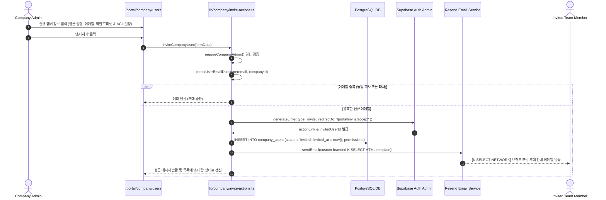
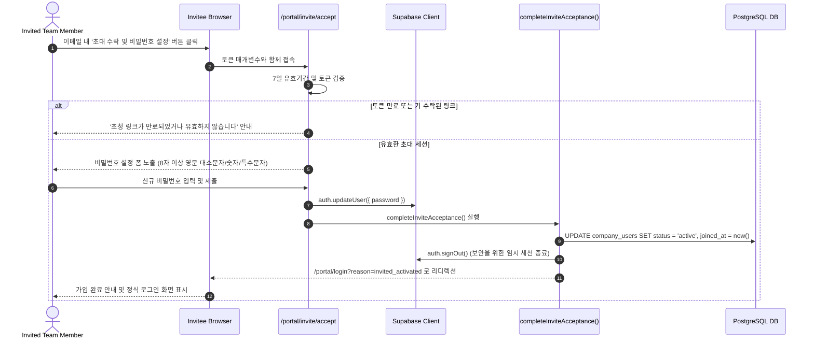
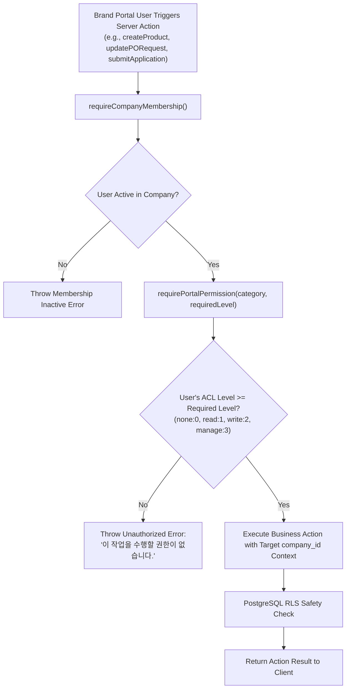

# MAN-B-PERM-001: Workflow & Architecture Diagrams
## Permissions & User Management (사용자, 역할 및 권한 관리)

**Manual ID:** `MAN-B-PERM-001`  
**Topic:** Verified Workflows for Identity, Invitation, ACL Enforcement & Multi-Tenant Security  
**Phase:** `01_SOURCE`  
**Authoritative Reference:** Production Middleware, DAL, Server Actions & PostgreSQL RLS Policies

---

## 1. Authentication to Company Context Resolution Flow

```mermaid
flowchart TD
    A["User Request with Session Cookie"] --> B["DAL: verifyPortalSession()"]
    B --> C{"auth.users valid & active?"}
    C -->|No / Expired| D["Redirect: /portal/login?reason=session_expired"]
    C -->|Yes| E["Query profiles where id = auth.uid()"]
    
    E --> F{"profiles.role === 'portal'?"}
    F -->|No (e.g. admin/retailer)| G["Redirect: /portal/login?reason=role_mismatch"]
    F -->|Yes| H["DAL: requireCompanyMembership()"]
    
    H --> I["Query company_users where id = user.id"]
    I --> J{"company_users status === 'active'?"}
    J -->|No (invited or suspended)| K["Redirect: /portal/login?reason=membership_inactive"]
    J -->|Yes| L["Establish CompanyMembership Context<br/>- userId<br/>- companyId<br/>- companyRole ('company_admin' | 'company_staff')"]
    
    L --> M["getPortalUserAcl()<br/>- Read company_users.permissions JSONB<br/>- normalizePermissions() across 9 Categories"]
    M --> N["Render PortalLayout & Filter Navigation Items"]
```

---

## 2. End-to-End User Invitation Workflow



---

## 3. Invitation Acceptance & Password Onboarding Workflow



---

## 4. 5-Role Preset & Granular ACL Evaluation Flow

```mermaid
flowchart TD
    A["Company Admin Selects Role Preset"] --> B{"Selected Preset"}
    
    B -->|Restricted| C["ROLE_PRESETS.restricted<br/>All 9 Categories = 'none'"]
    B -->|Viewer (Default)| D["ROLE_PRESETS.viewer<br/>7 Operational = 'read', 2 Sensitive = 'none'"]
    B -->|Staff| E["ROLE_PRESETS.staff<br/>5 Operational = 'write', 2 Info = 'read', 2 Sensitive = 'none'"]
    B -->|Manager| F["ROLE_PRESETS.manager<br/>Products/Orders/Support = 'manage', Finance/Info = 'write', 2 Sensitive = 'read'"]
    B -->|Admin| G["ROLE_PRESETS.admin<br/>All 9 Categories = 'manage'"]
    
    C --> H["Individual Category Radio Override in ACL Matrix Editor"]
    D --> H
    E --> H
    F --> H
    G --> H
    
    H --> I["Serialize to JSONB & Save in company_users.permissions"]
    I --> J["Runtime Resolution via normalizePermissions()"]
```

---

## 5. Server Action Authorization & Protected Execution Flow



---

## 6. PostgreSQL Row-Level Security (RLS) Multi-Tenant Architecture

```mermaid
flowchart TD
    subgraph ClientLayer ["Client & Portal Application Layer"]
        U1["Brand A User (company_id: AAA)"]
        U2["Brand B User (company_id: BBB)"]
        A1["Letusto Admin Staff (role: admin)"]
    end

    subgraph SecurityDefiner ["PostgreSQL Security Definer Functions"]
        F1["public.auth_company_id()<br/>Returns caller's company_id"]
        F2["public.auth_is_admin()<br/>Returns true if caller is Letusto Staff"]
    end

    subgraph DatabaseLayer ["PostgreSQL Database Tables with FORCE RLS"]
        T1[("companies")]
        T2[("company_users")]
        T3[("brands")]
        T4[("products")]
        T5[("applications")]
        T6[("purchase_orders")]
        T7[("supplier_invoices")]
        T8[("company_task_assignments")]
    end

    U1 -->|SQL Queries| SecurityDefiner
    U2 -->|SQL Queries| SecurityDefiner
    A1 -->|SQL Queries| SecurityDefiner

    SecurityDefiner -->|Policy: company_id = auth_company_id()| DatabaseLayer
    SecurityDefiner -->|Policy: auth_is_admin() = true| DatabaseLayer

    style T1 fill:#f9f9f9,stroke:#333,stroke-width:1px
    style T2 fill:#f9f9f9,stroke:#333,stroke-width:1px
    style T3 fill:#f9f9f9,stroke:#333,stroke-width:1px
    style T4 fill:#f9f9f9,stroke:#333,stroke-width:1px
    style T5 fill:#f9f9f9,stroke:#333,stroke-width:1px
```

---

## 7. Member Removal & Protected Admin Safety Flow

```mermaid
flowchart TD
    A["Company Admin Clicks '멤버 제거' (removeCompanyMember)"] --> B{"Is Target User Self?"}
    B -->|Yes| C["Block: 본인 계정은 직접 제거할 수 없습니다."]
    B -->|No| D{"Is Target User Initial Owner / Earliest Admin?"}
    
    D -->|Yes| E["Block: 최초 관리자(Owner) 계정은 회사에서 제거할 수 없습니다."]
    D -->|No| F{"Is Target User Company Admin?"}
    
    F -->|Yes| G{"Remaining Active Admins in Company <= 1?"}
    G -->|Yes| H["Block: 회사에는 최소 1명의 관리자가 필요합니다."]
    G -->|No| I["Proceed with Removal"]
    F -->|No (Staff)| I
    
    I --> J["Delete company_task_assignments for Target User"]
    J --> K["DELETE FROM company_users WHERE id = targetUserId"]
    K --> L["Deactivate Active Sessions & Revalidate Cache"]
    L --> M["Company Data Preserved Intact; User Access Revoked"]
```

---
*End of MAN-B-PERM-001 Workflow Map*
