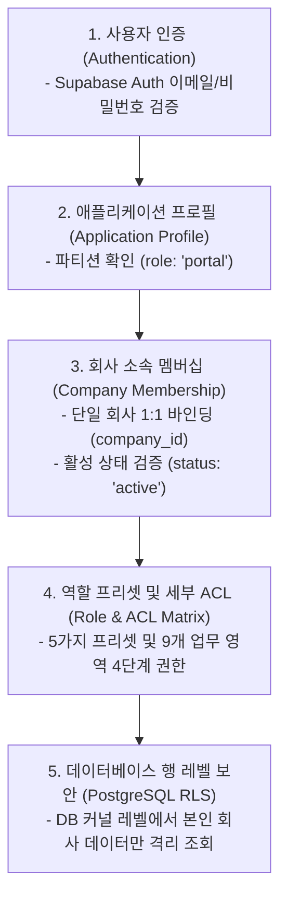
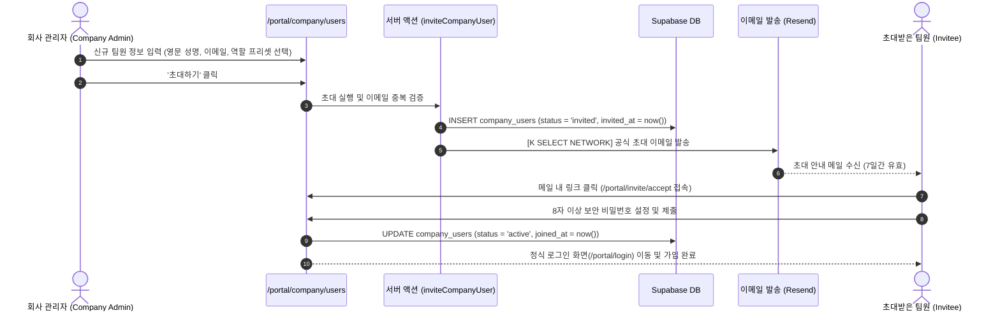
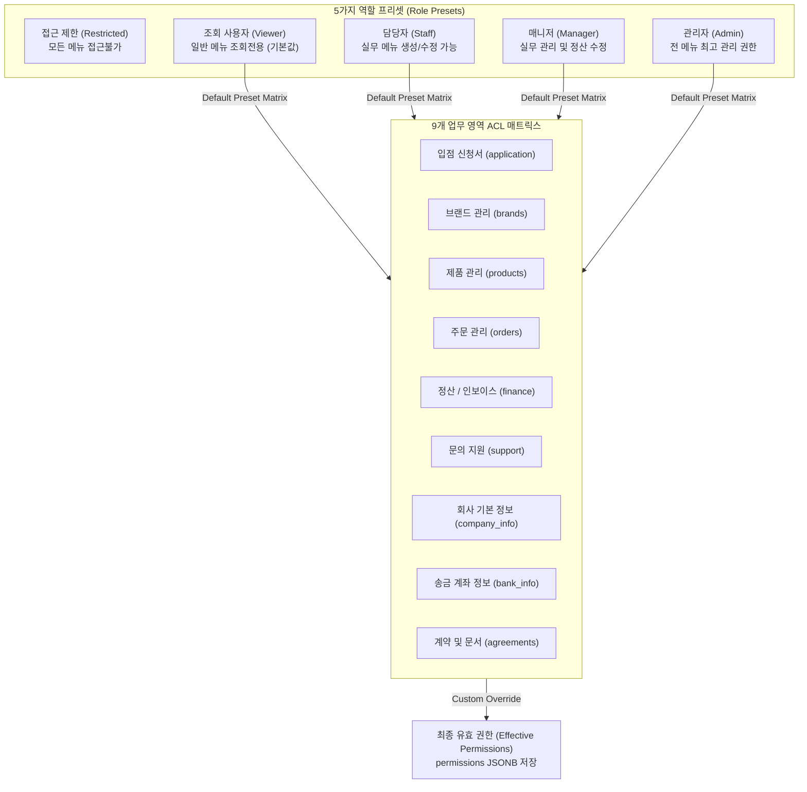
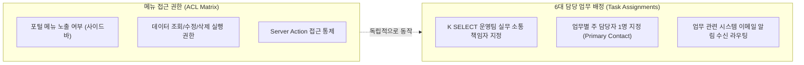
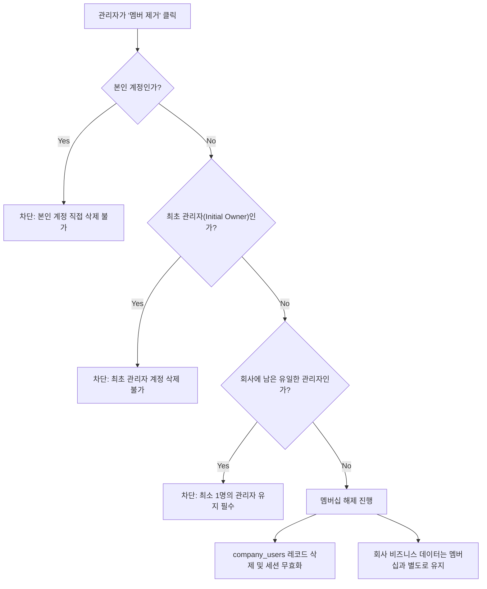

# MAN-B-PERM-001: Permissions & Architecture Diagrams
## Permissions & User Management (사용자, 역할 및 권한 관리)

---

## 1. 5-Layer Access Control & Security Model

---

## 2. End-to-End User Invitation & Onboarding Lifecycle

---

## 3. 5 Role Presets vs 9-Category ACL Mapping

---

## 4. Task Assignment vs ACL Permission Separation

---

## 5. Member Removal & Account Safety Protections

---
*End of PERMISSIONS_ARCHITECTURE_DIAGRAMS.md*
