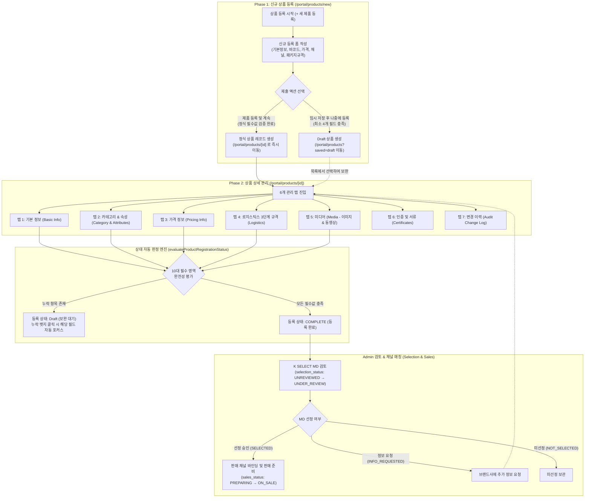
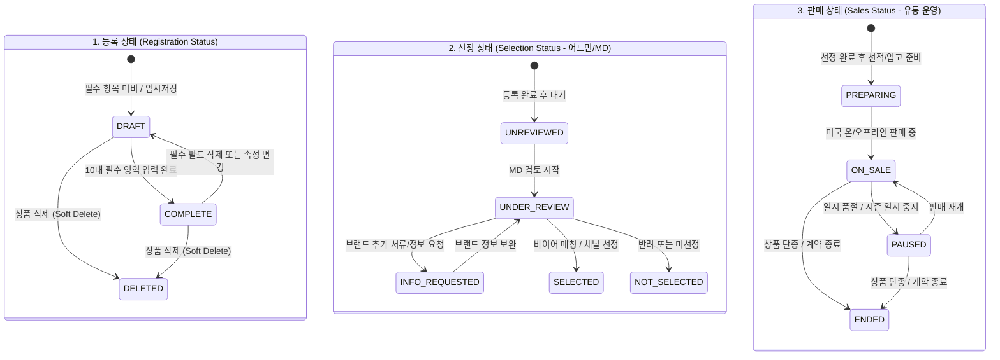
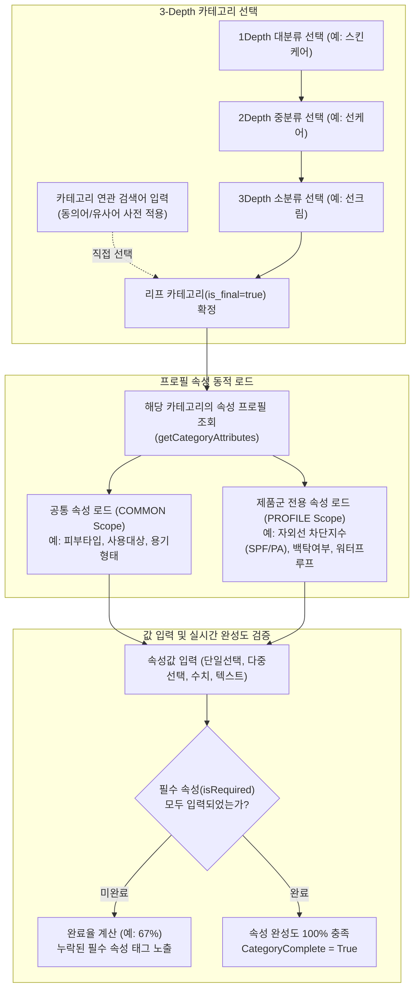
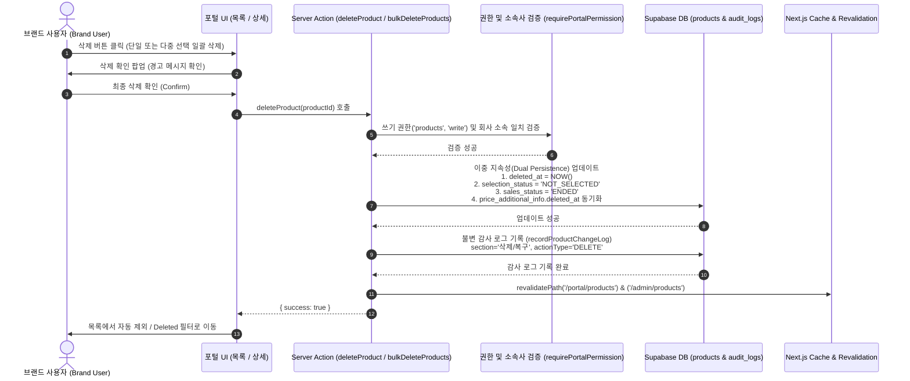

# MAN-B-PROD-001: Brand Portal Product Registration & Management — Workflow Map

> **Document ID:** `MAN-B-PROD-001-WFM`  
> **Topic:** 상품 등록 & 관리 / Product Registration & Management  
> **Source Target:** Production Brand Portal Architecture  
> **Phase:** `01_SOURCE — WORKFLOW SPECIFICATION`  
> **Audited Date:** 2026-10-01  

---

## 1. 전체 상품 관리 라이프사이클 (2-Phase Lifecycle)

K SELECT Brand Portal의 상품 등록 및 관리는 **Phase 1 (신규 진입)** 과 **Phase 2 (상세 다중 탭 관리 및 운영)** 의 2단계 파이프라인으로 구성됩니다.



---

## 2. Phase 1: 신규 상품 진입 경로 및 검증 분기 (Creation Paths)

```mermaid
flowchart LR
    START([사용자 입력 시작]) --> INPUT[폼 필드 입력]
    
    INPUT --> VALIDATE_DUP{실시간 고유성 검증}
    VALIDATE_DUP -->|제조사 SKU 중복| ERR_SKU[오류: 파트너사 내 중복된 SKU]
    VALIDATE_DUP -->|UPC / EAN 중복| ERR_BAR[오류: 시스템 내 등록된 바코드]
    VALIDATE_DUP -->|고유성 통과| ACTION_CHECK{버튼 클릭}

    ACTION_CHECK -->|"임시 저장 후 나중에 등록"| DRAFT_VAL{최소 4대 필드 검증<br>1. 브랜드<br>2. 카테고리<br>3. 제조사 SKU<br>4. 영문 제품명}
    DRAFT_VAL -->|누락| DRAFT_ERR[에러 메시지 표시]
    DRAFT_VAL -->|통과| DRAFT_SAVE[DB 저장: status=DRAFT<br>목록 페이지로 이동]

    ACTION_CHECK -->|"제품 등록 및 계속"| FULL_VAL{정식 필수값 종합 검증<br>+ 소비자가 > 0<br>+ FOB 가격 > 0<br>+ UPC 또는 EAN 필수<br>+ 온라인 판매시 링크1 필수}
    FULL_VAL -->|검증 실패| FULL_ERR[필드별 에러 하이라이트]
    FULL_VAL -->|검증 성공| FULL_SAVE[DB 저장<br>상세 페이지 /portal/products/[id] 로 전환]
```

---

## 3. 독립적 3대 상태 차원 매트릭스 (3 Status Dimensions)

K SELECT 시스템의 상품은 단일 상태값이 아닌 **3개의 상호 독립적인 차원(Dimension)** 으로 관리됩니다.



---

## 4. 카테고리 3-Depth 선택 및 동적 속성 바인딩 흐름 (Category & Attributes)



---

## 5. 소프트 삭제 및 일괄 삭제 라이프사이클 (Soft Delete Lifecycle)


