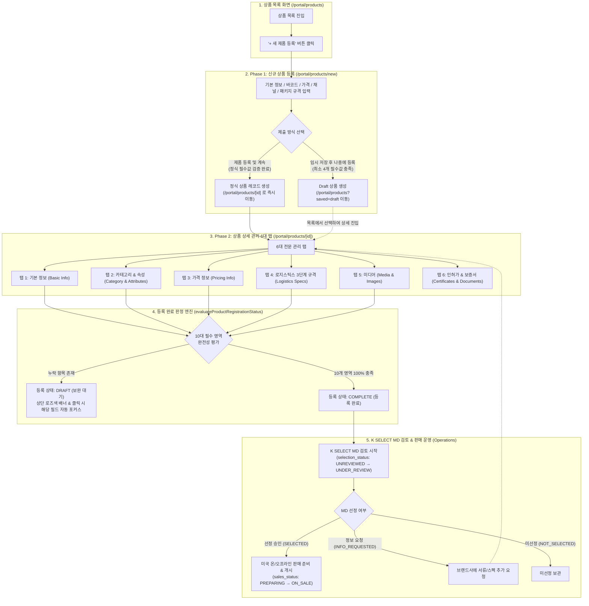
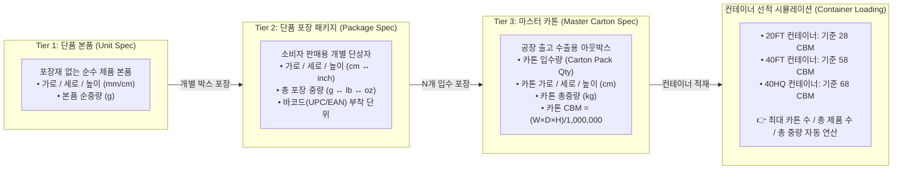
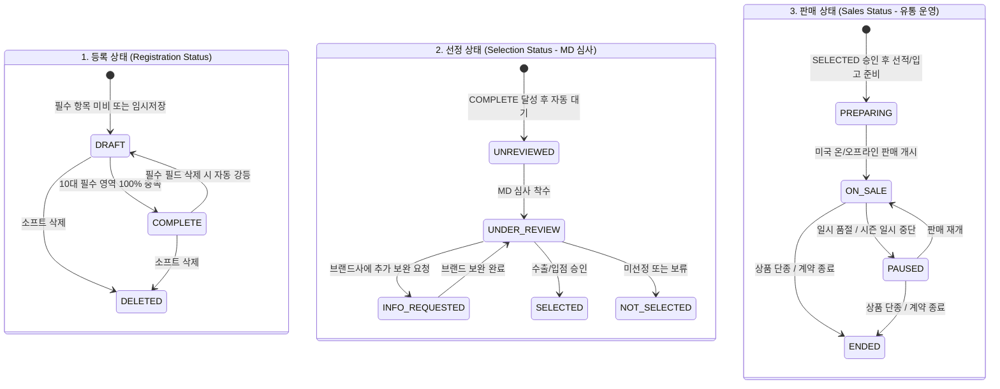

# MAN-B-PROD-001: Product Architecture & Workflow Diagrams

**Document ID:** `MAN-B-PROD-001-DIA`  
**Topic:** 상품 등록 & 관리 / Product Registration & Management  
**Manual ID:** `MAN-B-PROD-001`  
**Audience:** `B — Brand`  
**Location:** `Manuals/MAN-B-PROD-001_Product-Management/02_CLAUDE_PACKAGE/03_DIAGRAMS/`  

---

## 1. Diagram A: Product Registration Journey (전체 상품 라이프사이클)

사용자가 신규 상품을 등록하고, 상세 6대 탭 정보를 보완하여 등록 완료(`COMPLETE`) 후 K SELECT MD 검토 및 채널 판매로 이어지는 전체 엔드투엔드 여정입니다.

---

## 2. Diagram B: Product Detail Tabs Architecture (6대 전문 탭 아키텍처)

상품 상세 화면(`/portal/products/[id]`)에서 제공하는 6대 전문 관리 탭의 기능 구조도입니다.

```mermaid
graph TD
    ROOT["상품 상세 관리 시스템<br>/portal/products/[id]"]

    ROOT --> TAB1["탭 1: 기본 정보<br>(Basic Info)"]
    ROOT --> TAB2["탭 2: 카테고리 & 속성<br>(Category & Attributes)"]
    ROOT --> TAB3["탭 3: 가격 정보<br>(Pricing Info)"]
    ROOT --> TAB4["탭 4: 로지스틱스<br>(Logistics Specs)"]
    ROOT --> TAB5["탭 5: 미디어<br>(Media & Images)"]
    ROOT --> TAB6["탭 6: 인허가 & 보증서<br>(Certificates & Documents)"]

    TAB1 --> T1_1["국문 / 영문 제품명"]
    TAB1 --> T1_2["원산지, 용량, 납기(리드타임)"]
    TAB1 --> T1_3["식별 바코드 (UPC 12자리 / EAN 13자리)"]
    TAB1 --> T1_4["온라인 판매 링크 1, 2"]
    TAB1 --> T1_5["영문 불릿 포인트 (Bullet Points)"]
    TAB1 --> T1_6["전성분 텍스트 & 실시간 영문 번역기"]

    TAB2 --> T2_1["3-Depth 카테고리 선택기 (대 → 중 → 소)"]
    TAB2 --> T2_2["동의어 / 연관 검색어 자동 완성 사전"]
    TAB2 --> T2_3["공통 속성 (Common Scope)"]
    TAB2 --> T2_4["제품군 프로필 속성 (Profile Scope)"]
    TAB2 --> T2_5["필수 속성 실시간 완성도 지표"]

    TAB3 --> T3_1["4대 기준 가격 (KRW소비자가, FOB USD, MSRP USD, Retail USD)"]
    TAB3 --> T3_2["실시간 FOB 대비 MSRP 배수 산출 (MSRP ÷ FOB)"]
    TAB3 --> T3_3["실시간 FOB 마진율 및 공급 지표 산출"]
    TAB3 --> T3_4["수량별 B2B 공급 가격 (Tiered Pricing) 테이블"]

    TAB4 --> T4_1["Tier 1: 단품 본품 규격 (Unit W, D, H, Wt)"]
    TAB4 --> T4_2["Tier 2: 단품 포장 패키지 규격 (Package W, D, H, Wt, cm/inch, g/lb/oz)"]
    TAB4 --> T4_3["Tier 3: 마스터 카톤 규격 (Carton Pack Qty, W, D, H, Wt, CBM 자동연산)"]
    TAB4 --> T4_4["선적 시뮬레이터 (20FT=28CBM, 40FT=58CBM, 40HQ=68CBM)"]

    TAB5 --> T5_1["최대 5장 이미지 업로드 (최대 10MB/장)"]
    TAB5 --> T5_2["Position 0 대표 썸네일 자동 지정"]
    TAB5 --> T5_3["드래그 앤 드롭 순서 변경 & 실시간 DB 자동 저장"]
    TAB5 --> T5_4["고해상도 라이트박스 줌(Zoom) 뷰어"]
    TAB5 --> T5_5["홍보 동영상 연동 (URL / MP4 파일)"]

    TAB6 --> T6_1["국문 / 영문 전성분표 원본 파일 업로드"]
    TAB6 --> T6_2["상표권 / 시험성적서 / 인증 서류 자동 버전 관리 (v1, v2...)"]
```

---

## 3. Diagram C: Logistics 3-Tier Hierarchy (로지스틱스 3단계 규격 계층)

수출 물류와 컨테이너 적재 최적화를 위한 3계층 물리 규격 체계입니다.

---

## 4. Diagram D: 3 Independent Status Dimensions Matrix (3대 독립 상태 차원)

등록 상태, 선정 상태, 판매 상태의 상호 독립적인 상태 전이 매트릭스입니다.

