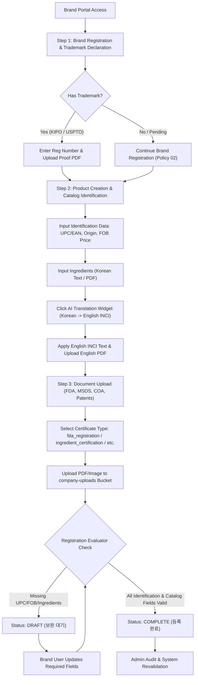
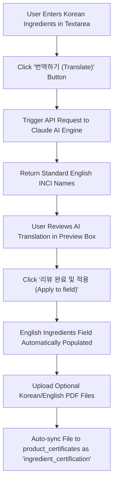
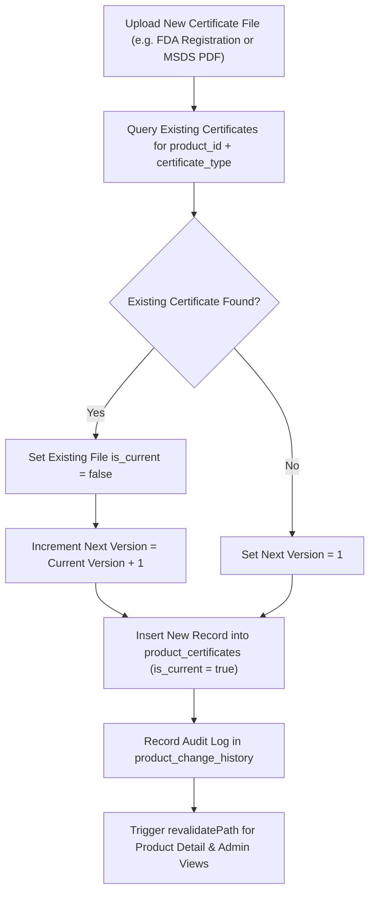
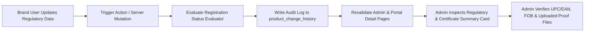

# MAN-B-REG-001 — Workflow Map
## Regulatory, Certification & Compliance Process Diagrams

**Manual ID:** `MAN-B-REG-001`  
**Document Type:** Process Workflow Specifications & Diagram Maps  
**Scope:** Brand Portal & Admin Regulatory/Compliance Integration  

---

## 1. End-to-End Regulatory & Compliance Lifecycle

---

## 2. Brand Trademark Registration Workflow (KIPO / USPTO)

```mermaid
flowchart LR
    subgraph Portal["Brand Portal (/portal/brands/new or edit)"]
        A["Check KIPO / USPTO Checkbox"] --> B["Input Registration Number"]
        B --> C["Upload Trademark Proof File (PDF/Image)"]
        C --> D["Submit Brand Form"]
    end

    subgraph Storage["Supabase Storage & DB"]
        D --> E["Save to company-uploads bucket"]
        E --> F["Serialize Metadata into intro JSON column"]
    end

    subgraph Admin["Admin Portal (/admin/brands/[brandId])"]
        F --> G["Parse Trademarks via parseBrandTrademarks()"]
        G --> H["Render Badge (KR / US) & Signed View/Download Links"]
        H --> I["Admin Audits Trademark Proof File"]
    end
```

---

## 3. Product Ingredient Declaration & AI Translation Workflow

---

## 4. Product Certificate & Document Versioning Workflow

---

## 5. Admin Verification & Compliance Revalidation Workflow

