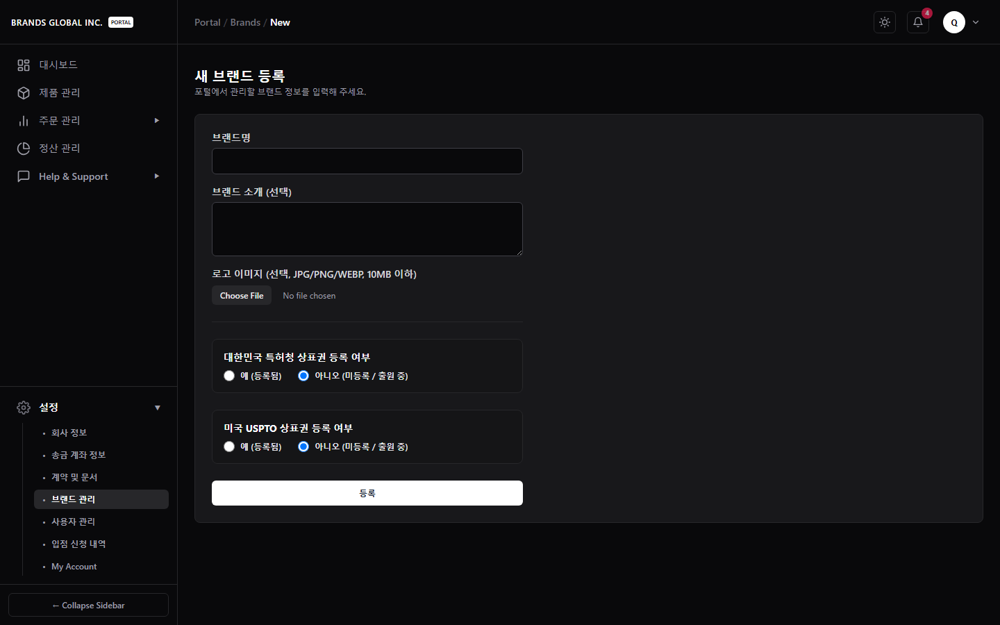
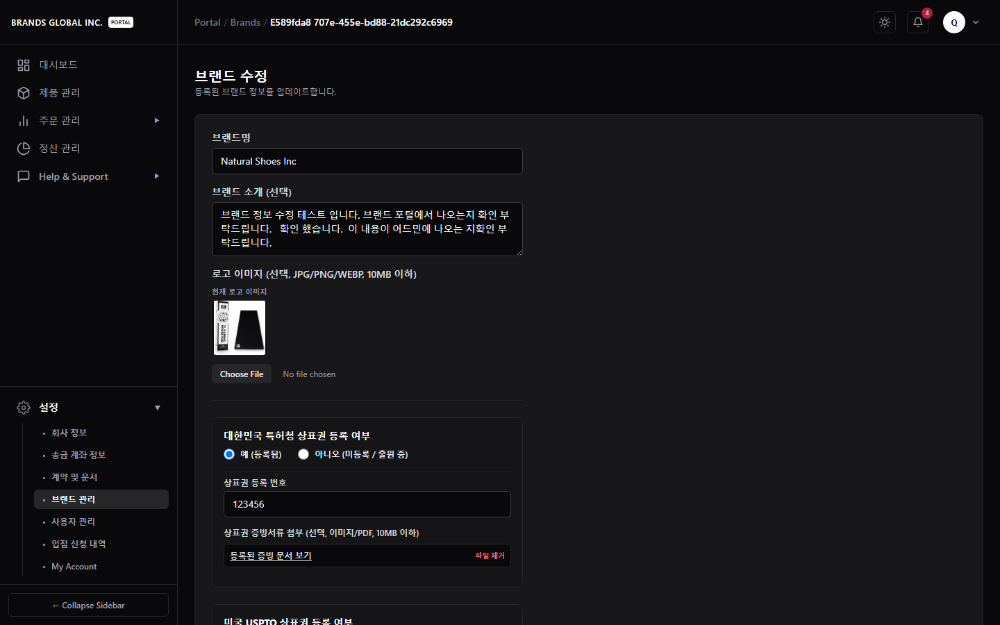
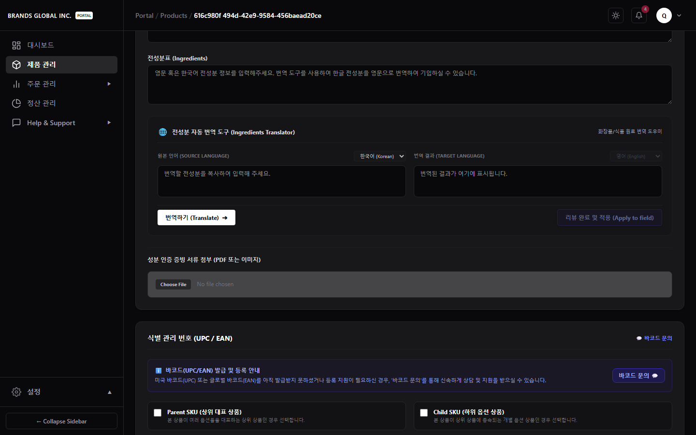
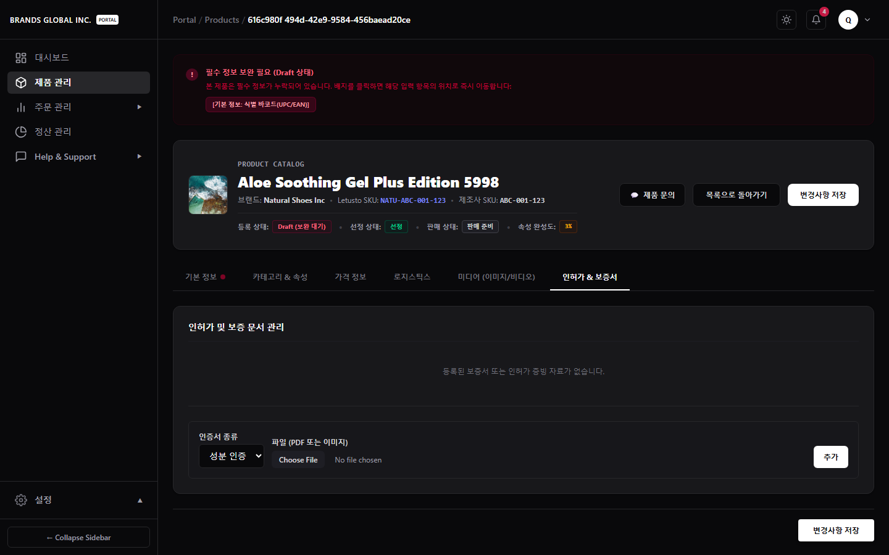
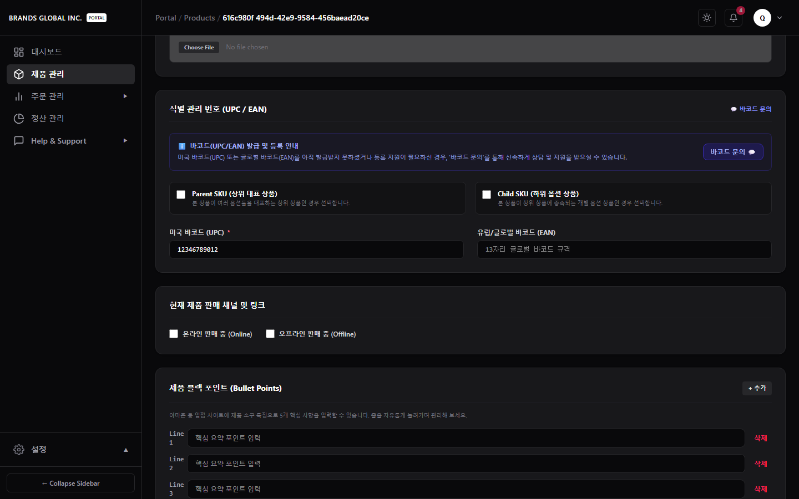
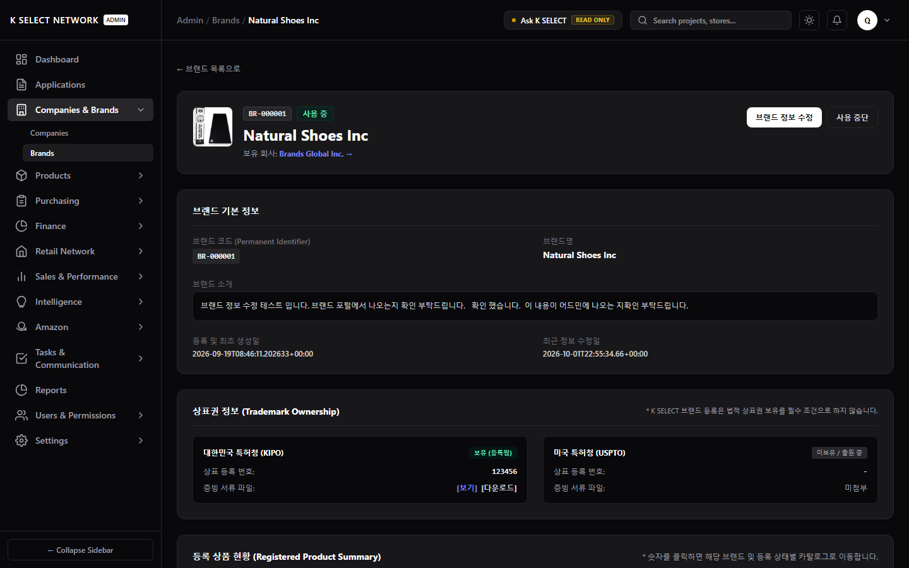

# MAN-B-REG-001 — Regulatory, Certification & Compliance User Guide
## 공식 브랜드 포털 인허가, 상표권 및 증빙 서류 관리 매뉴얼

**Manual ID:** `MAN-B-REG-001`  
**Manual Title:** `Regulatory, Certification & Compliance User Guide`  
**Audience:** `B` (Brand Portal Users — 브랜드사 담당자 및 관리자)  
**Effective Date:** 2026-10-01  
**Version:** `1.1.0`  
**System Scope:** K SELECT NETWORK 소프트웨어 시스템 (`https://portal.kselectnetwork.com`)  

---

## 목차 (Table of Contents)
1. [제1장: 소프트웨어 인허가 모듈 개요](#제1장-소프트웨어-인허가-모듈-개요)
2. [제2장: 브랜드 상표권 정보 및 증빙 서류 관리](#제2장-브랜드-상표권-정보-및-증빙-서류-관리)
3. [제3장: 전성분 선언 및 AI 영문 번역기 활용](#제3장-전성분-선언-및-ai-영문-번역기-활용)
4. [제4장: 상품 인증 서류 업로드 및 버전 관리](#제4장-상품-인증-서류-업로드-및-버전-관리)
5. [제5장: 바코드 검증 및 문의 채널 안내](#제5장-바코드-검증-및-문의-채널-안내)
6. [제6장: 어드민 서류 확인 및 상태 동기화](#제6장-어드민-서류-확인-및-상태-동기화)

---

## 제1장: 소프트웨어 인허가 모듈 개요

### 1.1 모듈 목적 및 시스템 범위
K SELECT NETWORK 브랜드 포털은 입점 브랜드사가 미국 및 글로벌 B2B 리테일 시장 진출에 필요한 **상표권 정보, 이중 언어 전성분표, FDA 및 성분 인증 서류, 바코드 규격**을 효율적으로 등록하고 관리할 수 있는 통합 인허가 모듈을 제공합니다.

> [!NOTE]
> **시스템 범위 안내**: 본 매뉴얼은 K SELECT 포털 소프트웨어 내에서 인허가 정보 및 서류를 등록·수정·관리하는 시스템 사용법을 안내합니다. 외부 법률 조항이나 규제기관(FDA 등)의 행정 조문에 대한 법적 해석은 포함하지 않으며, 실제 시스템에 작성 및 업로드된 정보 관리법을 다룹니다.

### 1.2 주요 인허가 관리 영역
- **브랜드 상표권 (Brand Trademarks)**: 대한민국 특허청(KIPO) 및 미국 특허청(USPTO) 상표권 등록 정보 및 증빙 파일 관리.
- **전성분표 (Ingredients)**: 국문/영문 전성분 텍스트 선언, 국문/영문 전성분 PDF 첨부, AI 자동 번역 지원.
- **인증 보증서 (Certificates)**: FDA 등록증, 상표권증, 성분 인증서(MSDS/COA 등), 특허증, 기타 서류 업로드 및 자동 버전 관리.
- **상품 바코드 (Barcodes)**: 12자리 UPC / 13자리 EAN 바코드 규격 검증 및 카탈로그 `COMPLETE` 상태 전환.

---

## 제2장: 브랜드 상표권 정보 및 증빙 서류 관리

### 2.1 상표권 등록 정책 (Policy 02)
K SELECT 포털은 상표권을 미보유한 브랜드라도 카탈로그 구성을 위해 포털에 자유롭게 브랜드를 개설하고 등록하는 것을 허용합니다. (상표권 미보유 등록 가능)

> [!TIP]
> **상표권 미보유 브랜드**: 브랜드 등록 시 상표권 체크박스를 해제한 상태로 등록할 수 있으며, 향후 특허청 상표권이 등록되면 언제든지 브랜드 수정 화면에서 등록번호와 증빙 서류를 추가할 수 있습니다.

### 2.2 브랜드 신규 등록 시 상표권 입력 방법
1. 브랜드 포털 좌측 메뉴에서 **[브랜드 관리]** 클릭 후 상단 **[새 브랜드 추가]** 단추를 누릅니다 (`/portal/brands/new`).
2. **대한민국 특허청(KIPO) 상표권 보유** 여부 체크박스를 확인합니다.
   - 상표권을 보유한 경우: 체크박스를 클릭하고 **상표 등록번호**를 입력한 뒤 **상표권 증빙 파일(PDF/이미지)**을 첨부합니다.
3. **미국 특허청(USPTO) 상표권 보유** 여부 체크박스를 확인합니다.
   - 보유 시 체크 후 등록번호 입력 및 증빙 파일을 첨부합니다.
4. **[저장]** 버튼을 눌러 등록을 완료합니다.

  
*그림 2.1: 브랜드 신규 개설 화면의 KIPO / USPTO 상표권 선택 및 증빙 파일 첨부 영역*

### 2.3 등록된 브랜드의 상표권 수정 및 서류 업데이트
1. **[브랜드 관리]** 목록에서 수정할 브랜드의 카드에 위치한 **[수정]** 버튼을 클릭합니다 (`/portal/brands/[id]`).
2. 기존에 첨부된 상표권 증빙 파일이 있는 경우 `[보기]` 링크를 클릭해 업로드된 문서를 즉시 확인할 수 있습니다.
3. 기존 증빙 파일을 삭제하거나 새 파일로 교체할 수 있습니다.

  
*그림 2.2: 브랜드 수정 화면의 상표권 번호 및 첨부 서류 확인 링크*

---

## 제3장: 전성분 선언 및 AI 영문 번역기 활용

### 3.1 국문/영문 전성분 입력 및 첨부파일
상품 상세 페이지 (`/portal/products/[id]`)의 **[기본 정보]** 탭 내 전성분 영역에서 다음 항목을 설정합니다:
- **전성분 텍스트**: 제품에 함유된 전체 성분을 함량순으로 작성합니다.
- **국문/영문 전성분표 파일**: PDF 또는 이미지 파일 형태로 전성분표 문서를 업로드합니다.

### 3.2 AI 기반 실시간 영문 번역기 활용
1. **[전성분 텍스트 (국문)]** 필드에 한국어 전성분 목록을 작성합니다.
2. 하단의 **[번역하기 (Translate)]** 버튼을 클릭합니다.
3. 시스템이 AI 번역 엔진을 통해 화장품 표준 **INCI (International Nomenclature of Cosmetic Ingredients)** 명칭으로 자동 번역하여 프리뷰 상자에 표시합니다.
4. 번역 결과를 확인한 후 **[리뷰 완료 및 적용 (Apply to field)]** 버튼을 누르면 영문 전성분 텍스트 필드에 자동으로 입력됩니다.

  
*그림 3.1: 전성분 입력란 하단의 AI 번역 실행 위젯*

  
*그림 3.2: AI 영문 INCI 번역 완료 결과 확인 및 적용*

> [!NOTE]
> **전성분 서류 관리 안내**: 전성분 관련 증빙 문서(전성분 분석표, MSDS, COA 등)는 **[인허가 & 보증서]** 탭(Tab 6)의 **[성분 인증]** (`ingredient_certification`) 카테고리를 이용하여 별도로 업로드하고 관리할 수 있습니다.

---

## 제4장: 상품 인증 서류 업로드 및 버전 관리

### 4.1 서류 종류 (Certificate Category) 구분
상품 상세 페이지 (`/portal/products/[id]`)의 **[인허가 & 보증서]** 탭 (Tab 6)에서 제공하는 5가지 서류 카테고리는 다음과 같습니다:

| 서류 종류 코드 | UI 표시 명칭 | 파일 설명 및 업로드 예시 |
| :--- | :--- | :--- |
| `fda_registration` | FDA 등록 | FDA 시설 등록(FFRM) 및 제품 리스팅(PDRM) 관련 증빙 서류 |
| `trademark` | 상표권 | 특정 상품 관련 상표권 등록 서류 |
| `ingredient_certification` | 성분 인증 | 전성분 분석표, MSDS (물질안전보건자료), COA (시험성적서) 등 |
| `patent` | 특허 | 용기 구조, 성분 추출 기술 특허증 |
| `other` | 기타 | 위생 허가증, 자유판매증명서(CFS) 및 기타 보증 서류 |

> [!NOTE]
> **MSDS / COA 서류 업로드 안내**: MSDS(Safety Data Sheet) 및 COA(Certificate of Analysis)는 독립된 별도 시스템 메뉴가 아니며, **[성분 인증]** (`ingredient_certification`) 또는 **[기타]** (`other`) 서류 카테고리를 선택하여 업로드하시면 됩니다.

### 4.2 서류 업로드 및 버전 관리 (Version Control) 규칙
1. **[인허가 & 보증서]** 탭 하단의 서류 등록 서식에서 서류 종류를 선택하고 PDF/이미지 파일을 선택한 뒤 **[등록]**을 누릅니다.
2. 동일한 서류 종류로 새 파일을 등록하면:
   - 이전 업로드 파일: `is_current: false` 상태로 자동 변경되어 이력으로 보존됩니다.
   - 신규 업로드 파일: `version` 번호가 `+1` 증가(예: Version 1 -> Version 2)하며 최신 서류(`is_current: true`)로 지정됩니다.

  
*그림 4.1: 등록된 인허가 서류 목록과 버전(Version 1) 표시*

  
*그림 4.2: 5가지 표준 서류 카테고리 선택 드롭다운*

---

## 제5장: 바코드 검증 및 문의 채널 안내

### 5.1 UPC / EAN 바코드 유효성 검증
상품의 최종 등록 상태가 `COMPLETE (등록 완료)`가 되기 위해서는 식별 바코드가 필수적으로 검증되어야 합니다.
- **UPC 바코드**: 정확히 **12자리 숫자** (`/^\d{12}$/`)
- **EAN 바코드**: 정확히 **13자리 숫자** (`/^\d{13}$/`)

> [!IMPORTANT]
> **바코드 포맷 오류**: 12자리/13자리 규칙에 맞지 않는 문자나 자리수가 입력되면 등록 평가기(Registration Evaluator)에 의해 제품 상태가 `Draft (보완 대기)`로 지정됩니다. 바코드가 없는 경우 입력란 우측의 **[💬 바코드 문의]** 링크를 클릭하여 지원을 요청하십시오.

  
*그림 5.1: 식별 바코드(UPC/EAN) 입력란 및 바코드 문의 지원 링크*

---

## 제6장: 어드민 서류 확인 및 상태 동기화

### 6.1 어드민(Admin) 검증 및 서류 열람
1. 브랜드사가 등록한 상표권 서류 및 인허가 보증서는 어드민 상세 화면(`https://admin.kselectnetwork.com/admin/brands/[brandId]` 및 `/admin/products/[id]`)에서 담당자에 의해 실시간 검증됩니다.
2. 어드민 사용자는 브랜드사가 제출한 상표권 및 인허가 증빙 파일을 `[보기]` 또는 `[다운로드]`를 통해 서류 원본을 확인할 수 있습니다.

  
*그림 6.1: 어드민 상표권 정보 카드 및 증빙 파일 열람/다운로드 버튼*

### 6.2 데이터 변경 감사 이력 (Change History Audit)
브랜드사 또는 어드민이 전성분, 상표권, 인허가 보증서 파일을 수정·삭제·추가하면 `product_change_history` 모듈에 변경 내역이 기록되며, 어드민과 브랜드 포털 간 실시간 경로 재검증(`revalidatePath`)이 수행됩니다.
