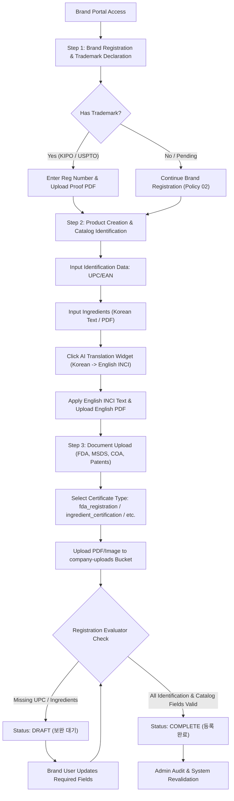
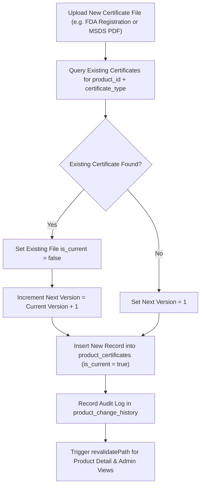

# REGULATORY_ARCHITECTURE_DIAGRAMS.md
## Regulatory, Certification & Compliance Process Diagrams

**Manual ID:** `MAN-B-REG-001`  
**Document Type:** Process Architecture & Technical Diagrams  
**Asset Folder:** `03_DIAGRAMS/`  

---

## 1. Compliance Lifecycle & Product Completion Evaluator Diagram

---

## 2. Certificate Version Control Data Flow

