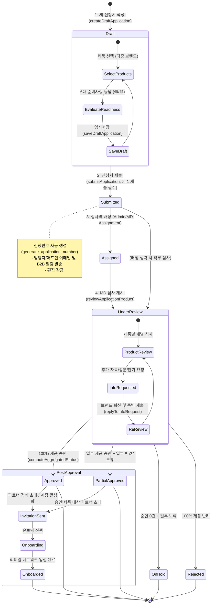
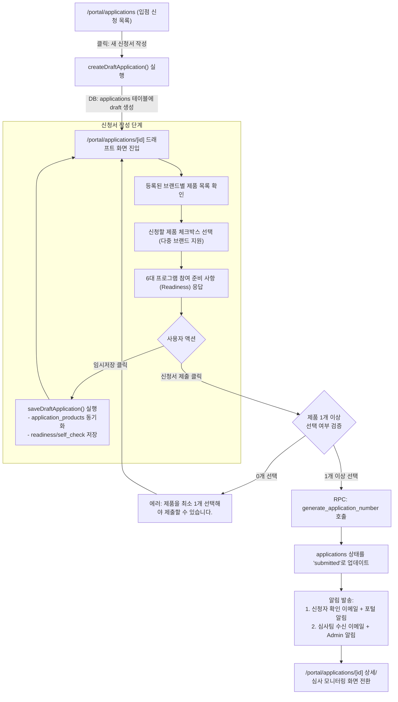
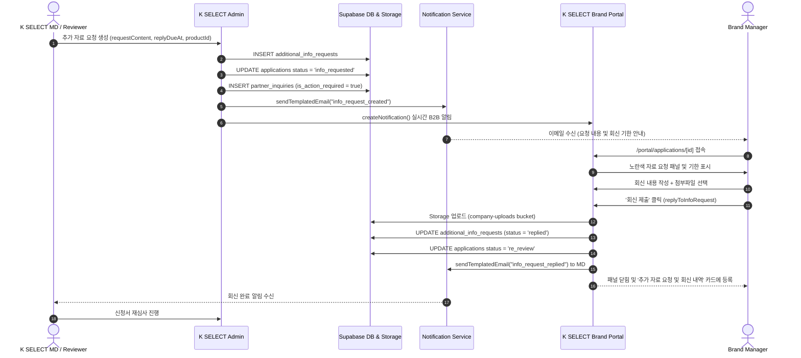

# MAN-B-RET-001: Retail Placement & Application Workflow Maps

---

## 1. End-to-End Application Lifecycle State Machine



> **📌 Boundary Notice (Retail Application vs Purchase Order)**:  
> `Retail Application Approval ≠ Automatic PO Creation`  
> 입점 신청 승인은 K SELECT 리테일 네트워크 입점 자격 획득 및 포털 온보딩 활성화를 의미하며, 발주는 `MAN-B-ORD-001`의 Brand PO Request 또는 Admin 직접 발주 생성을 통해 독립적으로 체결됩니다.

---

## 2. Brand User Application Drafting & Submission Flow



---

## 3. Granular Multi-Product Review & Status Aggregation

```mermaid
flowchart TD
    subgraph AdminMD ["어드민 MD 심사 프로세스"]
        A1["Admin: /admin/applications/[id] 접속"] --> A2["신청 제품 목록 개별 검토"]
        A2 --> A3["제품별 심사 결정:<br/>1. 승인 (approved)<br/>2. 보류 (on_hold, 사유 필수)<br/>3. 반려 (rejected, 사유 필수)"]
        A3 --> A4["reviewApplicationProduct() 실행"]
        A4 --> A5["DB: application_products 상태 & 사유 업데이트"]
        A5 --> A6["activity_logs에 감사 로그 기록"]
    end

    subgraph AggregationEngine ["자동 상태 집계 엔진 (computeAggregatedStatus)"]
        A6 --> B1{"아직 심사 중인<br/>제품이 있는가?"}
        B1 -->|Yes (pending/reviewing/info_requested)| B2["전체 상태 = 'under_review' (심사중)"]
        B1 -->|No| B3{"승인된 제품 수 비율"}
        B3 -->|100% 승인| B4["전체 상태 = 'approved' (최종 승인)"]
        B3 -->|100% 반려| B5["전체 상태 = 'rejected' (심사 반려)"]
        B3 -->|승인 0건, 일부 보류| B6["전체 상태 = 'on_hold' (심사 보류)"]
        B3 -->|일부 승인 + 일부 반려/보류| B7["전체 상태 = 'partial_approved' (부분 승인)"]
    end

    subgraph BrandPortalSync ["브랜드 포털 실시간 반영"]
        B2 --> C1["포털 타임라인 갱신"]
        B4 --> C2["결과 통보 이메일 발송 + 승인 안내"]
        B5 --> C2
        B6 --> C2
        B7 --> C2
    end
```

---

## 4. Additional Info Request & Reply Sequence


