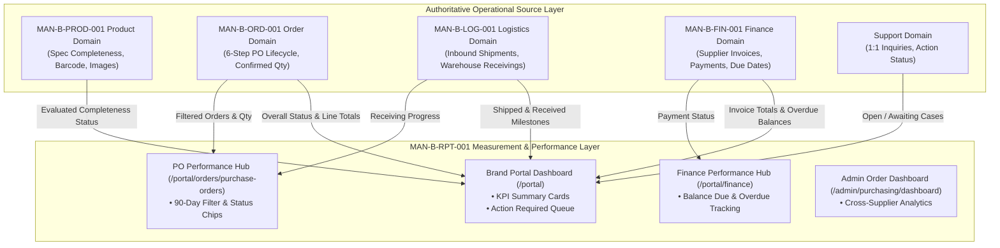

# MAN-B-RPT-001 — Source Collection Report
## Reports & Performance Guide (01_SOURCE)

- **Manual ID:** `MAN-B-RPT-001`
- **Manual Title:** `Reports & Performance Guide`
- **Primary Audience:** Brand Portal Users / Brand Company Managers (`Audience B`)
- **System Scope:** K SELECT NETWORK Partner Portal (`https://portal.kselectnetwork.com`) & Admin Backoffice (`https://admin.kselectnetwork.com`)
- **Effective Date:** 2026-10-01
- **Status:** `APPROVED CANONICAL SOURCE`

---

## 1. Executive Summary & Module Purpose

`MAN-B-RPT-001 Reports & Performance Guide`는 K SELECT NETWORK 파트너 포털을 이용하는 입점 브랜드사가 매일 아침 및 주요 마일스톤마다 브랜드의 운영 건전성(Operational Health), 발주 및 출고 파이프라인 성과(PO Pipeline Performance), 대금 정산 및 미지급 잔액(Finance & Settlement), 카탈로그 등록 완성도(Product Readiness), 그리고 고객지원 문의 처리 현황(Support Performance)을 종합적으로 측정·분석할 수 있도록 표준 지표 및 운영 절차를 규정합니다.

K SELECT의 Reports 모듈은 독립된 별도의 정적 보고서 생성기에 국한되지 않고, **단일 권위적 데이터 모델(Single Authoritative Data Model)**을 바탕으로 실시간 운영 데이터(Operational Data)를 집계하여 **대시보드 KPI 카드, 실행 필요 큐(Action Required Queue), 발주 성과 필터, 정산 요약**으로 실시간 제공하는 **측정 및 분석 계층(Measurement & Reporting Layer)**으로 동작합니다.

---

## 2. Production Surfaces Audited

본 소스 리포트는 실제 프로덕션 코드, 라우트, 컴포넌트, 서버 액션 및 데이터베이스를 1:1로 실사(Audit)하여 작성되었습니다.

| Surface ID | Route | Primary Purpose & Features | Verification Status |
| :--- | :--- | :--- | :---: |
| **SRF-RPT-01** | `/portal` | **브랜드 포털 메인 대시보드 (Operational Dashboard)** - 발주 파이프라인 KPI (진행 중 발주, 출고 준비, 입고 검수 등) - 정산 및 재무 KPI (총 청구액, 지급 완료액, 미지급 잔액, 연체 잔액) - 제품 카탈로그 완성도 KPI (Complete vs Draft 제품 수) - 1:1 문의 처리 현황 (열린 문의, 브랜드 회신 대기, 운영팀 검토) - 실시간 긴급 조치 큐 (Action Required Items Queue) | `VERIFIED` |
| **SRF-RPT-02** | `/portal/orders/purchase-orders` | **발주 성과 및 파이프라인 분석 (PO Performance Hub)** - 상단 5대 라이프사이클 집계 카드 (전체 진행, 생산 중, 출고 준비, 입고 검수, 완료) - 90일 기본 기간 필터 및 커스텀 날짜 선택기 - 6대 상태 칩 (IN_PRODUCTION, READY_TO_SHIP, SHIPPED, RECEIVING, COMPLETED, CANCELLED) - 검색, 정렬 (최신순, 과거순, 금액순) 및 SKU 요약 | `VERIFIED` |
| **SRF-RPT-03** | `/portal/finance` | **정산 및 인보이스 실적 (Finance & Invoice Tracking)** - 인보이스 총액, 지급 완료액, 잔액 요약 - 지급 기한(Due Date) 초과 및 미지급 인보이스 추적 - 공급사 발행 인보이스 및 조정(Adjustment) 내역 대조 | `VERIFIED` |
| **SRF-RPT-04** | `/portal/products` | **제품 등록 완성도 지표 (Catalog Readiness)** - 28대 필수 스펙 및 바코드 검증 상태 평가 - 보완 대기(Draft) 제품 및 누락 필드 알림 | `VERIFIED` |
| **SRF-RPT-05** | `/admin/purchasing/dashboard` | **어드민 발주 현황 대시보드 (Admin Order Dashboard)** - 전사 발주 총액, 미입고 수량/금액, 지급/미지급 현황 - 공급사별(Supplier Summary), SKU별(Product Summary) 실적 집계 - 날짜 프리셋 (당월, 전월, 당분기, 당해, 커스텀) 필터 | `VERIFIED` |
| **SRF-RPT-06** | `/admin/sales` | **어드민 매출 및 성과 화면 (Admin Sales Mock Surface)** - 월간 리테일/아마존 매출 추이 바 차트 및 SKU 성과 테이블 - 모의 데이터(`mockSalesData`, `mockProducts`) 기반 UI 프로토타입 | `VERIFIED (MOCK)` |
| **SRF-RPT-07** | `/admin/reports` | **어드민 리포트 및 통계 (Admin Reports Placeholder)** - 향후 리포트 다운로드 모듈 안내 페이지 (현재 준비 중) | `NOT IMPLEMENTED` |
| **SRF-RPT-08** | `/retailer/sales` | **리테일러 판매 성과 대시보드 (Retailer Sales Performance)** - Weekly Check 재고 소진(Movement) 추정, 주간 공급량(WOS), 발주 신호 집계 | `VERIFIED (RETAILER)` |

---

## 3. Critical Ground-Truth Classification

시스템 감사 결과에 따라 기능별 실현 상태를 엄격히 분류합니다:

### 3.1 `VERIFIED` (Active Production Functionality)
1. **실시간 발주 파이프라인 KPI 집계**:
   - `openPoCount`: `overall_status !== 'Completed' && overall_status !== 'Cancelled'`
   - `readyToShipCount`: `overall_status === 'Ready to Ship'`
   - `receivingCount`: `overall_status === 'Receiving' || overall_status === 'Arrived'`
   - `completedCount`: `overall_status === 'Completed'`
2. **정산 및 재무 실적 산출**:
   - `totalInvoiceAmount`: `sum(invoiceTotal)`
   - `totalPaidAmount`: `sum(amountPaid)`
   - `totalOutstandingBalance`: `sum(balanceDue)`
   - `totalOverdueAmount`: `sum(balanceDue)` where `dueDate < now`
3. **제품 등록 완성도 자동 평가**:
   - `evaluateProductRegistrationStatus()` 엔진 기반 `COMPLETE` vs `Draft (Incomplete)` 분류 및 누락 필드 목록 반환.
4. **실행 필요 항목 큐 (Action Required Queue)**:
   - 우선순위 3단계(`URGENT`, `DUE_SOON`, `NORMAL`) 기반 실시간 병목 감지 (발주서 미수락, 출고 패킹서류 미등록, 연체 인보이스, 1:1 문의 미회신, 제품 필수 스펙 누락).
5. **발주 목록 기간 및 상태 필터링**:
   - 90일 기본 프리셋(`initialRange: last 90 days`), YYYY-MM-DD 날짜 포맷, 6대 카테고리 칩 선택.
6. **테넌트 격리(Multi-Tenant Isolation)**:
   - 모든 브랜드 포털 지표는 세션의 `companyId`를 기준으로 엄격하게 필터링됨 (`.eq("company_id", companyId)` 및 RLS).

### 3.2 `INFERENCE` (Architectural Pattern)
- 리포트 및 지표 집계는 별도의 비동기 배치(Batch) 파이프라인이 아닌, 서버 컴포넌트 렌더링 시 최신 Supabase DB 레코드를 직접 쿼리하여 메모리에서 집계·연산합니다.

### 3.3 `SYSTEM GAP`
- 브랜드 포털 전용 독립 메뉴(`/portal/reports`)는 아직 별도로 분리되어 있지 않으며, 현재 대시보드(`/portal`), 발주 목록(`/portal/orders/purchase-orders`), 정산 목록(`/portal/finance`)에 지표 및 성과 분석 기능이 통합되어 제공됩니다.

### 3.4 `NOT IMPLEMENTED`
- 브랜드 포털 대시보드 내 단일 클릭 CSV/Excel/PDF 다운로드 버튼 (개별 발주서 PDF, 인보이스 상세 등은 각 모듈에서 다운로드 지원).
- 어드민 전사 리포트 다운로드 센터 (`/admin/reports`는 현재 준비 중 플레이스홀더).

---

## 4. Cross-Manual Domain Boundaries

Reports 모듈은 측정/분석 계층(Reporting Layer)으로서 타 운영 도메인의 상태를 측정하되, 각 도메인의 상태 전이나 비즈니스 규칙을 임의로 재정의하지 않습니다.

1. **RPT ↔ PROD (`MAN-B-PROD-001`)**:
   - PROD는 상품 속성, 바코드, 이미지, 가격의 권위적 등록을 담당합니다.
   - RPT는 등록 평가기(`evaluateProductRegistrationStatus`)를 통해 완성도(`COMPLETE` vs `Draft`) 및 보완 필요 필드를 측정하여 대시보드에 표시합니다.
2. **RPT ↔ ORD (`MAN-B-ORD-001`)**:
   - ORD는 공식 발주 6단계 라이프사이클(`Sent to Supplier` → `Supplier Confirmed` → `In Production` → `Ready to Ship` → `Shipped/Receiving` → `Completed`)을 정의합니다.
   - RPT는 발주 상태를 집계하여 진행 중 발주 건수, 단계별 진행 현황, 미입고 수량을 측정합니다.
3. **RPT ↔ LOG (`MAN-B-LOG-001`)**:
   - LOG는 실물 출고 패킹리스트, 운송장, 물류창고 검수 및 입고를 담당합니다.
   - RPT는 `Ready to Ship` 건수 및 창고 도착/입고 진행(`Receiving`/`Arrived`) 건수를 집계합니다.
4. **RPT ↔ FIN (`MAN-B-FIN-001`)**:
   - FIN은 청구 인보이스 생성, 지급 스케줄, 조정 금액, 은행 계좌를 관리합니다.
   - RPT는 총 청구액, 지급 완료액, 미지급 잔액, 지급 기한 초과(Overdue) 금액을 합산하여 재무 건전성을 측정합니다.
5. **RPT ↔ RET (`MAN-B-RET-001`)**:
   - RET는 오프라인 리테일 매장의 Weekly Check 실사 및 재고 소진율을 관리합니다.
   - RPT는 리테일러 포털에서 WOS(주간 공급량) 및 재발주 신호 지표를 제공합니다.
6. **RPT ↔ PERM (`MAN-B-PERM-001`)**:
   - PERM은 회사별 테넌트 격리 및 9대 ACL 카테고리를 통제합니다.
   - RPT는 세션 사용자의 `companyId` 및 권한(`orders`, `finance`, `products`, `support`)에 따라 지표 노출 범위를 안전하게 제어합니다.

---

## 5. Summary of Key Performance Calculation Formulas

| Metric Name | UI Display Label | Calculation Formula / Implementation Rule | Timeframe / Scope |
| :--- | :--- | :--- | :--- |
| **Open PO Count** | 진행 중 발주서 | `count(POs where overall_status NOT IN ('Completed', 'Cancelled'))` | Real-time (Active) |
| **Ready to Ship Count** | 출고 준비 완료 | `count(POs where overall_status === 'Ready to Ship')` | Real-time |
| **Receiving Count** | 입고/검수 진행 중 | `count(POs where overall_status IN ('Receiving', 'Arrived'))` | Real-time |
| **Completed PO Count** | 완료된 발주 | `count(POs where overall_status === 'Completed')` | Real-time |
| **Total Invoiced** | 총 청구 금액 | `sum(invoice_total)` for company | All time |
| **Total Paid** | 총 정산 완료액 | `sum(amount_paid)` for company | All time |
| **Balance Due** | 미지급 정산 잔액 | `sum(balance_due)` for company | Outstanding |
| **Overdue Amount** | 지급 기한 초과 잔액 | `sum(balance_due)` where `due_date < current_date` | Overdue |
| **Catalog Completeness** | 카탈로그 완성도 | `complete_products / (complete_products + incomplete_products) * 100` | Current Catalog |
| **Open Support Cases** | 미종결 1:1 문의 | `count(Inquiries where normalized_status !== 'CLOSED')` | Open Cases |
