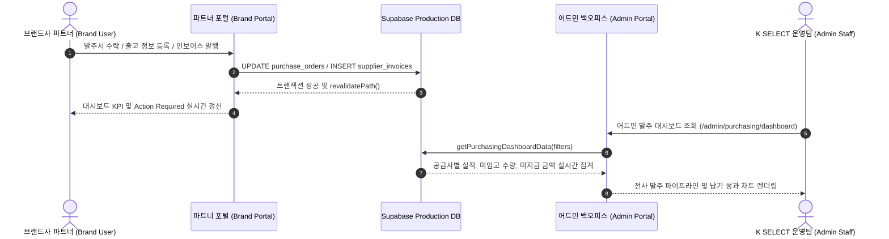

# MAN-B-RPT-001 — Operational Workflow Map
## Reports & Performance Guide (01_SOURCE)

- **Manual ID:** `MAN-B-RPT-001`
- **Document Name:** `Operational Workflow Map`
- **Audience:** `B` (Brand Portal Users & Operations Team)
- **Effective Date:** 2026-10-01
- **Status:** `APPROVED CANONICAL SOURCE`

---

## 1. Overview of Reporting & Performance Workflows

K SELECT NETWORK의 성과 및 지표 분석 시스템은 브랜드사가 매일 아침 접속하여 신속하게 비즈니스 병목을 진단하고, 적기에 발주 이행과 정산 대금을 수령할 수 있도록 **5단계 표준 운영 워크플로우**를 제공합니다:

1. **Workflow 1: 일일 브랜드 운영 건전성 진단 (Daily Health Check & Action Resolution)**
2. **Workflow 2: 발주 파이프라인 및 출고 성과 분석 (Order Pipeline & Fulfillment Analysis)**
3. **Workflow 3: 재무 정산 및 미지급 잔액 모니터링 (Financial Settlement & Cash Flow Tracking)**
4. **Workflow 4: 카탈로그 등록 완성도 감사 (Catalog Readiness & Spec Completeness Audit)**
5. **Workflow 5: 포털-어드민 실시간 데이터 동기화 (Cross-Domain Data Sync & Admin Audit)**

---

## 2. Workflow 1: Daily Health Check & Action Resolution

브랜드사 담당자가 매일 업무 시작 시 포털 대시보드에 접속하여 긴급 병목을 5분 내에 해소하는 표준 절차입니다.

```mermaid
flowchart TD
    START([포털 로그인<br>/portal]) --> FETCH[실시간 회사 데이터 로드<br>PO / Invoice / Product / Case]
    FETCH --> SCAN[대시보드 KPI 카드 스캔<br>• 진행 중 발주<br>• 미지급 잔액<br>• Draft 제품<br>• 미종결 문의]
    SCAN --> CHECK_ACTION{실행 필요 항목<br>Action Required 존재?}
    
    CHECK_ACTION -- YES --> EVAL_PRIORITY[우선순위 3단계 분류<br>1. URGENT (빨강)<br>2. DUE_SOON (주황)<br>3. NORMAL (파랑)]
    CHECK_ACTION -- NO --> NORMAL_MONITORING[정상 운영 모니터링 유지]
    
    EVAL_PRIORITY --> ACT_URGENT[URGENT 조치:<br>• 발주서 수락/회신<br>• 연체 인보이스 확인<br>• 1:1 문의 답변]
    ACT_URGENT --> RESOLVE[해당 상세 화면으로 즉시 이동하여 작업 완료]
    RESOLVE --> REVALIDATE[실시간 지표 자동 갱신<br>Action Required 큐에서 자동 제거]
    REVALIDATE --> COMPLETE([일일 건강성 진단 완료])
    NORMAL_MONITORING --> COMPLETE
```

### 상세 실행 단계
1. **포털 메인 화면 접속 (`/portal`)**:
   - 세션 권한에 따라 로그인된 회사(`company_id`)의 실시간 지표를 자동 로드합니다.
2. **4대 도메인 KPI 카드 스캔**:
   - 발주(진행 중, 출고 준비, 입고 검수), 재무(총 청구액, 지급 완료, 미지급 잔액, 연체 잔액), 제품(Complete vs Draft), 문의(회신 대기, 검토 중) 지표를 한눈에 파악합니다.
3. **Action Required Items 큐 해결**:
   - `URGENT`(발주서 미수락, 연체 인보이스, 운영팀 답변 요청) 항목의 액션 버튼을 클릭하여 즉시 처리합니다.
   - 처리가 완료되면 캐시가 자동 재검증(`revalidatePath`)되어 대시보드 큐에서 즉시 제거됩니다.

---

## 3. Workflow 2: Order Pipeline & Fulfillment Performance Analysis

발주 이행 및 출고 실적을 기간별·상태별로 다차원 분석하는 워크플로우입니다.

```mermaid
flowchart TD
    O_START([발주 관리 메뉴 진입<br>/portal/orders/purchase-orders]) --> O_KPI[상단 5대 파이프라인 KPI 확인<br>전체 진행 | 생산 중 | 출고 준비 | 입고/검수 | 완료]
    O_KPI --> O_FILTER{기간 및 상태 필터 설정}
    
    O_FILTER -->|기본 90일| D90[최근 90일 발주서 로드]
    O_FILTER -->|커스텀 기간| DCUST[시작일 / 종료일 지정]
    O_FILTER -->|상태 칩 선택| CHIPS[IN_PRODUCTION / READY_TO_SHIP<br>SHIPPED / RECEIVING / COMPLETED]
    
    D90 --> O_TABLE[필터링된 발주 목록 테이블 렌더링]
    DCUST --> O_TABLE
    CHIPS --> O_TABLE
    
    O_TABLE --> O_SORT[정렬 기준 선택<br>최신순 | 과거순 | 금액 높은순 | 금액 낮은순]
    O_SORT --> O_DRILL[특정 발주서 클릭 → 상세 성과 및 무역 서류 확인<br>/portal/orders/purchase-orders/[id]]
    O_DRILL --> O_END([발주 성과 분석 완료])
```

### 상세 실행 단계
1. **발주 목록 화면 진입 (`/portal/orders/purchase-orders`)**:
   - 공급사 전용 발주서 목록과 상단 KPI 요약 카드가 렌더링됩니다.
2. **기간 필터 설정**:
   - 기본 설정은 최근 90일(`Last 90 Days`)이며, 필요에 따라 커스텀 시작일/종료일을 입력합니다.
3. **상태 카테고리 칩 선택**:
   - `IN_PRODUCTION`, `READY_TO_SHIP`, `SHIPPED`, `RECEIVING`, `COMPLETED`, `CANCELLED` 칩을 클릭하여 원하는 공정 단계의 발주서만 선별합니다.
4. **상세 분석 및 무역 서류 다운로드**:
   - 목록에서 발주 번호를 클릭하여 품목별 단가, 발주 수량, 출고 완료 수량, 입고 수량 및 무역 서류(PO PDF, 패킹리스트, 상업송장)를 확인합니다.

---

## 4. Workflow 3: Financial Settlement & Cash Flow Tracking

인보이스 발행, 지급 완료액, 미지급 잔액 및 지급 기한을 추적하여 자금 흐름을 관리하는 절차입니다.

```mermaid
flowchart TD
    F_START([정산 관리 메뉴 진입<br>/portal/finance]) --> F_SUMMARY[정산 요약 지표 확인<br>총 청구액 | 지급 완료액 | 미지급 잔액]
    F_SUMMARY --> F_OVERDUE{지급 기한 초과<br>Overdue 인보이스 존재?}
    
    F_OVERDUE -- YES --> F_URGENT[지급 지연 인보이스 우선 점검<br>Due Date 및 Balance Due 확인]
    F_OVERDUE -- NO --> F_SCHEDULE[정상 지급 스케줄 확인]
    
    F_URGENT --> F_DETAIL[인보이스 상세 페이지 진입<br>/portal/finance/[id]]
    F_SCHEDULE --> F_DETAIL
    
    F_DETAIL --> F_RECONCILE[발주서 번호 및 조정 내역(Adjustment) 대조]
    F_RECONCILE --> F_REMIT[송금 계좌 정보 및 영수증 확인]
    F_REMIT --> F_END([재무 정산 분석 완료])
```

### 상세 실행 단계
1. **정산 관리 화면 진입 (`/portal/finance`)**:
   - 발행된 전체 공급사 인보이스, 조정(Adjustment) 내역, 지급(Payment) 내역이 로드됩니다.
2. **미지급 잔액 및 지급 기한 점검**:
   - 계약 조건(Payment Terms)에 따른 인보이스별 지급 기한(Due Date)과 잔여 미지급 잔액(Balance Due)을 확인합니다.
3. **인보이스 상세 대조**:
   - 발주서(PO) 번호와 1:1 매칭 여부, 품목별 금액 및 정산 가감 조정 내역을 대조합니다.

---

## 5. Workflow 4: Product Catalog Readiness & Completeness Audit

신규 상품이 바이어 발주 및 리테일 배포가 가능한 `COMPLETE` 상태인지 검증하는 절차입니다.

```mermaid
flowchart TD
    P_START([대시보드 또는 제품 관리 진입<br>/portal/products]) --> P_CHECK[카탈로그 완성도 지표 스캔<br>Complete SKUs vs Draft SKUs]
    P_CHECK --> P_HAS_DRAFT{Draft 제품 존재?}
    
    P_HAS_DRAFT -- YES --> P_LIST[보완 대기 제품 목록 확인<br>Missing Fields 파악]
    P_HAS_DRAFT -- NO --> P_READY[전체 카탈로그 발주 준비 완료]
    
    P_LIST --> P_EDIT[제품 수정 화면 진입<br>/portal/products/[id]]
    P_EDIT --> P_INPUT[누락 스펙 입력:<br>• 단품/포장/카톤 규격<br>• 12/13자리 바코드<br>• 대표 이미지]
    P_INPUT --> P_SAVE[저장 및 등록 평가기 실행]
    P_SAVE --> P_EVAL{28대 기준 통과?}
    
    P_EVAL -- PASS --> P_COMPLETE[COMPLETE 상태로 승격<br>발주 가능 카탈로그 등록]
    P_EVAL -- FAIL --> P_RETRY[남은 누락 필드 안내]
    P_RETRY --> P_INPUT
    
    P_COMPLETE --> P_END([카탈로그 완성도 100% 달성])
    P_READY --> P_END
```

---

## 6. Workflow 5: Cross-Domain Data Sync & Admin Audit

브랜드 포털에서 발생한 운영 변경 사항이 어드민 발주 대시보드로 실시간 동기화되는 아키텍처입니다.


