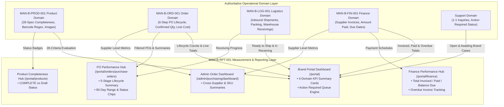
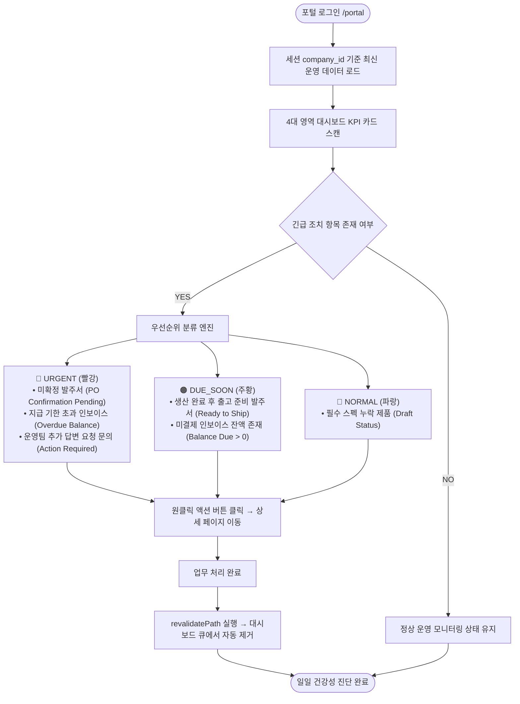
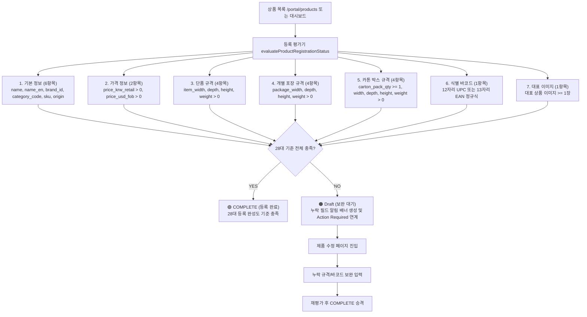
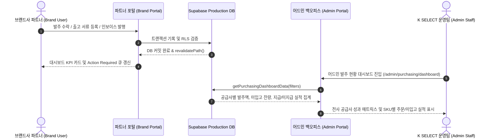

# REPORTS & PERFORMANCE ARCHITECTURE DIAGRAMS: MAN-B-RPT-001
## 5 Authoritative Production Architecture & Data Flow Diagrams

- **Manual ID:** `MAN-B-RPT-001`
- **Topic:** `Reports & Performance (성과 분석, 대시보드 KPI 및 운영 지표)`
- **Audience:** `B — Brand Portal Users & Technical Operators`
- **Authoritative Date:** 2026-10-01

---

## 1. Diagram 1: Operational Source vs Reporting Layer Architecture



---

## 2. Diagram 2: Daily Health Check & Action Required Priority Engine



---

## 3. Diagram 3: 5-Stage PO Pipeline Aggregation & Filter Flow
*(RPT 5-Stage Reporting Aggregation ≠ ORD 6-Step Lifecycle Transition Model)*

```mermaid
flowchart TD
    PO_ENTRY([발주 관리 메뉴 진입 /portal/orders/purchase-orders]) --> DATE_FILTER{기간 필터 적용}
    
    DATE_FILTER -->|Default| D90[최근 90일 (Last 90 Days)]
    DATE_FILTER -->|Custom| DCUST[사용자 지정 시작일 ~ 종료일]
    
    D90 --> STAGE_AGG[5대 파이프라인 단계별 집계 연산]
    DCUST --> STAGE_AGG
    
    STAGE_AGG --> S1["1. 전체 진행 중 (Total Open)<br>overall_status NOT IN ('Completed', 'Cancelled')"]
    STAGE_AGG --> S2["2. 생산 중 (In Production)<br>Sent to Supplier / Supplier Confirmed / In Production"]
    STAGE_AGG --> S3["3. 출고 준비 (Ready to Ship)<br>Ready to Ship (패킹 등록 대기)"]
    STAGE_AGG --> S4["4. 입고/검수 (Receiving)<br>Shipped / Arrived / Receiving"]
    STAGE_AGG --> S5["5. 완료 (Completed)<br>Completed (검수 완료 및 정산 연계)"]
    
    S1 & S2 & S3 & S4 & S5 --> CHIP_FILTER{상태 카테고리 칩 선택}
    CHIP_FILTER --> RENDER_TABLE[필터링된 발주 목록 테이블 렌더링]
    RENDER_TABLE --> SORT_ENGINE[정렬: 최신순 / 과거순 / 금액 높은순 / 금액 낮은순]
    SORT_ENGINE --> PO_DETAIL_VIEW([발주 상세 및 무역 서류 다운로드])
```

---

## 4. Diagram 4: 28-Criteria Product Completeness Audit Flow



---

## 5. Diagram 5: Brand Portal to Admin Backoffice Data Synchronization Flow



---
*End of REPORTS_PERFORMANCE_ARCHITECTURE_DIAGRAMS.md*
