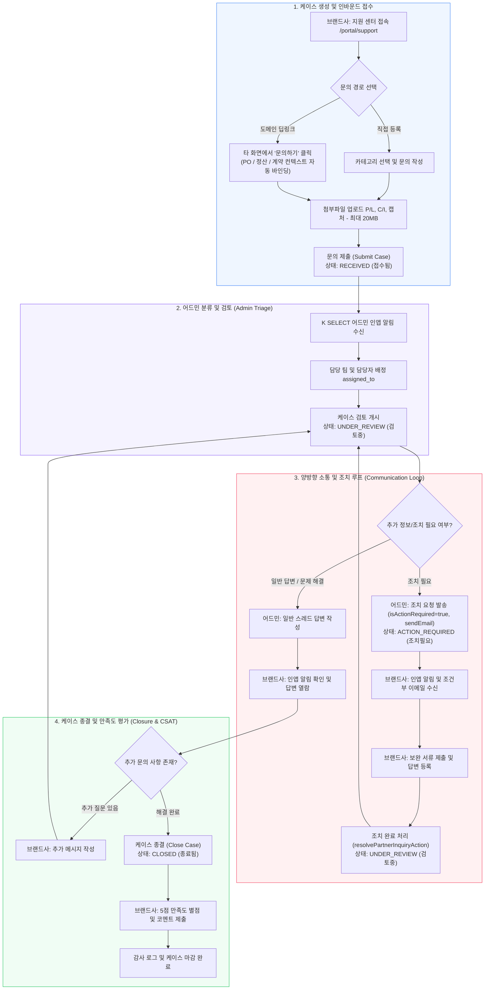
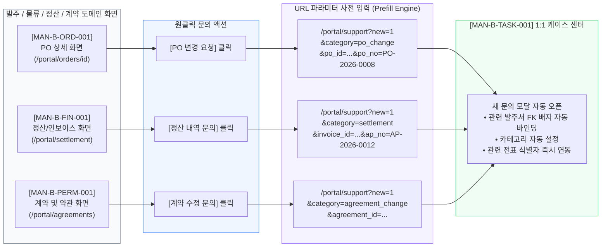
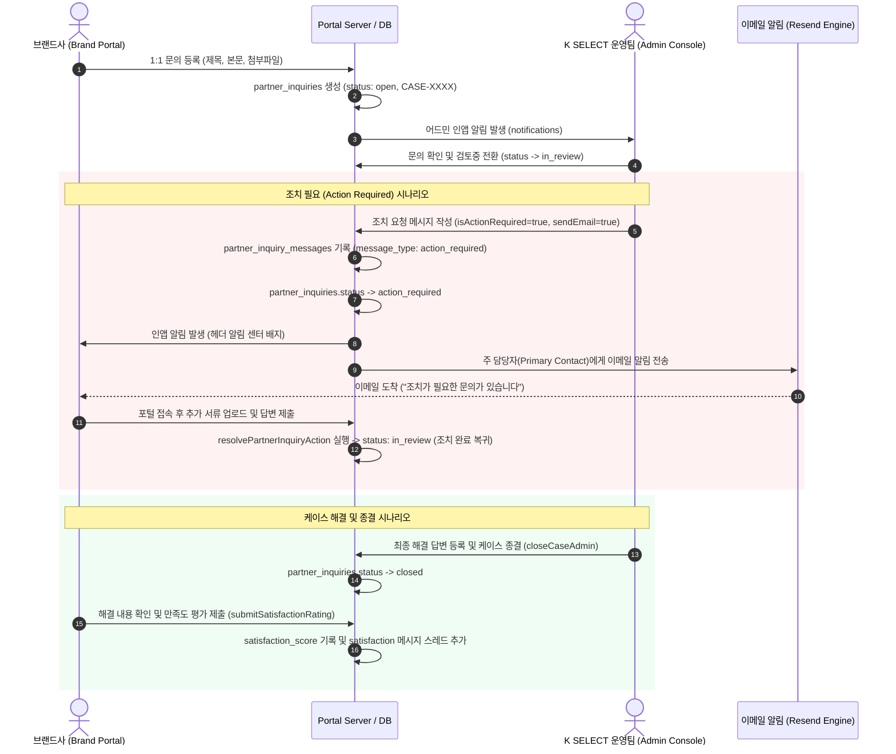
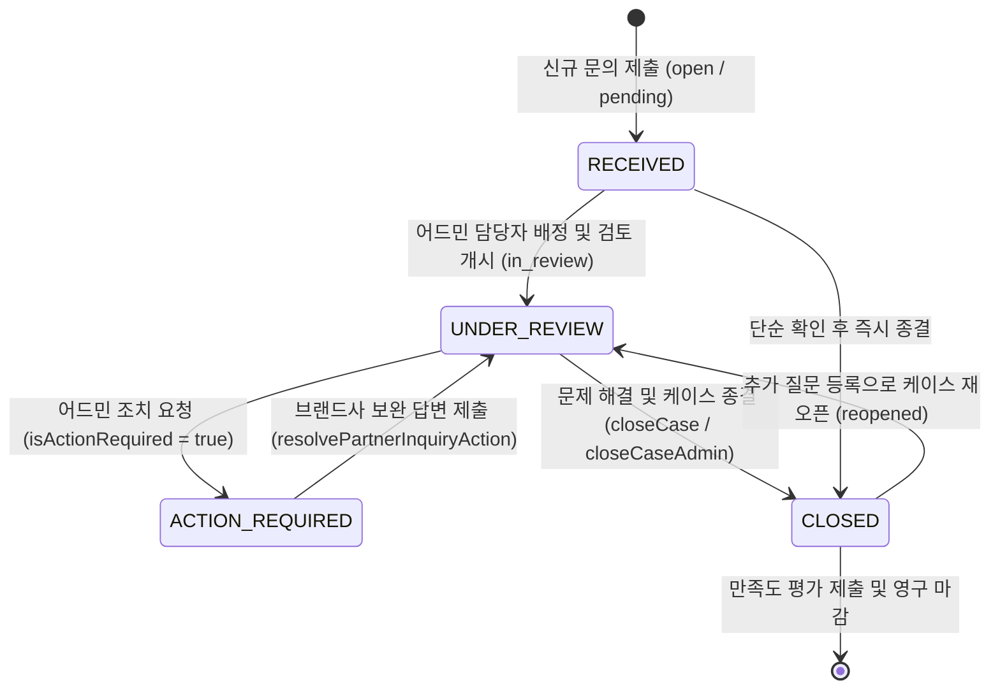
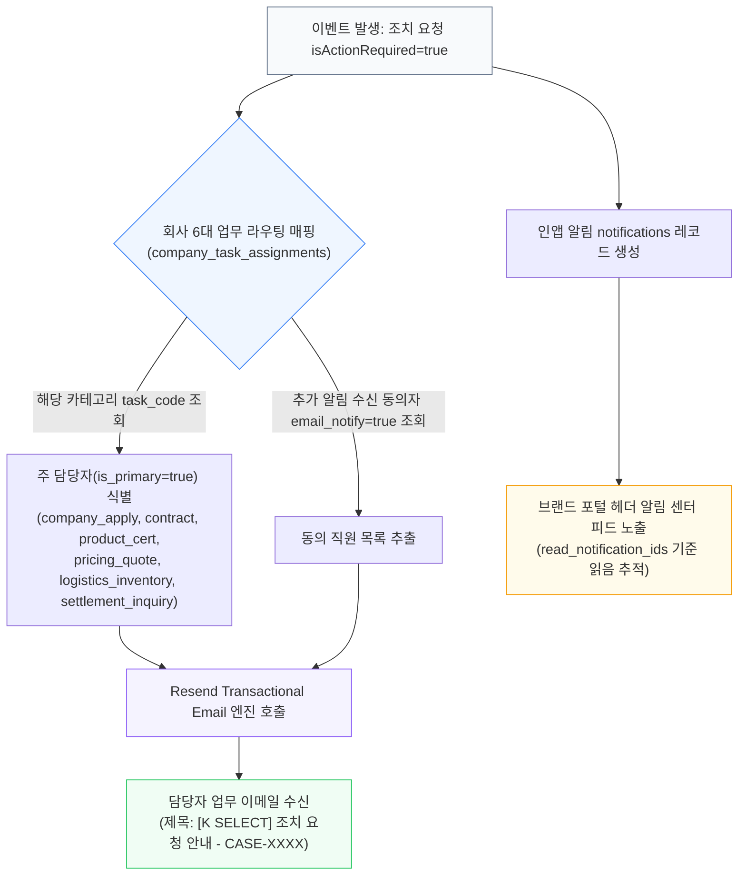
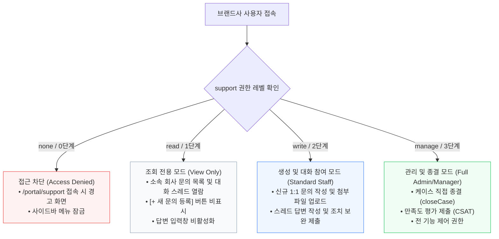
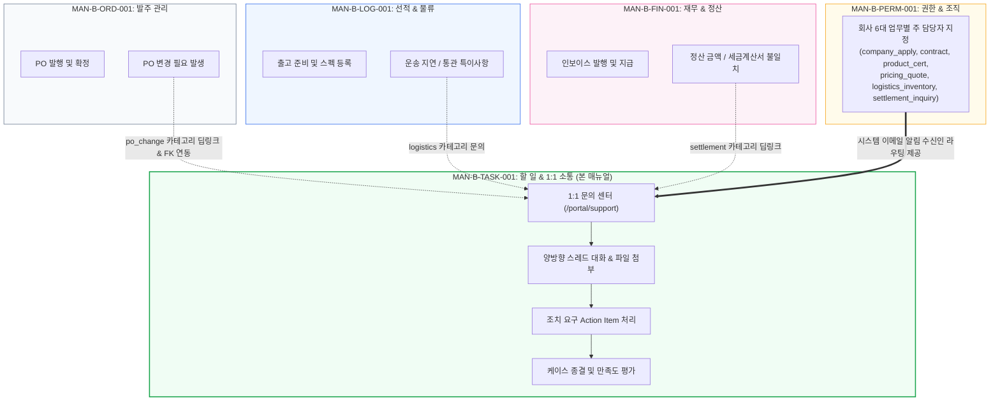

# WORKFLOW MAP: MAN-B-TASK-001
## Task & Communication Lifecycle & Architecture Diagrams

- **Manual ID:** `MAN-B-TASK-001`
- **Topic:** `Task & Communication (할 일, 업무 조율 및 1:1 케이스 소통)`
- **Audience:** `B — Brand Portal Users`
- **Authoritative Date:** 2026-10-02

---

## Diagram 1. End-to-End Case Management Lifecycle (전체 케이스 라이프사이클)

---

## Diagram 2. Cross-Domain Context & Prefill Inflow (도메인 간 컨텍스트 연계 워크플로우)

---

## Diagram 3. Brand ↔ Admin Communication & Action Required Loop (스레드 소통 시퀀스)

---

## Diagram 4. Official Case Status State Machine (케이스 상태 전이도)

---

## Diagram 5. Notification & Primary Contact Email Routing (알림 라우팅 구조)

---

## Diagram 6. Support Menu ACL Permission Boundary (권한 제어 경계)

---

## Diagram 7. Multi-Manual Domain Architecture & Relationship Map

---
*End of MAN-B-TASK-001_Workflow_Map.md*
