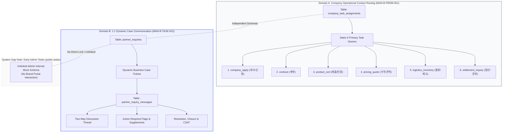
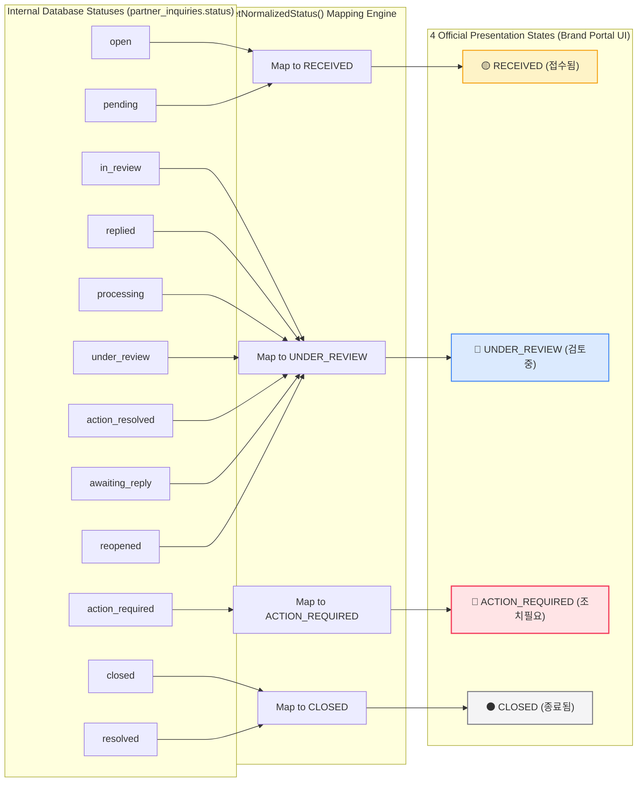
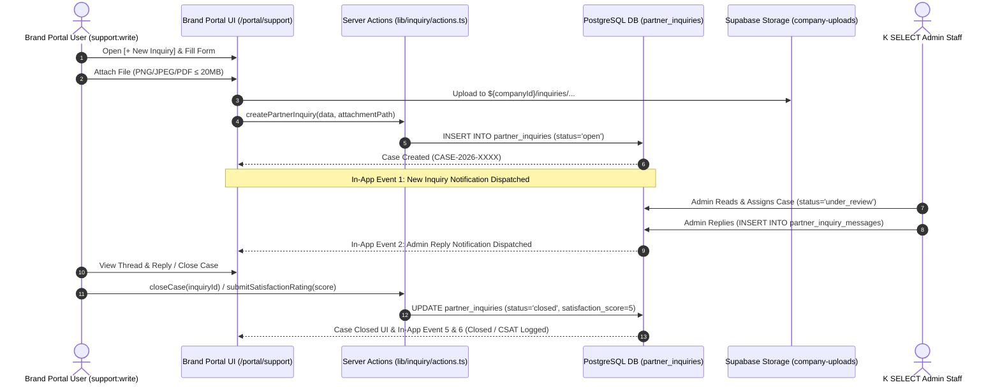
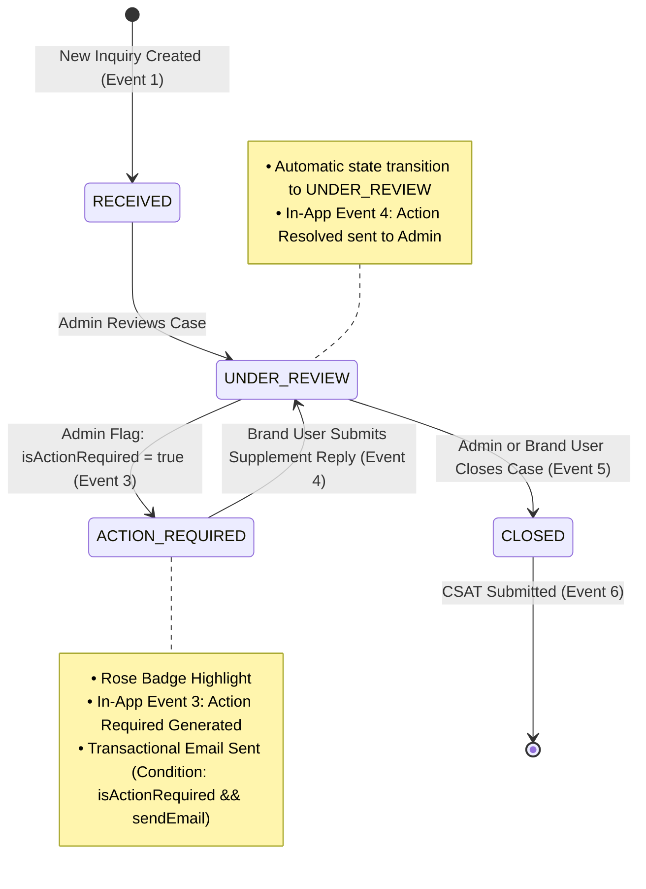
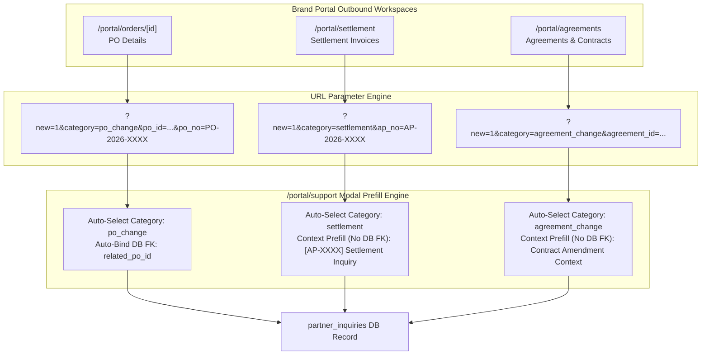
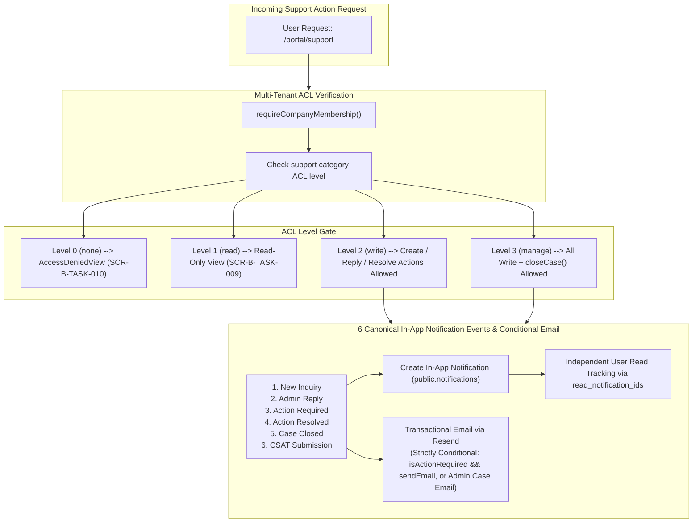
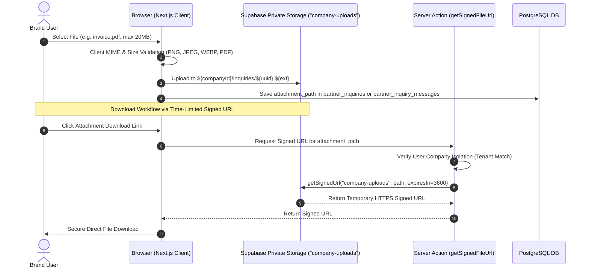

# TASK & COMMUNICATION ARCHITECTURE DIAGRAMS: MAN-B-TASK-001
## K SELECT System Architecture, Workflows & Data Pipelines

- **Manual ID:** `MAN-B-TASK-001`
- **Topic:** `Task & Communication (할 일, 업무 조율 및 1:1 케이스 소통)`
- **Audience:** `B — Brand Portal Users`
- **Authoritative Date:** 2026-10-02

---

## Diagram 1: Two Distinct Task Domains (Operational Routing vs Dynamic Cases)

---

## Diagram 2: Case Status Normalization Matrix (10 DB Enums → 4 Presentation States)

---

## Diagram 3: End-to-End Inquiry & Case Communication Lifecycle

---

## Diagram 4: Action Required Escalation & Resolution Flow

---

## Diagram 5: Cross-Domain Deep Linking Inflow (PO FK vs Context Prefill)

---

## Diagram 6: Multi-Tenant ACL & Notification Fan-Out Pipeline

---

## Diagram 7: Attachment Upload & Signed URL Security Architecture

---
*End of TASK_COMMUNICATION_ARCHITECTURE_DIAGRAMS.md*
