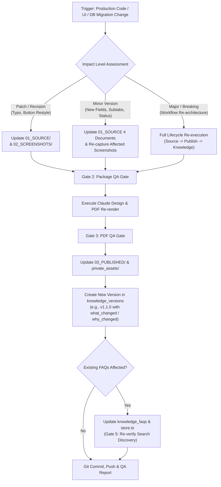
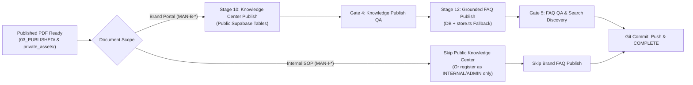

# MAN-I-DOC-001 — Workflow Map & Architecture Diagrams
## K SELECT Internal Operations: Manual Creation, QA, Publishing & Maintenance Workflows
### (매뉴얼 라이프사이클 엔드투엔드 워크플로우 맵 & 아키텍처 다이어그램)

---

## 1. Executive Overview & Workflow Taxonomy
본 문서는 K SELECT 매뉴얼 엔지니어링 시스템의 모든 운영 프로세스를 시각화한 워크플로우 맵입니다. 신규 매뉴얼 생성, 기존 매뉴얼 업데이트, 5대 엄격한 품질 검수 게이트(Quality Gates), 지식 센터 등록 및 FAQ 연동에 이르는 모든 상태 전이와 분기 조건을 정의합니다.

```text
[Pipeline 1: New Manual Creation] ──┐
                                     ├─➔ [Strict Blocking QA Gates (1~5)] ─➔ [Production Release & Git Sync]
[Pipeline 2: Existing Manual Update] ┘
```

---

## 2. End-to-End Master Manual Lifecycle Workflow

```mermaid
flowchart TD
    subgraph STAGE_A["1. Investigation & Source Creation"]
        A1["Production Code & DB Audit\n(app, lib, supabase/migrations)"] --> A2["Create 01_SOURCE/\n(Source, Field, Workflow, Screenshots)"]
        A2 --> A3{"Gate 1: Source QA Review\n(SRC-QA / R1 Gate)"}
        A3 -- "Defects / Ungrounded Found" --> A2
        A3 -- "Approved (Ground Truth Verified)" --> B1["Initialize 02_CLAUDE_PACKAGE/"]
    end

    subgraph STAGE_B["2. Claude Packaging & QA"]
        B1 --> B2["Write Package Markdowns\n(README, Prompts, Structure, Content)"]
        B2 --> B3["Capture Production Screenshots\n(11~14 Images, Unique SHA-256)"]
        B3 --> B4["Write Diagrams & Reference Guide"]
        B4 --> B5{"Gate 2: Package QA Gate\n(1:1 Source Match & Asset Hash)"}
        B5 -- "Mismatch / Corrupted / Dup Hash" --> B2
        B5 -- "All Green Pass" --> C1["Execute Claude Design Generation"]
    end

    subgraph STAGE_C["3. Design & PDF Publishing"]
        C1 --> C2["Render High-Fidelity PDF\n(MAN-B-BRAND-001 Master Ref)"]
        C2 --> C3{"Gate 3: PDF QA Gate\n(No Overflow, No TODOs, Clean Layout)"}
        C3 -- "Visual / Text Defects" --> C1
        C3 -- "PDF Approved" --> C4["Store in 03_PUBLISHED/\n& Copy to private_assets/manuals/"]
    end

    subgraph STAGE_D["4. Knowledge Hub & FAQ Release (Public Brand Manual Only)"]
        C4 --> D0{"Manual Audience Scope?"}
        D0 -- "Internal SOP (MAN-I-*)" --> E1["Final Git Commit & Push\n(Skip Public Knowledge & FAQ)"]
        D0 -- "Brand Portal (MAN-B-*)" --> D1["Register Knowledge Center\n(Upsert 4 DB Tables)"]
        D1 --> D2{"Gate 4: Knowledge Publish Gate\n(Status=PUBLISHED & Asset 200 OK)"}
        D2 -- "Fail / Download Error" --> D1
        D2 -- "Pass (Knowledge Item Active)" --> D3["Draft 8~12 Grounded FAQs\n(Hard Prerequisite: kno-id bound)"]
        D3 --> D4["Upsert knowledge_faqs\n& Sync memoryFaqs in store.ts"]
        D4 --> D5{"Gate 5: FAQ QA Gate\n(Search Discovery & 0 Duplicates)"}
        D5 -- "Regression / Duplicate Found" --> D3
        D5 -- "Pass" --> E1
    end

    subgraph STAGE_E["5. Release Finalization"]
        E1 --> E2["Verify Local HEAD === origin/main"]
        E2 --> E3["Output Final Completion Report"]
    end
```



---

## 3. Workflow 1: New Manual Creation Pipeline (신규 매뉴얼 제작)

신규 매뉴얼 제작 시 수행하는 상세 세부 단계입니다:

```text
[Step 1.1: System Reconnaissance]
  │  - 포털 UI 경로(`/portal/...`) 및 어드민 UI 경로(`/admin/...`) 전수 탐색
  │  - 관련 컴포넌트(`components/...`) 및 서버 액션(`lib/portal/actions.ts`) 코드 분석
  │  - DB 스키마 테이블, 컬럼 제약조건, RLS 정책, 인덱스(`supabase/migrations/...`) 분석
  ▼
[Step 1.2: Source Documents Drafting]
  │  - `Manuals/[MANUAL_ID]_[Title]/01_SOURCE/` 생성
  │  - `[MANUAL_ID]_Source.md`: 시스템 아키텍처, 상태 머신, 도메인 경계 정의
  │  - `[MANUAL_ID]_Field_Inventory.md`: 모든 입력 폼, 필터, DB 컬럼 데이터 사전
  │  - `[MANUAL_ID]_Workflow_Map.md`: 사용자 및 관리자 업무 플로우 차트
  │  - `[MANUAL_ID]_Screenshot_Requirements.md`: 11~14개 촬영 스크린 및 Pin 기획서
  ▼
[Step 1.3: Gate 1 — Source Review & Grounding Verification]
  │  - 독립적 검증 수행 (미구현 기능, 절대적 보증 표현, 도메인 불일치 적발)
  │  - 수정 사항 반영 및 R1 승인 baseline 확정 (QA 미통과 시 패키지 생성 불가)
  ▼
[Step 1.4: Claude Package Assembly]
  │  - `02_CLAUDE_PACKAGE/` 디렉터리 구축
  │  - `PACKAGE_README.md`, `CLAUDE_DESIGN_MASTER_PROMPT.md`, `CLAUDE_DESIGN_HANDOFF_PROMPT.md`, `[MANUAL_ID]_Design_Structure.md`
  │  - `01_CONTENT/[MANUAL_ID]_Manual_Content.md`
  │  - `02_SCREENSHOTS/` (실제 Production 화면 캡처 + `SCREENSHOT_ANNOTATION_GUIDE.md`)
  │  - `03_DIAGRAMS/` (`[DOMAIN]_ARCHITECTURE_DIAGRAMS.md`)
  │  - `04_REFERENCE/` (`REFERENCE_GUIDE.md` -> `MAN-B-BRAND-001` 디자인 시스템 바인딩)
  ▼
[Step 1.5: Gate 2 — Package QA & Physical Verification]
  │  - 모든 파일 물리적 실재성(Non-empty) 확인 (`readback-verify-physical-files.js`)
  │  - 스크린샷 100% Unique SHA-256 검증 (`verify-screenshots-hash.js`)
  │  - Source ↔ Package 마크다운 1:1 대조 완료
  ▼
[Step 1.6: Claude Design PDF Rendering & Generation]
  │  - Master Reference(`MAN-B-BRAND-001_Brand-Policy_V1.pdf`) 기준으로 PDF 렌더링
  ▼
[Step 1.7: Gate 3 — PDF QA Verification]
  │  - PDF 전 페이지 검수 (텍스트 잘림, 테이블 줄바꿈, 핀 매핑, TODO 잔존 여부, 100% 사실 일치)
  ▼
[Step 1.8: Publish & Asset Storage]
  │  - `03_PUBLISHED/[MANUAL_ID]_[Title]_V1.pdf` 저장
  │  - `private_assets/manuals/[MANUAL_ID]_[Title]_V1.pdf` 복제 및 SHA-256 해시 대조
  ▼
[Step 1.9: Gate 4 & 5 — Knowledge Center & FAQ Deployment (Brand Portal Only)]
  │  - [선행 필수] Supabase `knowledge_items`, `knowledge_versions`, `knowledge_manual_assets`, `knowledge_relations` upsert
  │  - [자산 검증] `/api/admin/knowledge/asset/[asset-id]` 다운로드 응답 200 OK 확인
  │  - [FAQ 배포] `source_knowledge_id` 바인딩된 8~12개 FAQ upsert 및 `lib/knowledge/store.ts` 동기화
  │  - [FAQ 검수] Search Discovery 및 회귀 테스트 통과
  ▼
[Step 1.10: Git Commit, Push & Deployment Verification]
  │  - `Local HEAD === origin/main` 일치 확인
  │  - 최종 완료 보고서 작성
```

---

## 4. Workflow 2: Existing Manual Update Pipeline (기존 매뉴얼 업데이트)

시스템 변경에 따라 기존 매뉴얼을 개정할 때 사용하는 연쇄 영향(Cascading Impact) 파이프라인입니다:



---

## 5. Quality Assurance Gates (5-Level Strict Blocking Matrix)

매뉴얼 제작 라이프사이클의 각 단계는 다음 5단계의 품질 게이트(Quality Gate)를 반드시 통과해야만 다음 단계로 진입할 수 있습니다:

| 게이트 단계 | 명칭 | 주관 검증 도구 | 통과 필수 조건 (Hard Criteria) | 차단 조치 (Block Action) |
| :--- | :--- | :--- | :--- | :--- |
| **Gate 1** | **Source Review Gate** | 소스코드/DB 교차 감사 | 4개 기획 문서 작성 완료, 미구현 기능 `NOT IMPLEMENTED` 표시, 도메인 경계 정의 100% 일치. | 미통과 시 패키지 생성 진입 불가 |
| **Gate 2** | **Package QA Gate** | Package QA Script & Hash Inspector | 8개 마크다운 파일 무결성, 스크린샷 전수 실재 및 Unique SHA-256 100%, 핀 어노테이션 매핑 완료. | 미통과 시 디자인 렌더링 진입 불가 |
| **Gate 3** | **PDF QA Gate** | PDF Visual Inspector | 전 페이지 시각 검수, 텍스트 오버플로우 0건, `TODO/FIXME` 0건, 마스터 디자인 시스템 규격 준수. | 미통과 시 배포(Publish) 진입 불가 |
| **Gate 4** | **Knowledge Publish Gate**| Supabase DB Query & Asset API Client | `knowledge_items.status = 'PUBLISHED'`, `/api/admin/knowledge/asset/[id]` 다운로드 응답 200 OK. | 미통과 시 FAQ 생성/배포 진입 불가 (**STOP**) |
| **Gate 5** | **FAQ Publish Gate** | FAQ Discovery & Regression Suite | 8~12개 신규 FAQ 등록, 기존 N개 FAQ 100% 보존, 중복 0건, `store.ts` 동기화, 키워드 검색 성공. | 미통과 시 Git Commit & Release 불가 |

---

## 6. Knowledge Center DB Upsert & Asset Serving Workflow

Brand Portal 매뉴얼이 최종 Publish된 후 지식 허브에 등록되고 사용자에게 제공되는 기술적 아키텍처 흐름입니다:

```text
[Admin Script / Workflow]
       │
       ├─➔ 1. [Storage] Copy PDF to `private_assets/manuals/[FILE_NAME].pdf`
       │
       ├─➔ 2. [DB: knowledge_items] Upsert Metadata (ID, Title, Category, Module, Scope, Status='PUBLISHED')
       │
       ├─➔ 3. [DB: knowledge_versions] Insert Version Record (Version='v1.0', what_changed, why_changed)
       │
       ├─➔ 4. [DB: knowledge_manual_assets] Insert Asset Binding (file_url='/api/admin/knowledge/asset/[asset_id]')
       │
       └─➔ 5. [DB: knowledge_relations] Insert Menu Linkages (related_route='/portal/...')
                                      │
                                      ▼
[Brand Portal End User Request]
  1. User visits `/portal/help` or `/portal/help/manuals`
  2. Next.js Server Component queries `knowledge_items` & `knowledge_topics`
  3. User clicks `[다운로드 (Download)]` button for manual
  4. Browser navigates to `/api/admin/knowledge/asset/[asset-id]`
  5. Route handler verifies authentication, reads from `private_assets/manuals/`, and streams binary PDF (`200 OK`)
```

---

## 7. FAQ Authoring, Fallback Sync & Search Flow

```text
[Published Manual PDF & Registered Knowledge Item (Prerequisite)]
       │
       ▼
[Draft 8~12 Bilingual FAQs (faq-[domain]-01 ~ 12)]
  - Source Binding: `source_knowledge_id = kno-[domain]-v10`
  - Grounded Anchor: Chapter & Section in PDF
  - 3~4 Featured Items: `is_featured = true`
       │
       ├───────────────────────────────────────────────┐
       ▼                                               ▼
[Supabase: knowledge_faqs]                 [Codebase: lib/knowledge/store.ts]
  - Upsert all rows into DB                   - Append objects to `memoryFaqs` array
  - Foreign Key: `source_knowledge_id`        - Ensures Zero-Downtime in-memory fallback
       │                                               │
       └───────────────────────┬───────────────────────┘
                               ▼
                [Gate 5: Search Discovery & Regression QA]
                  - Query "Invoice", "Shipping", etc.
                  - Audit 0 duplicate IDs / titles
                  - Verify all existing FAQ groups intact
```

---

## 8. Divergence Path: Internal SOP (`MAN-I-*`) vs Brand Portal (`MAN-B-*`)


