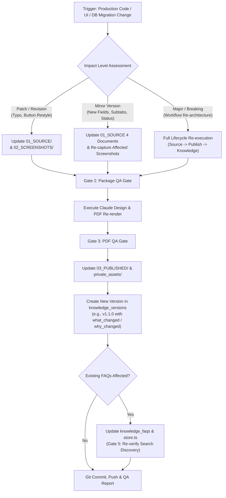
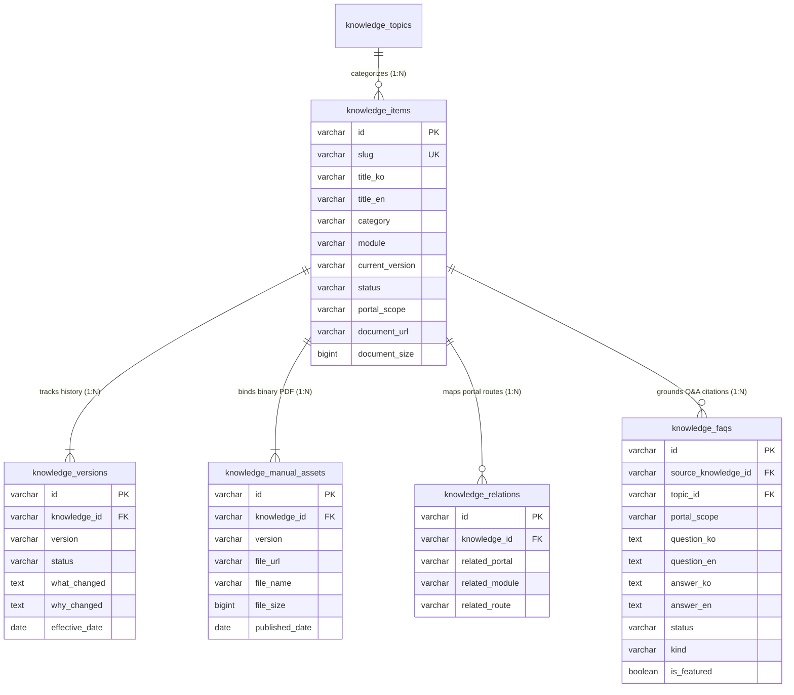
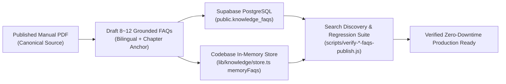

# MAN-I-DOC-001 — Manual Engineering Architecture Diagrams
## K SELECT Internal Operations: Manual Lifecycle, QA Gates & Knowledge Architecture
### (K SELECT 매뉴얼 엔지니어링 아키텍처 다이어그램 모음집)

---

## 1. 13-Stage Master Manual Lifecycle & 5-Level QA Blocking Gates

```mermaid
flowchart TD
    subgraph STAGE_A["1. Investigation & Source Creation"]
        A1["Production Code & DB Reconnaissance\n(app, lib, supabase/migrations)"] --> A2["Write 01_SOURCE/\n(Source, Field, Workflow, Screenshots)"]
        A2 --> A3{"Gate 1: Source QA Gate\n(Line-by-Line Code/DB Audit)"}
        A3 -- "Defects / Ungrounded Claims" --> A2
        A3 -- "Approved (Ground Truth Verified)" --> B1["Initialize 02_CLAUDE_PACKAGE/"]
    end

    subgraph STAGE_B["2. Claude Packaging & Asset Audit"]
        B1 --> B2["Write Package Markdowns\n(README, Prompts, Structure, Content)"]
        B2 --> B3["Capture Production Screenshots\n(11~14 Images, 100% Unique SHA-256)"]
        B3 --> B4["Write Diagrams & Reference Guide"]
        B4 --> B5{"Gate 2: Package QA Gate\n(Source ↔ Package 1:1 Match)"}
        B5 -- "Mismatch / Corrupted / Dup Hash" --> B2
        B5 -- "All Green Pass" --> C1["Execute Claude Design Generation"]
    end

    subgraph STAGE_C["3. Design & PDF Publishing"]
        C1 --> C2["Render High-Fidelity PDF\n(MAN-B-BRAND-001 Master Ref)"]
        C2 --> C3{"Gate 3: PDF QA Gate\n(0 Overflow, 0 TODOs, 100% Grounded)"}
        C3 -- "Visual / Text Defects" --> C1
        C3 -- "PDF Approved" --> C4["Store in 03_PUBLISHED/\n& Copy to private_assets/manuals/"]
    end

    subgraph STAGE_D["4. Knowledge Hub & FAQ Release (Public Brand Manual Only)"]
        C4 --> D0{"Manual Audience Scope?"}
        D0 -- "Internal SOP (MAN-I-*)" --> E1["Final Git Commit & Push\n(Skip Public Knowledge & FAQ)"]
        D0 -- "Brand Portal (MAN-B-*)" --> D1["Register Knowledge Center\n(Upsert 4 Supabase Tables)"]
        D1 --> D2{"Gate 4: Knowledge Publish Gate\n(Status=PUBLISHED & Asset 200 OK)"}
        D2 -- "Download Error / Incomplete" --> D1
        D2 -- "Pass (Knowledge Item Active)" --> D3["Draft 8~12 Grounded FAQs\n(Hard Prerequisite: kno-id bound)"]
        D3 --> D4["Upsert knowledge_faqs\n& Sync memoryFaqs in store.ts"]
        D4 --> D5{"Gate 5: FAQ QA Gate\n(Search Discovery & 0 Duplicates)"}
        D5 -- "Regression / Duplicates Found" --> D3
        D5 -- "Pass" --> E1
    end

    subgraph STAGE_E["5. Release Finalization"]
        E1 --> E2["Verify Local HEAD === origin/main"]
        E2 --> E3["Output Final Completion Report"]
    end
```

---

## 2. Existing Manual Update & Cascading Impact Workflow

---

## 3. Supabase Knowledge Center Database Architecture (ERD)

---

## 4. FAQ Dual-Store Zero-Downtime Synchronization Architecture

