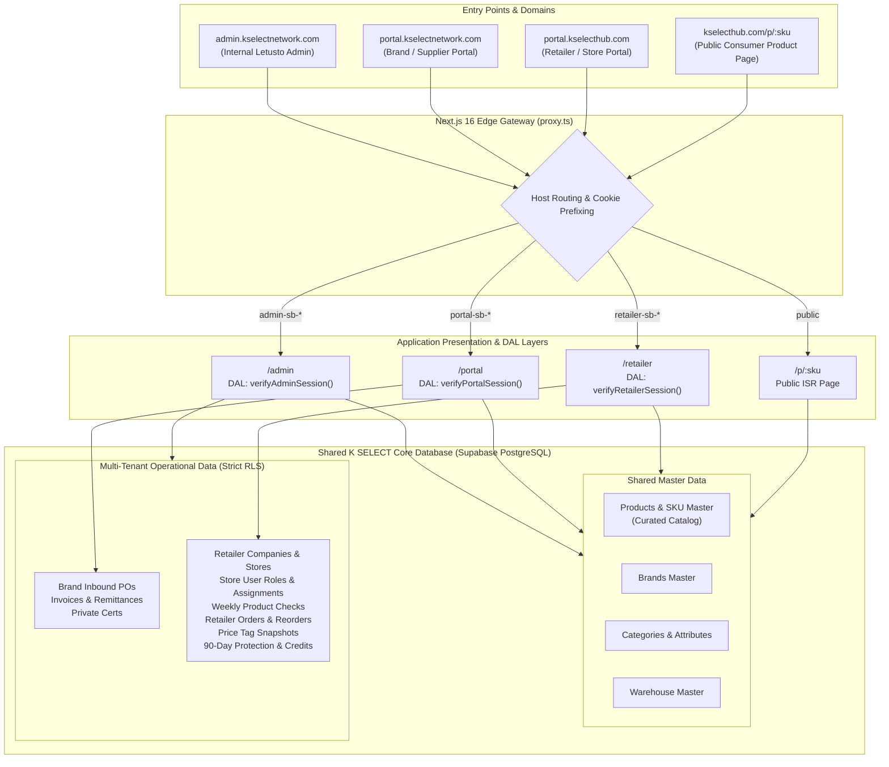
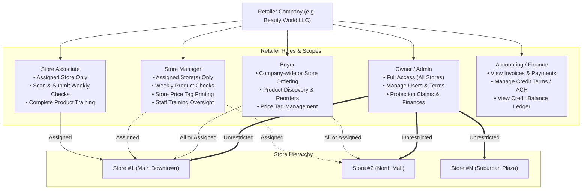
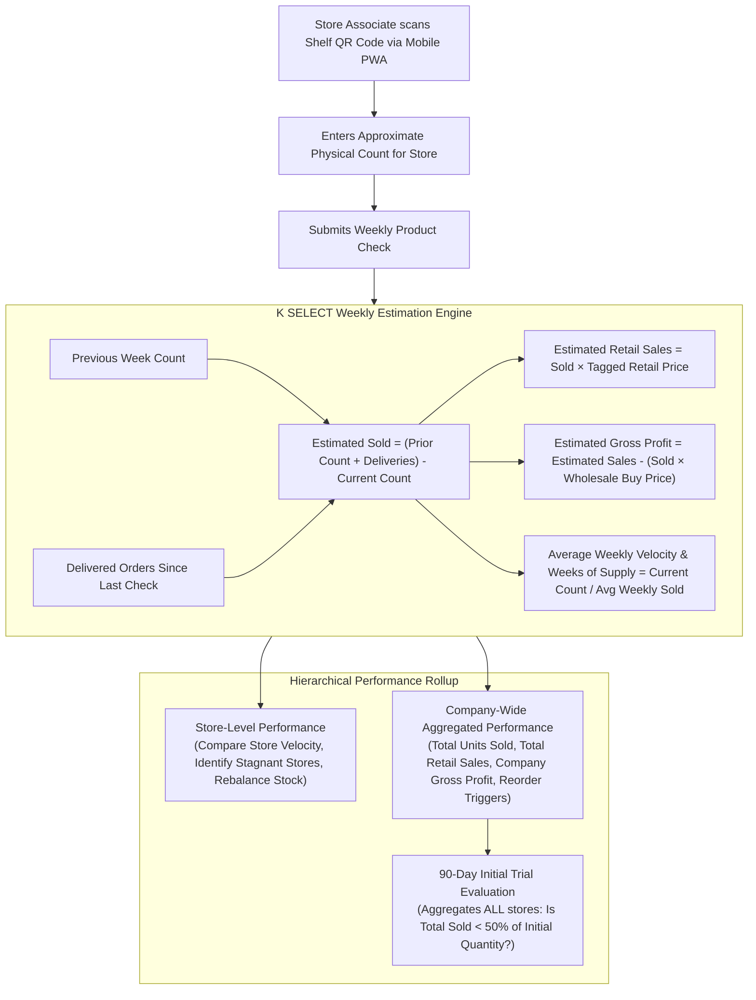

# K SELECT Retailer Portal — Application & Data Architecture Design
**Task ID:** `RTP-ARC-001`  
**Target Production Domain:** `portal.kselecthub.com`  
**Execution Type:** Architecture & Design Specification (Read-Only)

---

## 1. System Relationship Diagram



---

## 2. Existing Data Model Classification Table

| Existing Table / Model | Current Purpose | Classification | Retailer Portal Purpose | Risk / Notes |
| :--- | :--- | :--- | :--- | :--- |
| `profiles` | User profile linked to `auth.users(id)` with `app_role` enum (`'portal'`, `'admin'`). | **EXTEND** | Extend `app_role` enum with `'retailer'` to cleanly identify retailer user profiles. | Non-destructive enum extension; zero risk to existing admin/brand users. |
| `companies` | Company entity for brands, suppliers, and partners with `company_code`, business info. | **REUSE** | Represents the parent Retailer Company entity (e.g. "Beauty World LLC"). | Unified company table preserves consistent company code generation and metadata. |
| `company_roles` | Many-to-many company role mapping (`'Brand Owner'`, `'Retailer'`, etc.). | **REUSE** | Map retailer companies with role `'Retailer'`. | Already supports `'Retailer'` in check constraint. |
| `company_users` | Maps profiles to companies with `company_role` (`'company_admin'`, `'company_staff'`). | **EXTEND / REUSE** | Manage company-level retailer user memberships and basic statuses (`active`, `invited`). | Extended by `retailer_user_roles` and `retailer_user_store_access` for granular store permissions. |
| `stores` | Table for retail stores created in prototype migration 0014; currently lacks `company_id`. | **EXTEND** | Physical store locations belonging to a Retailer company (`company_id`, name, store code, address, manager). | Needs `company_id` foreign key, multi-tenant RLS, and store status fields. |
| `placements` | Prototype store shelf placement matrix from migration 0014; unlinked to production code. | **DO NOT USE** | Superseded by the simpler, scan-based Weekly Product Check model (`weekly_product_checks`). | Avoid heavy placement matrix maintenance. |
| `products` | Core Product Master (SKU, brand, category, volume, MSRP, ingredients, curation status). | **REUSE** | Catalog source for retailer product discovery, ordering, and training. | Read-only for retailers; pricing/assortment customizations stored in separate retailer tables. |
| `brands` | Brand entity and profile (logo, name, intro, status). | **REUSE** | Display brand context and storytelling in retailer catalog and QR pages. | Read-only for retailers. |
| `product_images` | Image assets for products in storage. | **REUSE** | Display product packshots and shelf thumbnails in Retailer Portal and Public QR page. | Stored in private bucket; requires published asset view policy. |
| `product_certificates` | Compliance and ingredient certificates for brands. | **DO NOT USE (for Retailers)** | Internal brand compliance only. | Strictly confidential; hidden from Retailer Portal via RLS. |
| `purchase_orders` / `lines` | Inbound Supplier POs (Letusto buying from Korean manufacturers). | **DO NOT USE (for Retailers)** | Supplier procurement only. | Retailers use dedicated `retailer_orders` table. |
| `supplier_invoices` / `payments` | Inbound AP invoices and wire remittance records to Korean suppliers. | **DO NOT USE (for Retailers)** | Supplier AP only. | Retailers use dedicated `retailer_invoices` and `retailer_payments`. |
| `warehouses` | Warehouse facilities and fulfillment centers. | **REUSE** | Ship-from origin for retailer orders and return destination for 90-day protection claims. | Shared operational master. |
| `email_templates` / `activity_logs` | Centralized email templates and audit logging infrastructure. | **REUSE / EXTEND** | Retailer notification templates (invites, order confirmations, reminders) and retailer action auditing. | Unified audit and communication infrastructure. |

---

## 3. Proposed New Retailer Entities

### 1. `retailer_profiles`
- **Purpose:** Store company-level B2B commercial terms, payment conditions, and account configuration.
- **Parent / Relationship:** `1:1` with `public.companies(id)`.
- **Key Data:** `payment_terms` (`PREPAID_CARD`, `PREPAID_ACH`, `NET_30`, `NET_45`, `NET_60`), `credit_limit`, `terms_approved_by_admin`, `stripe_customer_id`, `resale_certificate_number`, `tax_exempt_status`.
- **Why Needed:** Admin needs to configure and enforce credit terms and payment methods independently for each retailer business.

### 2. `retailer_user_roles`
- **Purpose:** Store granular organizational roles for retailer team members.
- **Parent / Relationship:** `1:1` or `1:N` linked to `public.company_users(id)`.
- **Key Data:** `role` (`owner`, `buyer`, `store_manager`, `employee`, `accounting`).
- **Why Needed:** Distinguishes executive buyers from frontline store associates scanning weekly checks.

### 3. `retailer_user_store_access`
- **Purpose:** Granular mapping of which stores a retailer user is permitted to manage or report on.
- **Parent / Relationship:** Links `company_users(id)` to `stores(id)`.
- **Key Data:** `user_id`, `store_id`, `can_submit_checks`, `can_print_tags`.
- **Why Needed:** Enables multi-store retail chains to restrict store managers/employees to their specific store locations while giving buyers company-wide visibility.

### 4. `retailer_product_pricing`
- **Purpose:** Manage retailer regular prices, sale prices, and store-specific overrides without mutating the Product Master.
- **Parent / Relationship:** Linked to `companies(id)`, `stores(id)` (nullable for company-wide default), and `products(id)`.
- **Key Data:** `regular_price`, `sale_price`, `discount_percent`, `effective_start_date`, `effective_end_date`.
- **Why Needed:** Retailers set their own shelf prices; Price Tags must reflect retailer-specific pricing and promotional discounts.

### 5. `retailer_price_tag_logs`
- **Purpose:** Immutable audit snapshots of printed or generated price tags.
- **Parent / Relationship:** Linked to `companies(id)`, `stores(id)`, `products(id)`, and `auth.users(id)`.
- **Key Data:** `regular_price`, `sale_price`, `discount_percent`, `barcode`, `template_type`, `printed_at`, `printed_by`.
- **Why Needed:** Provides Admin with historical visibility into advertised shelf pricing across all physical stores.

### 6. `retailer_orders` & `retailer_order_lines`
- **Purpose:** End-to-end B2B sales order management (Cart -> Checkout -> Fulfillment -> Delivery).
- **Parent / Relationship:** `retailer_orders` linked to `companies(id)` and `stores(id)` (ship-to); `retailer_order_lines` linked to `products(id)`.
- **Key Data:** `order_number`, `order_status` (`draft`, `submitted`, `confirmed`, `processing`, `shipped`, `delivered`, `cancelled`), `payment_method`, `payment_status`, `subtotal`, `shipping_fee`, `total_amount`, `tracking_number`, `is_initial_trial_order`. Line items include `case_pack_qty`, `order_multiple`, `unit_wholesale_price`, `quantity`, `line_total`.
- **Why Needed:** Completely separates US retailer sales orders from Korean supplier purchase orders.

### 7. `weekly_product_checks` & `weekly_product_check_items`
- **Purpose:** Lightweight mobile-first weekly scan & count records for store inventory movement estimation.
- **Parent / Relationship:** `weekly_product_checks` linked to `companies(id)`, `stores(id)`, and `auth.users(id)`; items linked to `products(id)`.
- **Key Data:** `check_date`, `week_number`, `year`, `status` (`completed`, `draft`). Items include `reported_remaining_qty`, `delivered_since_last_check`, `estimated_units_sold`, `notes`.
- **Why Needed:** Foundation for estimated retail sales, gross profit tracking, reorder recommendations, and 90-day trial protection validation.

### 8. `retailer_protection_trials`
- **Purpose:** Track 90-Day Initial Trial Protection eligibility and progress at `Retailer Company × SKU` level.
- **Parent / Relationship:** Linked to `companies(id)` and `products(id)`.
- **Key Data:** `initial_order_id`, `initial_delivered_at`, `protection_deadline` (delivered_at + 90 days), `initial_quantity`, `cumulative_estimated_sold`, `status` (`active`, `eligible_for_claim`, `claim_submitted`, `credit_issued`, `expired_safe`).
- **Why Needed:** Ensures protection is strictly evaluated across all stores once per SKU per Retailer Company.

### 9. `retailer_protection_claims`
- **Purpose:** Formal return & credit claim workflow for underperforming trial SKUs (<50% sold within 90 days).
- **Parent / Relationship:** Linked to `retailer_protection_trials(id)` and `companies(id)`.
- **Key Data:** `claim_number`, `claimed_return_qty`, `calculated_credit_amount`, `status` (`submitted`, `admin_approved`, `goods_returned`, `credit_issued`, `rejected`), `admin_notes`.
- **Why Needed:** Manages return authorization, warehouse receiving of returned units, and credit issuance.

### 10. `retailer_credits` & `retailer_credit_transactions`
- **Purpose:** Retailer store credit ledger for protection refunds, return adjustments, and incentive credits.
- **Parent / Relationship:** `retailer_credits` 1:1 with `companies(id)`; `transactions` 1:N immutable ledger.
- **Key Data:** `current_balance`, `transaction_type` (`PROTECTION_REFUND`, `ORDER_DEDUCTION`, `ADMIN_ADJUSTMENT`), `amount`, `balance_after`, `reference_id`.
- **Why Needed:** Allows retailers to apply issued protection credits toward future reorders seamlessly.

### 11. `product_training_modules` & `retailer_training_completions`
- **Purpose:** Product education, selling points, how-to-use videos, and store staff completion tracking.
- **Parent / Relationship:** Modules linked to `products(id)`; completions linked to `auth.users(id)`, `stores(id)`, and `companies(id)`.
- **Key Data:** `title`, `selling_points`, `video_url`, `content_ko`, `content_en`, `content_es`, `quiz_data`. Completions track `completed_at`, `score`.
- **Why Needed:** Empowers store staff with product knowledge to drive higher retail sell-through.

---

## 4. User / Role Architecture & Store Permissions



---

## 5. Product Data Architecture: Global Master vs Retailer-Specific Data

```
┌─────────────────────────────────────────────────────────────────────────────┐
│                       GLOBAL PRODUCT / SKU MASTER                           │
│                 (Single Source of Truth - Admin & Brand)                    │
├─────────────────────────────────────────────────────────────────────────────┤
│ • Product ID & Brand ID              • Description & Specifications         │
│ • SKU / Item Code & UPC Barcode      • How-to-Use & Key Ingredients         │
│ • Product Name (EN / KO / ES)        • Product Images & Packshots           │
│ • Category & Subcategory Hierarchy   • Product Video & Marketing Assets     │
│ • Suggested Retail Price (MSRP)      • Case Pack Qty & Order Multiples      │
│ • Tiered Wholesale Supply Prices     • Minimum Order Quantity (MOQ)         │
│ • Curation & Trading Status          • Global Training Content              │
└──────────────────────────────────────┬──────────────────────────────────────┘
                                       │ Inherits base product catalog
                                       ▼
┌─────────────────────────────────────────────────────────────────────────────┐
│                       RETAILER-SPECIFIC PRODUCT DATA                        │
│                     (Isolated by Retailer Company / Store)                  │
├─────────────────────────────────────────────────────────────────────────────┤
│ • Retailer Regular Shelf Price       • Weekly Reported Remaining Quantities │
│ • Retailer Promotional Sale Price    • Estimated Units Sold & Retail Sales  │
│ • Retailer Price Tag Snapshots       • Estimated Gross Profit Margin %      │
│ • Ordered Assortment History         • Reorder Recommendations & Velocity   │
│ • Active Trial Protection Records    • Store Staff Training Completions     │
└─────────────────────────────────────────────────────────────────────────────┘
```

---

## 6. Order Architecture: Supplier PO vs Retailer Order

```
┌──────────────────────────────────────┐     ┌──────────────────────────────────────┐
│         SUPPLIER PURCHASE ORDER      │     │            RETAILER ORDER            │
│         (purchase_orders table)      │     │        (retailer_orders table)       │
├──────────────────────────────────────┤     ├──────────────────────────────────────┤
│ • Buyer: Letusto / K SELECT          │     │ • Buyer: US Retailer Company         │
│ • Seller: Korean Brand Manufacturer  │     │ • Seller: K SELECT (Letusto US Hub)  │
│ • Flow: KR Factory → US Warehouse    │     │ • Flow: US Warehouse → Retail Store  │
│ • Currency: KRW / USD                │     │ • Currency: USD                      │
│ • Terms: Incoterms (FOB/CIF), Port   │     │ • Terms: Card / ACH / Net 45         │
│ • Units: Production batches / Master │     │ • Units: Case Packs / MOQ multiples  │
│ • Financials: supplier_invoices      │     │ • Financials: retailer_invoices      │
│ • Settlement: Wire Remittance AP     │     │ • Settlement: Stripe AR / Terms      │
└──────────────────────────────────────┘     └──────────────────────────────────────┘
```

---

## 7. Reporting & Weekly Estimation Architecture



---

## 8. Security Architecture & 3-Way Tenant Isolation

```
┌─────────────────────────────────────────────────────────────────────────────┐
│                          ADMIN (Letusto Internal)                           │
│         Supervisory access across all Brands, Products, and Retailers        │
└──────────────────────────────┬──────────────────────────────┬───────────────┘
                               │                              │
                               ▼                              ▼
┌───────────────────────────────────────────┐  ┌──────────────────────────────┐
│          BRAND TENANT (Supplier)          │  │       RETAILER TENANT        │
├───────────────────────────────────────────┤  ├──────────────────────────────┤
│ • Restricted to own Brand company_id      │  │ • Restricted to own Retailer │
│ • Can manage products, images, and certs  │  │   company_id & assigned store│
│ • Views own supplier POs & Invoices       │  │ • Read-only curated catalog  │
│ • STRICTLY FORBIDDEN FROM:                │  │ • Manages own stores & checks│
│   - Retailer store lists & user accounts  │  │ • Places B2B reorders        │
│   - Retailer weekly check counts          │  │ • Tracks own credits & terms │
│   - Retailer sales / profit reports       │  │ • STRICTLY FORBIDDEN FROM:   │
│   - Retailer orders & customer identities │  │   - Brand supply costs       │
│                                           │  │   - Brand supplier POs       │
│                                           │  │   - Private brand certs      │
└───────────────────────────────────────────┘  └──────────────────────────────┘
```

---

## 9. Critical Architecture Decisions & Recommendations

### Critical Issue 1: `stores` vs `retailer_stores`
- **Decision:** How to handle retail store location data.
- **Recommended Option:** **Extend and migrate the existing `public.stores` table.**
- **Alternative:** Create a new `public.retailer_stores` table and deprecate `stores`.
- **Reason:** Codebase inspection revealed `public.stores` is currently unlinked to any active production query (Admin UI uses `mockData.ts`). Migrating `stores` to include `company_id uuid NOT NULL REFERENCES public.companies(id) ON DELETE CASCADE`, store code, status, and multi-tenant RLS cleans up technical debt while keeping schema names canonical (`companies`, `stores`, `warehouses`).
- **Backward Compatibility Risk:** Zero (no production code queries `stores`).

### Critical Issue 2: User Role Architecture (`app_role = retailer`)
- **Decision:** How to classify Retailer users in authentication.
- **Recommended Option:** **Extend `public.app_role` enum with `'retailer'` + manage granular organizational roles in `retailer_user_roles`.**
- **Alternative:** Keep `app_role = 'portal'` and branch on `company_roles.role = 'Retailer'`.
- **Reason:** `public.app_role` directly drives Next.js DAL verification (`verifyRetailerSession()`) and cookie prefixing (`retailer-sb-`). Distinguishing `'retailer'` at the profile layer ensures clean separation from Brand portal users, prevents cross-portal session pollution, and simplifies DAL logic.
- **Backward Compatibility Risk:** Zero (Postgres enum extension `ADD VALUE 'retailer'` is non-breaking).

### Critical Issue 3: Product Assets / Storage Architecture
- **Decision:** How to serve product media to Retailers and Public QR pages without leaking private brand documents.
- **Recommended Option:** **Published Media Separation Architecture.**
  1. Maintain `company-uploads` as private (strictly locked to Brand owner and Admin for private certs, compliance docs, supplier invoices).
  2. For curated products with `status = 'selling'`, serve product images, videos, and brand logos through public storage buckets (`product-media`) or approved CDN signed URLs.
- **Alternative:** Single private bucket with dynamic RLS joins for every image request.
- **Reason:** High-speed edge rendering for Public QR Product pages (`kselecthub.com/p/:sku`) requires public asset delivery without database auth roundtrips, while private certificates remain 100% secure.
- **Backward Compatibility Risk:** Zero.

### Critical Issue 4: Order Architecture (PO vs Retailer Order)
- **Decision:** Whether to reuse `purchase_orders` or create `retailer_orders`.
- **Recommended Option:** **Create dedicated `retailer_orders` and `retailer_order_lines` tables.**
- **Alternative:** Reuse `purchase_orders` with a `direction` flag (`inbound_supplier` vs `outbound_retailer`).
- **Reason:** Inbound supplier POs (KRW/USD, Incoterms, Port of Loading, Container Shipments) and outbound US retail orders (USD, Store Delivery, Stripe Card/ACH, Net 45 Terms, Case Pack Validation) have completely incompatible lifecycles, statuses, and accounting fields.
- **Backward Compatibility Risk:** Zero.

---

## 10. Recommended Implementation Sequence for RTP-DB-001

1. **Auth & Profile Extensions:**
   - Extend `public.app_role` enum with `'retailer'`.
   - Update `profiles` triggers and RLS policies.
2. **Retailer Company & Store Foundation:**
   - Migrate `public.stores` (add `company_id`, `store_code`, `status`, store RLS).
   - Create `retailer_profiles` (payment terms, credit limits, Stripe customer ID).
   - Create `retailer_user_roles` & `retailer_user_store_access`.
3. **Retail Pricing & Price Tag Management:**
   - Create `retailer_product_pricing` & `retailer_price_tag_logs`.
4. **Weekly Product Check & Estimation:**
   - Create `weekly_product_checks` & `weekly_product_check_items`.
5. **Retailer B2B Ordering:**
   - Create `retailer_orders` & `retailer_order_lines`.
6. **90-Day Initial Trial Protection & Credit Ledger:**
   - Create `retailer_protection_trials`, `retailer_protection_claims`, `retailer_credits`, and `retailer_credit_transactions`.
7. **Training & Product Education:**
   - Create `product_training_modules` and `retailer_training_completions`.
8. **Storage & RLS Policy Enforcement:**
   - Configure multi-tenant RLS on all retailer tables and configure published product media policies.

---

```markdown
K SELECT DEVELOPMENT HANDOFF REPORT

Task ID:
RTP-ARC-001

Status:
COMPLETED


1. TASK OBJECTIVE

- Define the complete application, data, and security architecture for the K SELECT Retailer Portal (portal.kselecthub.com), establishing exact integration boundaries with Admin, Brand Portal, Supabase, Auth, Product Master, and Storage before starting database migrations.


2. WHAT WAS REVIEWED / DONE

- Deeply inspected existing database schema, migrations 0001-0095, and codebase references to `stores`, `placements`, `companies`, `company_roles`, `company_users`, `products`, `brands`, `purchase_orders`, `supplier_invoices`, and `supplier_payments`.
- Verified that existing `public.stores` table is an unlinked prototype (Admin uses mockData.ts) with zero production queries.
- Designed the multi-store organizational model (Company -> Multiple Stores -> Users -> Granular Roles & Store Assignments).
- Resolved Critical Issues:
  1. Extended `public.stores` with `company_id` and strict multi-tenant RLS.
  2. Extended `public.app_role` enum with `'retailer'` for profile-level and DAL session isolation.
  3. Formulated Published Product Media separation from private brand documents for fast, secure public QR pages.
  4. Established dedicated `retailer_orders` model decoupled from supplier POs.
- Designed Weekly Product Check survey and estimation calculation engine (Estimated Units Sold, Retail Sales, Gross Profit, Weeks of Supply).
- Designed Company-wide aggregated reporting model and the 90-Day Initial Trial Protection lifecycle (<50% sold in 90 days across all stores -> Return & Credit).
- Documented REUSE / EXTEND / NEW / DO NOT USE classification for all relevant database models.
- Established the 8-step database implementation roadmap for RTP-DB-001.


3. KEY FINDINGS / DECISIONS

- STORE ARCHITECTURE: Migrate existing `public.stores` table to include `company_id`, store code, active status, and multi-tenant RLS.
- AUTH & DAL ROLE: Add `'retailer'` to `public.app_role` enum; handle `retailer-sb-` cookie prefix in `proxy.ts`; implement `verifyRetailerSession()` in `lib/auth/dal.ts`.
- USER ROLES: Implement 5 distinct retailer roles (`owner`, `buyer`, `store_manager`, `employee`, `accounting`) with join table `retailer_user_store_access` for multi-store scoping.
- PRODUCT MASTER: Keep `products` as single global catalog source; store retailer-custom regular/sale prices, tag logs, weekly checks, and reorders in retailer-specific satellite tables.
- ORDER MODEL: Use dedicated `retailer_orders` table (US domestic fulfillment, Case Packs, Stripe/Net 45) rather than overloading supplier POs.
- WEEKLY ESTIMATION ENGINE: Simple scan-and-count math avoids complex POS/WMS inventory ledgers while providing robust estimated sales and reorder signals.
- 90-DAY PROTECTION: Evaluated strictly at `Retailer Company × SKU × Initial Trial Batch` across all stores; claims generate store credits in `retailer_credits` ledger.
- SECURITY: Enforce strict 3-way RLS boundaries preventing Brand users from viewing Retailer operations, and Retailers from accessing Brand manufacturing costs or private certs.


4. CHANGES MADE

Files Created:
- reports/RTP-ARC-001.md

Files Modified:
- None

Database / Schema Changes:
- None — architecture/design task only.

API Changes:
- None — architecture/design task only.

Authentication / RLS / Security Changes:
- None — architecture/design task only.

Environment / Infrastructure Changes:
- None — architecture/design task only.


5. DEPLOYMENT

Environment:
None

Deployment Performed:
No

Production Changed:
No


6. QA / VERIFICATION

- Inspected entire codebase for SQL and ORM queries on `stores` table (confirmed zero production queries).
- Verified compatibility of `public.app_role` enum extension with existing Supabase SSR auth and DAL structure.
- Verified separation between private storage paths and public QR product page requirements.
- Confirmed zero modifications were made to production code or database.


7. ISSUES / RISKS

- Existing `stores` table policy is open (`USING (true)`) and must be strictly locked down during RTP-DB-001 migration.
- Must ensure that when Retailer users browse products, queries only expose curated/active products (`status = 'selling'`) and never leak Brand cost fields or supplier relations.


8. APPROVAL REQUIRED

1. Approval of Store Model: Migrate existing `stores` table to include `company_id` and retailer RLS (Recommended).
2. Approval of Auth Role: Add `'retailer'` to `public.app_role` enum and implement `retailer-sb-` cookie prefix (Recommended).
3. Approval of Order Model: Use dedicated `retailer_orders` table separated from supplier `purchase_orders` (Recommended).
4. Approval of 90-Day Protection Model: Company-wide SKU aggregation with credit ledger payout (Recommended).


9. RECOMMENDED NEXT TASK

Task ID:
RTP-DB-001

Objective:
Implement the complete Retailer Portal database schema, migrations (stores, retailer_profiles, user roles, pricing, weekly checks, orders, protection, credits), and 3-way RLS policies on Supabase.


10. IMPORTANT NOTES FOR NEXT AGENT

- When creating migrations in `supabase/migrations/`, maintain sequential numbering following `0095_...sql`.
- Follow strict RLS rules: enable and force RLS on all newly created tables, using `auth.uid()`, `auth_company_id()`, and `auth_is_admin()`.
- Ensure all retailer operational tables reference `company_id` to maintain unbreakable tenant boundaries.
```
