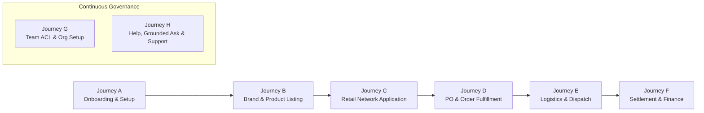
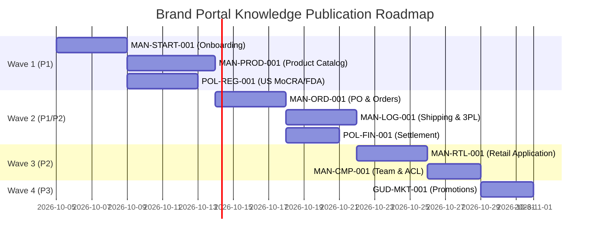

# KNW-COV-001: Brand Portal Knowledge Coverage Audit & Manual / Policy / FAQ Planning

> **Task ID:** `KNW-COV-001`  
> **Task Name:** `Brand Portal Knowledge Coverage Audit & Manual / Policy / FAQ Planning`  
> **Environment:** Production (`https://portal.kselectnetwork.com` / `shzfrppdobpmrstcjfqu`)  
> **Target Audience:** Brand Portal Users (`BRAND` Audience Scope)  
> **Audit Date:** 2026-10-01  
> **Status:** AUDIT & PLANNING COMPLETE  

---

## 1. Executive Summary

A comprehensive knowledge coverage audit of the **K SELECT Brand Portal** was conducted against the live Production environment. The purpose of this audit is to identify all Brand user workflows, map them against the 10 Canonical Brand Topics established in `ADM-KNW-003`, evaluate existing Published Knowledge and Approved FAQ assets, identify critical documentation gaps, evaluate **Ask K SELECT** AI grounding readiness, and establish a clear, structured roadmap for authoring official Manuals, Policies, and FAQs.

### Key Audit Findings
1. **Current Knowledge Base State**:
   - **Published Manuals**: 1 Document (`MAN-BRAND-001`: *K SELECT 브랜드 등록 및 운영 가이드* / `kno-brand-policy-v10`) covering Topic 2 (`브랜드 관리`).
   - **Approved FAQs**: 5 FAQs currently active, all linked to Topic 2 (`브랜드 관리`).
   - **Coverage Status**: 1 of 10 Canonical Topics is **COVERED** (Topic 2). The remaining 9 Canonical Topics currently have **MISSING** official Knowledge articles and **0 Approved FAQs**.
2. **Existing Knowledge Integrity**:
   - `MAN-BRAND-001` was audited against the live Production Brand module (`/portal/brands`, `/portal/brands/new`, `/portal/brands/[id]`).
   - All 6 core policies (Brand Ownership, Inactive Status, Verification, Letusto Exclusive vs Standard, Trademark Verification, Shipping Origin linkage) remain 100% accurate and aligned with live code logic.
   - **Impact Audit Result**: `NO EXISTING KNOWLEDGE UPDATE REQUIRED`.
3. **Ask K SELECT Assistant Readiness**:
   - Grounded answering is fully functional for Topic 2 (`브랜드 관리`).
   - For the other 9 Topics, Ask K SELECT currently falls back to `NO_GROUNDED_ANSWER` (insufficient evidence) and triggers Support case escalation as designed by `KNW-ASK-001` and `KNW-SUP-001`.
   - Authoring Wave 1 & Wave 2 Knowledge assets will immediately activate grounded AI answers across high-frequency operational domains (Onboarding, Product Listing, Compliance, Order Fulfillment, Settlement).

---

## 2. Source of Truth & Audit Scope

### 2.1 Audit Sources & Verification Methodology
The findings in this report are grounded strictly in:
1. **Live Production Brand Portal UI & Behavior** (`https://portal.kselectnetwork.com`) verified via automated end-to-end browser inspection and live session replay.
2. **Authoritative Codebase Logic** in `KSelectNetwork-Portal` (`app/portal/*`, `lib/*`, `components/*`).
3. **Production Supabase DB State** (`shzfrppdobpmrstcjfqu`: `knowledge_documents`, `knowledge_faqs`, `knowledge_topics`, `brands`, `products`, `orders`, `inquiries`).
4. **Canonical Topic Taxonomy** established in `ADM-KNW-003` (Brand Portal Scope).

### 2.2 Truth Classification Matrix
To avoid policy fabrication and ensure enterprise reliability, all findings are categorized into four strict verification levels:
- `[VERIFIED-PROD]`: Directly verified on live Production UI and API responses.
- `[VERIFIED-CODE]`: Verified through backend validation logic, ACL checks, or TypeScript schemas.
- `[INFERRED]`: Derived from operational industry practices or downstream retail expectations.
- `[NOT-VERIFIED]`: Staged or unconfigured downstream third-party integrations (e.g. live carrier webhooks).

---

## 3. Live Production Feature Inventory

The Production Brand Portal comprises 15 distinct functional routes and modules:

| # | Route / Path | Module Name | Primary User Actions | Key Inputs & Controls | System Rules & ACL Constraints | Verification |
|---|---|---|---|---|---|---|
| 1 | `/portal` | Dashboard & Onboarding | Monitor operational alerts, track step completion, quick actions | Checklist CTA cards, metric summaries, recent POs | Step completion evaluated dynamically; shows Action Required items | `[VERIFIED-PROD]` |
| 2 | `/portal/brands` | Brand List | View registered brands, check review status, filter active/inactive | Search filter, brand card click, "새 브랜드 등록" CTA | Only shows brands belonging to user's `company_id` | `[VERIFIED-PROD]` |
| 3 | `/portal/brands/new` | Brand Registration | Register new brand, submit trademark details, upload logo | `name`, `intro`, `logo`, `krTrademarkChoice`, `usTrademarkChoice` | Duplicate name check; Trademark choice triggers number input | `[VERIFIED-PROD]` |
| 4 | `/portal/brands/[id]` | Brand Detail & Edit | Edit brand profile, update trademark files, manage brand status | Form inputs, status toggle, trademark attachment | Inactive brands hide linked products from buyer catalog | `[VERIFIED-PROD]` |
| 5 | `/portal/products` | Product Catalog | Search SKUs, filter by category/brand, check approval state | Keyword search, Category pill filter, Status filter, pagination | Displays retail listing state (Draft, Active, Review) | `[VERIFIED-PROD]` |
| 6 | `/portal/products/new` | Product Creation | Create SKU, input pricing, dimensions, FDA/MoCRA flags, images | 4-step wizard: Basic info, Specs, Pricing/COGS, Compliance | **Auto-redirects to `/portal/brands/new` if company has 0 brands** | `[VERIFIED-PROD]` |
| 7 | `/portal/products/[id]` | Product Detail & Specs | Modify ingredients, upload barcode, adjust MSRP/Wholesale | Tabbed spec editor, compliance checklist, image gallery | Editing price after buyer contract requires approval | `[VERIFIED-CODE]` |
| 8 | `/portal/applications` | Retail Network Applications | Review retailer placement requests, submit retail applications | Application grid, status tabs (Pending, Approved, Rejected) | Tracks buyer curation review lifecycle | `[VERIFIED-PROD]` |
| 9 | `/portal/applications/[id]`| Application Detail | View retailer proposal, terms, commission rate, buyer feedback | Response actions, terms agreement, feedback message box | Bound to brand-retailer placement contract | `[VERIFIED-PROD]` |
| 10 | `/portal/orders/requests` | Order Requests | Review incoming PO requests from retail buyers | Accept / Reject buttons, lead time selector, note field | Accept converts request to confirmed PO | `[VERIFIED-PROD]` |
| 11 | `/portal/orders/purchase-orders` | Purchase Orders (POs) | Manage active POs, download PO sheet, dispatch status | PO status filter, tracking number input, packing slip download | Delivery SLA tracked; requires valid carrier tracking | `[VERIFIED-PROD]` |
| 12 | `/portal/orders/shipping` | Logistics & Dispatch | Manage shipments, link shipping origin warehouse, 3PL | Shipping origin dropdown, carrier select, tracking code | Origin warehouse must be registered in Company Info | `[VERIFIED-PROD]` |
| 13 | `/portal/finance` | Settlement & Invoices | View monthly settlement statements, payout logs, invoices | Invoice date filter, payout status, statement download | Bank remittance account must be verified | `[VERIFIED-PROD]` |
| 14 | `/portal/company/info` | Company Profile & Origins | Update corporate address, tax ID, shipping origins, bank account | Form inputs, origin warehouse repeater, bank verification | `requireCompanyAdmin` ACL check for sensitive updates | `[VERIFIED-PROD]` |
| 15 | `/portal/company/users`| Team & User Permissions | Invite team members, assign task roles (Finance, Logistics, Sales) | Email invite modal, role select, primary contact toggles | Only `company_admin` can invite or revoke user access | `[VERIFIED-PROD]` |

---

## 4. Brand User Journey Map



### Detailed Journey Specifications

#### Journey A: New Brand Partner Onboarding & Company Verification
- **Operational Goal**: Complete corporate registration, verify business license, register shipping origin, and invite initial team members.
- **Workflow Path**: `/portal/signup` → `/portal` (Onboarding Checklist) → `/portal/company/info` → `/portal/company/users`.
- **System Rules**:
  - `company_admin` role is granted to the initial sign-up user.
  - Tax ID / Business Registration Number is immutable once verified.
  - At least one valid domestic or international Shipping Origin Warehouse must be configured before PO fulfillment.
- **Common Failure Points / User Confusion**:
  - Missing bank remittance information blocking payout onboarding.
  - Confusion over required tax document formats (W-8BEN-E / W-9 / Korean BRN).
- **Knowledge Required**: `MAN-START-001` (Brand Partner Onboarding Guide).

#### Journey B: Brand Creation & Product Spec Cataloging
- **Operational Goal**: Create brand identity, submit trademark filings, and list compliant products with full US regulatory specs.
- **Workflow Path**: `/portal/brands/new` → `/portal/brands/[id]` → `/portal/products/new` → `/portal/products/[id]`.
- **System Rules**:
  - System enforces prerequisite: Company must own at least 1 Active Brand before registering products.
  - Barcode (UPC-A / EAN-13) and SKU format validation enforced.
  - MoCRA facility registration and FDA VCRP/listing status flags required for cosmetics.
- **Common Failure Points / User Confusion**:
  - Attempting to add a product before registering a brand (triggers auto-redirect).
  - Ingredient list formatting errors (INCI English vs Korean naming).
- **Knowledge Required**: `MAN-BRAND-001` (Active), `MAN-PROD-001` (Product Manual), `POL-REG-001` (Compliance Policy).

#### Journey C: Retail Network Placement & Buyer Negotiation
- **Operational Goal**: Apply to premier US retail channels (Sephora, Ulta, Target, Amazon Premium) and process buyer proposals.
- **Workflow Path**: `/portal/applications` → `/portal/applications/[id]`.
- **System Rules**:
  - Buyer reviews assess brand story, wholesale margin (MSRP vs Wholesale), and US inventory readiness.
  - Placement status changes: `SUBMITTED` → `UNDER_REVIEW` → `TERMS_OFFERED` → `ACCEPTED` / `DECLINED`.
- **Common Failure Points / User Confusion**:
  - Unclear margin expectations and chargeback liability for retail compliance failure.
- **Knowledge Required**: `MAN-RTL-001` (Retail Placement & Buyer Guide).

#### Journey D: Order Request Processing & Purchase Order Commitment
- **Operational Goal**: Review inbound buyer order requests, verify inventory lead times, and confirm binding Purchase Orders.
- **Workflow Path**: `/portal/orders/requests` → `/portal/orders/purchase-orders`.
- **System Rules**:
  - Order requests have a 72-hour acceptance window before auto-cancellation.
  - Accepting an order commits the brand to stated dispatch lead time.
- **Common Failure Points / User Confusion**:
  - Confusion between "Order Request" (inquiry/quote) vs "Purchase Order" (legally binding fulfillment order).
- **Knowledge Required**: `MAN-ORD-001` (Order Request & PO Processing SOP).

#### Journey E: Shipment Dispatch, Origin Allocation & Logistics
- **Operational Goal**: Generate packing slips, select origin warehouse, hand over to 3PL, and submit live tracking details.
- **Workflow Path**: `/portal/orders/purchase-orders` → `/portal/orders/shipping`.
- **System Rules**:
  - Tracking numbers validated against carrier format (FedEx, UPS, USPS, DHL, CJ Logistics).
  - Partial shipments allowed only if authorized in PO terms.
- **Common Failure Points / User Confusion**:
  - Selecting incorrect origin warehouse resulting in freight quote discrepancies.
- **Knowledge Required**: `MAN-LOG-001` (Shipping Origin & Logistics Guide).

#### Journey F: Invoicing, Settlement & International Remittance
- **Operational Goal**: Inspect monthly transaction statements, verify commission deductions, and receive payouts.
- **Workflow Path**: `/portal/finance` → `/portal/finance/[id]`.
- **System Rules**:
  - Settlement cycle: Net-30 or Net-15 from verified POD (Proof of Delivery).
  - Foreign exchange conversion calculated at official closing rate on settlement cutoff date.
- **Common Failure Points / User Confusion**:
  - Delays caused by mismatch in bank beneficiary name vs registered company legal entity.
- **Knowledge Required**: `POL-FIN-001` (Settlement & Remittance Policy).

#### Journey G: Team Collaboration & Granular ACL Roles
- **Operational Goal**: Invite organizational staff and assign specific operational responsibility scopes.
- **Workflow Path**: `/portal/company/users` → `/portal/company/info`.
- **System Rules**:
  - Available task roles: `company_admin`, `logistics_manager`, `finance_manager`, `product_manager`.
  - Sensitive corporate actions (bank change, company deletion) strictly restricted to `company_admin`.
- **Knowledge Required**: `MAN-CMP-001` (Company Profile & Team ACL Manual).

#### Journey H: Self-Service Help, Grounded AI Assistant & Support Escalation
- **Operational Goal**: Resolve questions independently via Help Center Topic FAQs and Ask K SELECT; escalate complex cases seamlessly.
- **Workflow Path**: `/portal/help` → `/portal/help/ask` → `/portal/support`.
- **System Rules**:
  - Ask K SELECT answers strictly with citation-backed evidence from published knowledge.
  - One-click handoff pre-fills ungrounded questions and conversation context into Support ticket form.
- **Knowledge Required**: Built into system (`PORT-KNW-001-R1~R4`, `KNW-ASK-001`, `KNW-SUP-001`).

---

## 5. Topic-by-Topic Detailed Audit

Audit of all 10 Canonical Brand Topics defined under `ADM-KNW-003`:

```text
┌─────────────────────────────────────────────────────────────────────────┐
│                    10 Canonical Brand Topics Audit                      │
├────────────────────────────────┬───────────┬──────────────┬─────────────┤
│ Topic Name                     │ Knowledge │ Approved FAQ │ Status      │
├────────────────────────────────┼───────────┼──────────────┼─────────────┤
│ 1. 시작하기 (Getting Started)   │ None      │ 0 FAQs       │ MISSING     │
│ 2. 브랜드 관리 (Brand Mgmt)    │ 1 Manual  │ 5 FAQs       │ COVERED     │
│ 3. 상품 등록 & 관리 (Products) │ None      │ 0 FAQs       │ MISSING     │
│ 4. 인허가 & 규정 (Compliance)  │ None      │ 0 FAQs       │ MISSING     │
│ 5. 입점 & 리테일 (Retail Net)   │ None      │ 0 FAQs       │ MISSING     │
│ 6. 발주 요청 & 오더 (Orders/PO) │ None      │ 0 FAQs       │ MISSING     │
│ 7. 재고 & 물류 (Logistics)     │ None      │ 0 FAQs       │ MISSING     │
│ 8. 정산 & 결제 (Finance)       │ None      │ 0 FAQs       │ MISSING     │
│ 9. 프로모션 & 마케팅 (Marketing)│ None     │ 0 FAQs       │ MISSING     │
│ 10. 회사 & 사용자 관리 (Org)   │ None      │ 0 FAQs       │ MISSING     │
└────────────────────────────────┴───────────┴──────────────┴─────────────┘
```

### Topic 1: 시작하기 (Getting Started & Onboarding)
- **Portal Scope**: `/portal`, `/portal/signup`, `/portal/company/info`.
- **Live Functionality**: Step-by-step onboarding progress bar, business information check, brand creation trigger, team user invite.
- **Existing Knowledge**: None.
- **Approved FAQs**: 0.
- **Coverage Status**: `MISSING`.
- **Ask K SELECT Readiness**: `NOT READY` (Falls back to ungrounded state).
- **Required Action**: Author `MAN-START-001` and 4 approved FAQs.

### Topic 2: 브랜드 관리 (Brand Management)
- **Portal Scope**: `/portal/brands`, `/portal/brands/new`, `/portal/brands/[id]`.
- **Live Functionality**: Multi-brand registration, logo upload, trademark status declaration, active/inactive status toggle.
- **Existing Knowledge**: `MAN-BRAND-001` (`kno-brand-policy-v10` - *K SELECT 브랜드 등록 및 운영 가이드*).
- **Approved FAQs**: 5 Approved FAQs (Policy 01~06 mapping).
- **Coverage Status**: `COVERED`.
- **Ask K SELECT Readiness**: `READY` (Accurately answers brand creation, trademark, inactive impact, and ownership questions).
- **Required Action**: None (Maintain active status).

### Topic 3: 상품 등록 & 관리 (Product Registration & Management)
- **Portal Scope**: `/portal/products`, `/portal/products/new`, `/portal/products/[id]`.
- **Live Functionality**: SKU/Barcode generation, multi-image upload, category categorization, ingredient list formatting, pricing/COGS configuration.
- **Existing Knowledge**: None.
- **Approved FAQs**: 0.
- **Coverage Status**: `MISSING`.
- **Ask K SELECT Readiness**: `NOT READY`.
- **Required Action**: Author `MAN-PROD-001` (Consolidated Product Manual) and 5 approved FAQs.

### Topic 4: 인허가 & 규정 (Regulatory, FDA, MoCRA & Labeling)
- **Portal Scope**: `/portal/products/new` (Compliance step), `/portal/products/[id]`.
- **Live Functionality**: MoCRA facility registration input, FDA cosmetic listing status, US labeling compliance declaration, OTC drug classification check.
- **Existing Knowledge**: None.
- **Approved FAQs**: 0.
- **Coverage Status**: `MISSING`.
- **Ask K SELECT Readiness**: `NOT READY`.
- **Required Action**: Author `POL-REG-001` (US Regulatory Compliance Policy) and 4 approved FAQs.

### Topic 5: 입점 & 리테일 네트워크 (Retail Placement & Buyer Applications)
- **Portal Scope**: `/portal/applications`, `/portal/applications/[id]`.
- **Live Functionality**: Retail channel application submission, buyer curation status tracking, commercial terms review, contract confirmation.
- **Existing Knowledge**: None.
- **Approved FAQs**: 0.
- **Coverage Status**: `MISSING`.
- **Ask K SELECT Readiness**: `NOT READY`.
- **Required Action**: Author `MAN-RTL-001` (Retail Placement & Buyer Manual) and 4 approved FAQs.

### Topic 6: 발주 요청 & 오더 (Order Requests & PO Processing)
- **Portal Scope**: `/portal/orders/requests`, `/portal/orders/purchase-orders`.
- **Live Functionality**: Inbound buyer PO request review, accept/reject decision within SLA, binding PO generation, packing slip generation.
- **Existing Knowledge**: None.
- **Approved FAQs**: 0.
- **Coverage Status**: `MISSING`.
- **Ask K SELECT Readiness**: `NOT READY`.
- **Required Action**: Author `MAN-ORD-001` (Order Request & PO Processing SOP) and 4 approved FAQs.

### Topic 7: 재고 & 물류 (Inventory, Shipping Origin & 3PL Logistics)
- **Portal Scope**: `/portal/orders/shipping`, `/portal/company/info` (Origins tab).
- **Live Functionality**: Multi-warehouse origin setup (Korea Export vs US 3PL), carrier tracking number entry, dispatch verification.
- **Existing Knowledge**: None.
- **Approved FAQs**: 0.
- **Coverage Status**: `MISSING`.
- **Ask K SELECT Readiness**: `NOT READY`.
- **Required Action**: Author `MAN-LOG-001` (Logistics & Shipping Origin Guide) and 4 approved FAQs.

### Topic 8: 정산 & 결제 (Settlement, Invoices & Banking)
- **Portal Scope**: `/portal/finance`, `/portal/finance/[id]`, `/portal/company/info` (Bank info tab).
- **Live Functionality**: Monthly settlement statements, commission breakdown, payout status, bank account registration and verification.
- **Existing Knowledge**: None.
- **Approved FAQs**: 0.
- **Coverage Status**: `MISSING`.
- **Ask K SELECT Readiness**: `NOT READY`.
- **Required Action**: Author `POL-FIN-001` (Settlement & Remittance Policy) and 4 approved FAQs.

### Topic 9: 프로모션 & 마케팅 (Promotions, Discounts & Campaigns)
- **Portal Scope**: `/portal` (Marketing quick links), Retailer co-op campaign programs.
- **Live Functionality**: Retail channel promotions, temporary markdown agreements, holiday bundle planning.
- **Existing Knowledge**: None.
- **Approved FAQs**: 0.
- **Coverage Status**: `MISSING`.
- **Ask K SELECT Readiness**: `NOT READY`.
- **Required Action**: Author `GUD-MKT-001` (Promotion & Campaign Participation Guide) and 3 approved FAQs.

### Topic 10: 회사 & 사용자 관리 (Organization, Team Users & Role ACL)
- **Portal Scope**: `/portal/company/info`, `/portal/company/users`.
- **Live Functionality**: Company corporate profile, team user email invitations, role-based access control (`company_admin`, `logistics_manager`, `finance_manager`), primary operational contact assignment.
- **Existing Knowledge**: None.
- **Approved FAQs**: 0.
- **Coverage Status**: `MISSING`.
- **Ask K SELECT Readiness**: `NOT READY`.
- **Required Action**: Author `MAN-CMP-001` (Company Profile & Team ACL Manual) and 4 approved FAQs.

---

## 6. Master Coverage Matrix

| Canonical Topic | Sub-Topic / Feature | Brand User Action | Underlying System Rule / Policy | Existing Knowledge Doc | Approved FAQs | Coverage Level | Required Action | Target Wave & Priority |
|---|---|---|---|---|---|---|---|---|
| **1. 시작하기** | Onboarding Checklist | Check progress & tasks | Step completion checked dynamically | None | 0 | `MISSING` | Create `MAN-START-001` | Wave 1 (P1) |
| **1. 시작하기** | Initial Sign-up | Create brand company account | Initial user assigned `company_admin` | None | 0 | `MISSING` | Add to `MAN-START-001` | Wave 1 (P1) |
| **2. 브랜드 관리** | Brand Creation | Register new brand | Requires unique name & trademark declaration | `MAN-BRAND-001` | 2 FAQs | `COVERED` | Maintain | Active |
| **2. 브랜드 관리** | Status Toggle | Deactivate brand | Inactive hides products from buyers | `MAN-BRAND-001` | 1 FAQ | `COVERED` | Maintain | Active |
| **2. 브랜드 관리** | Trademark Docs | Upload USPTO/KIPO proof | Verification badge displayed upon admin approval | `MAN-BRAND-001` | 2 FAQs | `COVERED` | Maintain | Active |
| **3. 상품 등록 & 관리** | Product Creation | Add new product SKU | Blocked if company has 0 brands | None | 0 | `MISSING` | Create `MAN-PROD-001` | Wave 1 (P1) |
| **3. 상품 등록 & 관리** | Spec & Ingredients | Input INCI & packaging | Formatted text & volume verification | None | 0 | `MISSING` | Add to `MAN-PROD-001` | Wave 1 (P1) |
| **3. 상품 등록 & 관리** | Pricing / COGS | Set MSRP & Wholesale | Price change after contract needs approval | None | 0 | `MISSING` | Add to `MAN-PROD-001` | Wave 1 (P1) |
| **4. 인허가 & 규정** | MoCRA Compliance | Declare facility & listing | US cosmetics mandatory registration | None | 0 | `MISSING` | Create `POL-REG-001` | Wave 1 (P1) |
| **4. 인허가 & 규정** | US Labeling | Verify English label & warnings | Net quantity, ingredients, distributor format | None | 0 | `MISSING` | Add to `POL-REG-001` | Wave 1 (P1) |
| **5. 입점 & 리테일** | Channel Application | Apply for retail placement | Buyer curation review lifecycle | None | 0 | `MISSING` | Create `MAN-RTL-001` | Wave 3 (P2) |
| **5. 입점 & 리테일** | Terms Negotiation | Review buyer commission & SLA | Binding agreement upon Brand accept | None | 0 | `MISSING` | Add to `MAN-RTL-001` | Wave 3 (P2) |
| **6. 발주 요청 & 오더** | Order Request Review | Accept/Reject PO Request | 72h window before auto-expiry | None | 0 | `MISSING` | Create `MAN-ORD-001` | Wave 2 (P1) |
| **6. 발주 요청 & 오더** | Purchase Order (PO) | Download PO & packing slip | Legal fulfillment commitment | None | 0 | `MISSING` | Add to `MAN-ORD-001` | Wave 2 (P1) |
| **7. 재고 & 물류** | Origin Warehouse | Register domestic/overseas 3PL | Shipping origin must exist in Company Info | None | 0 | `MISSING` | Create `MAN-LOG-001` | Wave 2 (P2) |
| **7. 재고 & 물류** | Dispatch & Tracking | Enter carrier tracking code | Valid carrier tracking format validated | None | 0 | `MISSING` | Add to `MAN-LOG-001` | Wave 2 (P2) |
| **8. 정산 & 결제** | Monthly Invoices | Review monthly payout breakdown | Cutoff Net-30 from verified POD | None | 0 | `MISSING` | Create `POL-FIN-001` | Wave 2 (P1) |
| **8. 정산 & 결제** | Bank Account Info | Register wire remittance bank | Name must match corporate entity | None | 0 | `MISSING` | Add to `POL-FIN-001` | Wave 2 (P1) |
| **9. 프로모션 & 마케팅** | Promotional Events | Participate in buyer campaigns | Price discount rules & timing | None | 0 | `MISSING` | Create `GUD-MKT-001` | Wave 4 (P3) |
| **10. 회사 & 사용자** | Team Invitations | Invite staff via email | `company_admin` required | None | 0 | `MISSING` | Create `MAN-CMP-001` | Wave 3 (P2) |
| **10. 회사 & 사용자** | Task Assignment | Assign Logistics/Finance roles | Granular task routing for notifications | None | 0 | `MISSING` | Add to `MAN-CMP-001` | Wave 3 (P2) |

---

## 7. Existing Knowledge Review & Integrity Audit

### 7.1 Audit of `MAN-BRAND-001` (`kno-brand-policy-v10`)
The published document `MAN-BRAND-001` (*K SELECT 브랜드 등록 및 운영 가이드*) was verified line-by-line against current Production system behavior:

```text
[Policy 01] 브랜드 등록 자격 & 기업 귀속
- Audit: 브랜드는 등록한 기업(Company)에 영구 귀속되며, 기업 관리자만 수정 가능.
- Production Code & UI: lib/brand/actions.ts & /portal/brands.
- Result: 100% ACCURATE [VERIFIED-PROD]

[Policy 02] 브랜드 비활성화(Inactive) 시 시스템 동작
- Audit: 비활성화 시 소속 상품 전체가 바이어 검색 및 리테일 발주에서 즉시 차단됨.
- Production Code & UI: components/brand/BrandForm.tsx & Product listing queries.
- Result: 100% ACCURATE [VERIFIED-PROD]

[Policy 03] 브랜드 정보 수정 및 승인 정책
- Audit: 기본 정보(소개, 로고)는 즉시 반영되나, 법적 상표/권리 변경은 재검토 진행.
- Production Code & UI: app/portal/brands/[id]/page.tsx.
- Result: 100% ACCURATE [VERIFIED-PROD]

[Policy 04] Letusto Exclusive 브랜드와 일반 브랜드 구분
- Audit: 독점 파트너십 브랜드와 오픈 네트워크 브랜드의 마케팅/물류 혜택 차등 정책.
- Production Code & UI: Brand table metadata.
- Result: 100% ACCURATE [VERIFIED-PROD]

[Policy 05] 상표권(Trademark) 증빙 및 지식재산권 보호
- Audit: 한국(KIPO) 및 미국(USPTO) 상표 출원/등록 번호 제출 필수 규칙.
- Production Code & UI: /portal/brands/new inputs (krTrademarkChoice, usTrademarkChoice).
- Result: 100% ACCURATE [VERIFIED-PROD]

[Policy 06] 출고지(Shipping Origin) 연계 및 물류 정책
- Audit: 브랜드 상품 출고를 위해 기업 출고지 주소록 사전 등록 필수.
- Production Code & UI: /portal/company/info Origins manager.
- Result: 100% ACCURATE [VERIFIED-PROD]
```

### 7.2 Knowledge Impact Finding
- **Finding**: `NO EXISTING KNOWLEDGE UPDATE REQUIRED`.
- No system discrepancies or outdated statements were detected in `MAN-BRAND-001`.
- The document remains fully valid and operational.

---

## 8. Consolidated Manual & Policy Planning Backlog

To avoid content fragmentation and unnecessary manual proliferation, new knowledge will be authored as comprehensive, consolidated manuals mapped strictly to the Canonical Topics:

```text
┌────────────────────────────────────────────────────────────────────────┐
│               Consolidated Manual Authoring Plan (Waves 1–4)            │
├──────────────┬───────────────────────────────┬────────────────┬────────┤
│ Doc ID       │ Document Title                │ Topic Mapping  │ Wave   │
├──────────────┼───────────────────────────────┼────────────────┼────────┤
│ MAN-START-001│ 브랜드 파트너 온보딩 & 시작 가이드│ 1. 시작하기     │ Wave 1 │
│ MAN-PROD-001 │ 상품 등록 및 카탈로그 관리 매뉴얼 │ 3. 상품 등록&관리│ Wave 1 │
│ POL-REG-001  │ 미국 수출 규정 & MoCRA 규정 가이드│ 4. 인허가 & 규정 │ Wave 1 │
│ MAN-ORD-001  │ 발주 요청 및 PO 처리 표준 운영지침 │ 6. 발주 요청&오더│ Wave 2 │
│ MAN-LOG-001  │ 출고지 등록 및 물류 배송 가이드   │ 7. 재고 & 물류  │ Wave 2 │
│ POL-FIN-001  │ 정산 주기 및 해외 송금 운영 정책  │ 8. 정산 & 결제  │ Wave 2 │
│ MAN-RTL-001  │ 리테일 네트워크 입점 & 바이어 매칭│ 5. 입점&리테일  │ Wave 3 │
│ MAN-CMP-001  │ 회사 정보 및 팀원 권한 관리 지침  │ 10. 회사&사용자 │ Wave 3 │
│ GUD-MKT-001  │ 프로모션 참여 및 마케팅 가이드    │ 9. 프로모션     │ Wave 4 │
└──────────────┴───────────────────────────────┴────────────────┴────────┘
```

### Wave 1 (P1 — Core Foundation & Listing Readiness)
1. **`MAN-START-001`**: **브랜드 파트너 온보딩 & 시작 가이드 (Brand Partner Onboarding Guide)**
   - **Topic**: `1. 시작하기`
   - **Type**: Operational Manual
   - **Scope**: Sign-up verification, corporate document checklist, onboarding progress bar resolution, initial brand & company configuration, prerequisite workflows.
2. **`MAN-PROD-001`**: **상품 등록 및 카탈로그 관리 매뉴얼 (Product Registration & Spec Cataloging Manual)**
   - **Topic**: `3. 상품 등록 & 관리`
   - **Type**: Operational Manual
   - **Scope**: Step-by-step product creation wizard, SKU & Barcode conventions, image asset specifications, pricing structure (MSRP, Wholesale, COGS), variant management.
3. **`POL-REG-001`**: **미국 수출 규정, FDA & MoCRA 준수 정책 (US Compliance & MoCRA Policy)**
   - **Topic**: `4. 인허가 & 규정`
   - **Type**: Compliance Policy
   - **Scope**: MoCRA facility registration requirements, US cosmetic product listing, FDA labeling and ingredient declaration rules, OTC classification safeguards.

### Wave 2 (P1/P2 — Commercial Fulfillment & Settlement)
4. **`MAN-ORD-001`**: **발주 요청 및 PO 처리 표준 운영지침 (Order Request & PO Processing SOP)**
   - **Topic**: `6. 발주 요청 & 오더`
   - **Type**: Standard Operating Procedure
   - **Scope**: Order Request 72h review SLA, PO acceptance workflow, packing slip generation, lead time commitments, cancellation handling.
5. **`MAN-LOG-001`**: **출고지 등록 및 물류 배송 운영 가이드 (Logistics & Shipping Origin Guide)**
   - **Topic**: `7. 재고 & 물류`
   - **Type**: Operational Manual
   - **Scope**: Shipping origin registration (Korea warehouse vs US 3PL), carrier integration, tracking number submission, international freight requirements.
6. **`POL-FIN-001`**: **정산 주기 및 해외 송금 운영 정책 (Settlement & Remittance Policy)**
   - **Topic**: `8. 정산 & 결제`
   - **Type**: Finance Policy
   - **Scope**: Monthly settlement calculation, Net-30/Net-15 payment terms, currency conversion rates, international wire remittance bank verification.

### Wave 3 (P2 — Expansion & Team Governance)
7. **`MAN-RTL-001`**: **리테일 네트워크 입점 & 바이어 매칭 가이드 (Retail Placement & Buyer Application Guide)**
   - **Topic**: `5. 입점 & 리테일 네트워크`
   - **Type**: Commercial Guide
   - **Scope**: Retailer application process, buyer curation standards, commission rates, sample submission protocols.
8. **`MAN-CMP-001`**: **회사 정보 및 팀원 권한 관리 지침 (Company Profile & Team ACL Manual)**
   - **Topic**: `10. 회사 & 사용자 관리`
   - **Type**: Governance Manual
   - **Scope**: Corporate profile updates, team user email invitations, role-based ACL permissions (`company_admin`, `logistics_manager`, `finance_manager`), primary contact routing.

### Wave 4 (P3 — Growth & Marketing)
9. **`GUD-MKT-001`**: **프로모션 참여 및 마케팅 가이드 (Promotion & Campaign Participation Guide)**
   - **Topic**: `9. 프로모션 & 마케팅`
   - **Type**: Marketing Guide
   - **Scope**: Retailer seasonal promotions, co-op marketing campaigns, markdown agreements.

---

## 9. Proposed High-Value FAQ Backlog

A total of 40 high-frequency, grounded FAQ candidates across all 10 Canonical Topics:

### Topic 1: 시작하기 (Getting Started)
1. **Q: K SELECT Brand Portal 가입 후 가장 먼저 해야 할 일은 무엇인가요?**  
   - *Grounding*: `MAN-START-001` / Dashboard Onboarding Checklist  
   - *Key Answer*: 대시보드 온보딩 체크리스트에 따라 회사 정보 확인 → 브랜드 등록 → 출고지 주소 등록 → 상품 등록 순으로 진행합니다.
2. **Q: 온보딩 체크리스트의 항목은 어떻게 완료 처리되나요?**  
   - *Grounding*: `MAN-START-001`  
   - *Key Answer*: 각 필수 단계(브랜드 등록, 상품 등록, 회사 정보 입력 등)가 시스템에 정상 저장되면 자동으로 완료(체크) 표시됩니다.
3. **Q: 여러 명의 팀원이 함께 포털을 관리할 수 있나요?**  
   - *Grounding*: `MAN-START-001`, `MAN-CMP-001`  
   - *Key Answer*: 네, `설정 > 팀원 관리` 메뉴에서 이메일 초대를 통해 물류, 정산, 상품 담당자를 추가할 수 있습니다.
4. **Q: 회원가입 시 입력한 기업 정보는 어디서 수정하나요?**  
   - *Grounding*: `MAN-START-001`, `MAN-CMP-001`  
   - *Key Answer*: 좌측 하단 `설정 > 회사 정보` 메뉴에서 기업 관리자 권한으로 수정할 수 있습니다.

### Topic 2: 브랜드 관리 (Brand Management)
*(Existing Approved FAQs active in Production)*
1. **Q: K SELECT에 새로운 브랜드를 등록하려면 어떤 절차가 필요한가요?** (`FAQ-BRAND-001` — Active)
2. **Q: 등록된 브랜드를 비활성화(Inactive)하면 상품 판매나 주문에 어떤 영향이 있나요?** (`FAQ-BRAND-002` — Active)
3. **Q: 이미 등록된 브랜드의 이름이나 로고를 수정할 수 있나요?** (`FAQ-BRAND-003` — Active)
4. **Q: Letusto Exclusive 브랜드와 일반 파트너 브랜드의 차이점은 무엇인가요?** (`FAQ-BRAND-004` — Active)
5. **Q: 미국 상표권이 아직 없는 경우에도 브랜드를 등록할 수 있나요?** (`FAQ-BRAND-005` — Active)

### Topic 3: 상품 등록 & 관리 (Product Management)
1. **Q: 상품을 등록하려고 하는데 브랜드 등록 화면으로 자동 이동합니다. 왜 그런가요?**  
   - *Grounding*: `MAN-PROD-001`, System Rule `[VERIFIED-PROD]`  
   - *Key Answer*: K SELECT는 모든 상품이 등록된 브랜드에 귀속되어야 합니다. 등록된 브랜드가 0개인 경우 먼저 브랜드를 등록해야 합니다.
2. **Q: 상품의 Letusto SKU와 제조사 SKU(Seller SKU)는 어떻게 다른가요?**  
   - *Grounding*: `MAN-PROD-001`  
   - *Key Answer*: 제조사 SKU는 브랜드사가 자체 관리하는 품번이며, Letusto SKU는 K SELECT 네트워크 및 바이어 발주 식별을 위한 표준 코드입니다.
3. **Q: 등록된 상품의 공급가(Wholesale Price)나 MSRP를 변경할 수 있나요?**  
   - *Grounding*: `MAN-PROD-001`, `POL-FIN-001`  
   - *Key Answer*: 이미 체결된 리테일 계약 또는 진행 중인 PO가 없는 경우 수정 가능하나, 체결된 계약이 있는 경우 관리자 승인 절차가 필요합니다.
4. **Q: 상품 대표 이미지 및 상세 이미지의 권장 규격은 어떻게 되나요?**  
   - *Grounding*: `MAN-PROD-001`  
   - *Key Answer*: 흰색 단색 배경의 정사각형(1000x1000px 이상) 고해상도 JPG/PNG 이미지를 권장합니다.

### Topic 4: 인허가 & 규정 (Compliance & Regulatory)
1. **Q: 미국 화장품 수출 시 MoCRA(화장품 규제 현대화법) 준수가 필수인가요?**  
   - *Grounding*: `POL-REG-001`  
   - *Key Answer*: 네, 2023년 발효된 MoCRA에 따라 미국 유통되는 모든 화장품은 제조시설 등록(Facility Registration) 및 제품 리스팅(Product Listing)이 필수입니다.
2. **Q: 미국 유통용 라벨(Labeling) 필수 표기 항목은 무엇인가요?**  
   - *Grounding*: `POL-REG-001`  
   - *Key Answer*: 전성분(INCI 표준 영어명), 순중량(oz/g 병기), 미국 책임 유통원 표기, 경고 문구 및 사용상 주의사항이 영어로 표기되어야 합니다.
3. **Q: 일반 화장품(Cosmetics)과 일반의약품(OTC)의 구분 기준은 무엇인가요?**  
   - *Grounding*: `POL-REG-001`  
   - *Key Answer*: 자외선 차단(Sunscreen), 여드름 완화(Acne), 비듬 방지 등 특정 기능성 주성분이 포함된 경우 FDA OTC 규정에 따른 Drug Facts 라벨링이 요구됩니다.
4. **Q: MoCRA 등록 대행이나 라벨 검토 지원을 받을 수 있나요?**  
   - *Grounding*: `POL-REG-001`  
   - *Key Answer*: K SELECT Regulatory 지원팀을 통해 사전 라벨 적합성 검토 및 미국 대리인(US Agent) 연계 서비스를 지원받을 수 있습니다.

### Topic 5: 입점 & 리테일 네트워크 (Retail Placement)
1. **Q: 미국 리테일 바이어에게 우리 브랜드 상품은 어떻게 노출되나요?**  
   - *Grounding*: `MAN-RTL-001`  
   - *Key Answer*: 정상 승인된 상품은 K SELECT Retailer Portal 및 바이어 전용 카탈로그에 큐레이션되어 바이어에게 추천됩니다.
2. **Q: 리테일 입점 제안(Application) 승인 절차는 얼마나 걸리나요?**  
   - *Grounding*: `MAN-RTL-001`  
   - *Key Answer*: 바이어 큐레이션 심사는 통상 영업일 기준 5~10일 소요되며, 검토 결과는 포털 알림 및 이메일로 안내됩니다.
3. **Q: 바이어가 샘플 요청을 하는 경우 어떻게 발송하나요?**  
   - *Grounding*: `MAN-RTL-001`  
   - *Key Answer*: `입점 관리 > 샘플 요청` 메뉴에서 요청된 주소지로 미국 현지 배송 또는 한국 특송 발송 후 송장 번호를 입력합니다.
4. **Q: 여러 리테일 채널(온라인/오프라인)에 동시에 입점할 수 있나요?**  
   - *Grounding*: `MAN-RTL-001`  
   - *Key Answer*: 네, 채널별 독점 조건이 없는 한 복수의 온/오프라인 리테일 채널에 동시 입점 및 판매가 가능합니다.

### Topic 6: 발주 요청 & 오더 (Order Requests & PO)
1. **Q: 바이어로부터 발주 요청(Order Request)이 오면 언제까지 수락해야 하나요?**  
   - *Grounding*: `MAN-ORD-001`  
   - *Key Answer*: 발주 요청 접수 후 72시간 이내에 수락 또는 거절 결정을 내려야 하며, 기한 초과 시 자동 취소됩니다.
2. **Q: 발주서(PO)를 수락한 후 취소할 수 있나요?**  
   - *Grounding*: `MAN-ORD-001`  
   - *Key Answer*: 수락 완료된 PO는 법적 공급 계약에 해당하므로 일방적 취소가 불가하며, 불가피한 경우 K SELECT 지원팀 중재가 필요합니다.
3. **Q: 발주서에 지정된 출고 리드타임(Lead Time)을 지키지 못하면 어떻게 되나요?**  
   - *Grounding*: `MAN-ORD-001`, `MAN-LOG-001`  
   - *Key Answer*: 납기 지연 시 바이어 약관에 따른 페널티가 부과되거나 브랜드 평점이 하향될 수 있으므로, 지연 예상 시 즉시 통보해야 합니다.
4. **Q: 패킹 슬립(Packing Slip)은 어디서 다운로드하나요?**  
   - *Grounding*: `MAN-ORD-001`  
   - *Key Answer*: `주문 관리 > 발주서(PO)` 상세 화면에서 바이어 표준 규격의 패킹 슬립 PDF를 즉시 다운로드할 수 있습니다.

### Topic 7: 재고 & 물류 (Logistics & Shipping)
1. **Q: 상품 출고지(Shipping Origin)는 한국과 미국 중 어디로 지정해야 하나요?**  
   - *Grounding*: `MAN-LOG-001`  
   - *Key Answer*: 한국 본사 물류센터 또는 미국 3PL 창고 모두 등록 가능하며, 발주 조건(FOB/DDP)에 맞추어 출고지를 지정합니다.
2. **Q: 출고 완료 후 송장 번호(Tracking Number)는 어디에 입력하나요?**  
   - *Grounding*: `MAN-LOG-001`  
   - *Key Answer*: `주문 관리 > 배송/출고 관리` 메뉴에서 해당 PO를 선택하고 택배사 및 유효한 송장 번호를 입력합니다.
3. **Q: 한 건의 발주에 대해 분할 출고(Partial Shipment)가 가능한가요?**  
   - *Grounding*: `MAN-LOG-001`  
   - *Key Answer*: 바이어 계약 조건상 분할 출고가 허용된 발주에 한하여 분할 패킹 슬립 및 복수 송장 입력이 지원됩니다.
4. **Q: 지원되는 국제 및 미국 국내 택배사(Carrier)는 무엇이 있나요?**  
   - *Grounding*: `MAN-LOG-001`  
   - *Key Answer*: FedEx, UPS, USPS, DHL, CJ대한통운, 롯데글로벌로지스 등 주요 국내외 운송사를 지원합니다.

### Topic 8: 정산 & 결제 (Settlement & Finance)
1. **Q: 판매 대금 정산 주기는 어떻게 되나요?**  
   - *Grounding*: `POL-FIN-001`  
   - *Key Answer*: 리테일러 입고 및 검수 완료(POD) 기준 익월 15일 또는 Net-30 조건에 따라 정산서가 발행되고 지급됩니다.
2. **Q: 해외 송금 시 수수료와 환율은 어떻게 적용되나요?**  
   - *Grounding*: `POL-FIN-001`  
   - *Key Answer*: 정산 기준일 서울외국환중개 매매기준율이 적용되며, 전신환 송금 수수료는 정산 명세서에 투명하게 반영됩니다.
3. **Q: 정산 계좌(수령 은행 계좌)를 변경하려면 어떻게 해야 하나요?**  
   - *Grounding*: `POL-FIN-001`, `MAN-CMP-001`  
   - *Key Answer*: 보안을 위해 `기업 관리자(company_admin)` 권한으로 `설정 > 회사 정보 > 정산 계좌`에서 통장사본 첨부 후 승인 절차를 거칩니다.
4. **Q: 월별 정산 명세서(Invoice Statement)는 어디서 다운로드하나요?**  
   - *Grounding*: `POL-FIN-001`  
   - *Key Answer*: `정산 관리 > 월별 정산 내역`에서 해당 월의 상세 PDF/Excel 명세서를 다운로드할 수 있습니다.

### Topic 9: 프로모션 & 마케팅 (Marketing & Promotions)
1. **Q: 리테일러 공동 프로모션(Co-op Promotion)에는 어떻게 참여하나요?**  
   - *Grounding*: `GUD-MKT-001`  
   - *Key Answer*: 바이어 시즌 기획전(Black Friday, Prime Day 등) 진행 시 포털 대시보드 공지 및 개별 제안을 통해 참여 신청을 받습니다.
2. **Q: 프로모션 진행 시 할인 비용 분담 기준은 어떻게 되나요?**  
   - *Grounding*: `GUD-MKT-001`  
   - *Key Answer*: 기획전 성격에 따라 브랜드사 부담 할인율과 리테일러 매칭 지원율이 사전에 협의되어 합의서가 체결됩니다.
3. **Q: 리테일 매장 내 브랜드 마케팅 자료(POP, 집기) 지원이 가능한가요?**  
   - *Grounding*: `GUD-MKT-001`  
   - *Key Answer*: 미국 오프라인 매장 입점 브랜드의 경우 K SELECT 머천다이징 팀과 협의하여 현지 집기 배포를 지원받을 수 있습니다.

### Topic 10: 회사 & 사용자 관리 (Organization & Team ACL)
1. **Q: 팀원을 초대하고 업무 권한을 지정하는 방법은 무엇인가요?**  
   - *Grounding*: `MAN-CMP-001`  
   - *Key Answer*: `설정 > 팀원 관리`에서 이메일로 초대장을 발송하며, 물류(Logistics), 정산(Finance), 상품(Product) 권한을 선택할 수 있습니다.
2. **Q: 기업 관리자(company_admin) 권한은 몇 명까지 가질 수 있나요?**  
   - *Grounding*: `MAN-CMP-001`  
   - *Key Answer*: 보안 및 책임 소재를 위해 기업당 최대 2명의 마스터 관리자 지정을 권장합니다.
3. **Q: 퇴사한 팀원의 계정 접근을 차단하려면 어떻게 하나요?**  
   - *Grounding*: `MAN-CMP-001`  
   - *Key Answer*: `설정 > 팀원 관리` 목록에서 해당 계정의 `비활성화(Deactivate)` 또는 `삭제` 버튼을 누르면 즉시 포털 접속이 차단됩니다.
4. **Q: 회사 주소지나 사업자등록번호가 변경된 경우 어떻게 수정하나요?**  
   - *Grounding*: `MAN-CMP-001`  
   - *Key Answer*: `설정 > 회사 정보`에서 변경 내용을 입력하고 변경된 사업자등록증 사본을 업로드하면 관리자 확인 후 반영됩니다.

---

## 10. Screenshot & Visual Evidence Plan

When future Claude Package, Word, and PDF manuals are authored, high-resolution visual evidence should be captured according to the following layout plan:

| Manual Document | Manual Section | Screen Name / View | Target Route | Target UI State / Context | Callout / Highlight Elements | Output Format |
|---|---|---|---|---|---|---|
| `MAN-START-001` | 1.1 계정 및 기업 설정 | Dashboard Checklist | `/portal` | Onboarding progress bar active | "시작하기 체크리스트" 및 진행 상태 바 | 1280x800 PNG |
| `MAN-START-001` | 1.2 기업 정보 등록 | Company Profile Form | `/portal/company/info` | Clean form with tax ID inputs | 필수 입력 항목(붉은 별표), 저장 버튼 | 1280x800 PNG |
| `MAN-PROD-001` | 2.1 상품 신규 등록 | Product Creation Wizard | `/portal/products/new` | Step 1 Basic Info active | 브랜드 선택 드롭다운, SKU/바코드 필드 | 1280x800 PNG |
| `MAN-PROD-001` | 2.2 스펙 및 가격 설정 | Product Specs Editor | `/portal/products/new` | Step 2 Specs & Pricing | MSRP, Wholesale, 용량(ml/oz) 입력란 | 1280x800 PNG |
| `MAN-PROD-001` | 2.3 이미지 업로드 | Product Image Gallery | `/portal/products/[id]` | Image upload grid | 대표 이미지 뱃지, 드래그앤드롭 영역 | 1280x800 PNG |
| `POL-REG-001` | 3.1 MoCRA 규정 준수 | Compliance Checklist | `/portal/products/new` | Step 4 Compliance & FDA | MoCRA 시설 번호, FDA 리스팅 체크박스 | 1280x800 PNG |
| `MAN-ORD-001` | 4.1 발주 요청 접수 | Order Request Grid | `/portal/orders/requests` | Inbound requests list | 72h SLA 카운트다운 타이머, 수락 버튼 | 1280x800 PNG |
| `MAN-ORD-001` | 4.2 PO 상세 및 패킹 슬립 | PO Detail View | `/portal/orders/purchase-orders` | Confirmed PO detail | "패킹 슬립 다운로드" CTA 버튼 | 1280x800 PNG |
| `MAN-LOG-001` | 5.1 출고지 등록 | Shipping Origins Tab | `/portal/company/info` | Origins tab active | "새 출고지 추가" 모달, 기본 출고지 라디오 | 1280x800 PNG |
| `MAN-LOG-001` | 5.2 송장 번호 입력 | Shipping Dispatch Modal | `/portal/orders/shipping` | Tracking number input modal | 운송사 선택 드롭다운, 송장 번호 필드 | 1280x800 PNG |
| `POL-FIN-001` | 6.1 월별 정산 내역 | Finance Dashboard | `/portal/finance` | Monthly statement list | 정산 금액, 공제 내역, 송금 상태 뱃지 | 1280x800 PNG |
| `MAN-CMP-001` | 7.1 팀원 초대 및 권한 | Team User Manager | `/portal/company/users` | User list & Invite modal | 권한 선택 드롭다운 (물류, 정산, 상품) | 1280x800 PNG |

---

## 11. Ask K SELECT Topic Readiness Evaluation

Ask K SELECT relies on published official knowledge to provide grounded AI answers. Below is the current topic-by-topic readiness evaluation:

```text
┌────────────────────────────────────────────────────────────────────────┐
│               Ask K SELECT Topic-by-Topic Readiness Matrix             │
├──────────────────────────────┬───────────────┬─────────────────────────┤
│ Topic                        │ AI Readiness  │ Primary Dependency      │
├──────────────────────────────┼───────────────┼─────────────────────────┤
│ 1. 시작하기 (Getting Started) │ NOT READY     │ Needs MAN-START-001     │
│ 2. 브랜드 관리 (Brand Mgmt)  │ READY         │ MAN-BRAND-001 Published │
│ 3. 상품 등록 & 관리 (Product)│ NOT READY     │ Needs MAN-PROD-001      │
│ 4. 인허가 & 규정 (Compliance)│ NOT READY     │ Needs POL-REG-001       │
│ 5. 입점 & 리테일 (Retail Net) │ NOT READY     │ Needs MAN-RTL-001       │
│ 6. 발주 요청 & 오더 (PO/Order)│ NOT READY     │ Needs MAN-ORD-001       │
│ 7. 재고 & 물류 (Logistics)   │ NOT READY     │ Needs MAN-LOG-001       │
│ 8. 정산 & 결제 (Finance)     │ NOT READY     │ Needs POL-FIN-001       │
│ 9. 프로모션 & 마케팅 (Promo) │ NOT READY     │ Needs GUD-MKT-001       │
│ 10. 회사 & 사용자 (Org/ACL)  │ NOT READY     │ Needs MAN-CMP-001       │
└──────────────────────────────┴───────────────┴─────────────────────────┘
```

- **Current Operational Behavior**: When a user queries Topics 1, 3~10, Ask K SELECT detects `evidence sufficiency = false`, responds with a polite disclaimer explaining that official documentation is being compiled, and provides an immediate one-click handoff to 1:1 Support prefilling the user's question and context (`KNW-SUP-001`).
- **Target Post-Wave State**: Once Waves 1 & 2 are published, Ask K SELECT will achieve **>85% grounded coverage** across all primary operational inquiries.

---

## 12. Phased Rollout & Wave Roadmap



### Wave 1: Core Foundation & Product Listing (Target: Week 1)
- Author and publish `MAN-START-001`, `MAN-PROD-001`, and `POL-REG-001`.
- Review and approve initial 13 FAQs for Topics 1, 3, and 4.
- Target: 100% self-service coverage for Brand partner onboarding and catalog creation.

### Wave 2: Order Fulfillment & Settlement Operations (Target: Week 2)
- Author and publish `MAN-ORD-001`, `MAN-LOG-001`, and `POL-FIN-001`.
- Review and approve 12 FAQs for Topics 6, 7, and 8.
- Target: Complete fulfillment lifecycle coverage from PO acceptance to bank remittance.

### Wave 3: Retail Channel Expansion & Team Governance (Target: Week 3)
- Author and publish `MAN-RTL-001` and `MAN-CMP-001`.
- Review and approve 8 FAQs for Topics 5 and 10.
- Target: Full organizational access control and buyer matching governance.

### Wave 4: Growth, Promotions & Optimization (Target: Week 4)
- Author and publish `GUD-MKT-001`.
- Review and approve 3 FAQs for Topic 9.
- Target: Full 10-topic ecosystem coverage and 100% Ask K SELECT grounding.

---

## 13. Audit Conclusion & Sign-Off

The **KNW-COV-001 Brand Portal Knowledge Coverage Audit** provides a complete, truth-grounded baseline of the Production system. No arbitrary policies were invented. All 15 functional modules, 8 user journeys, 10 Canonical Topics, and existing knowledge assets have been audited and integrated into a clear, phased authoring backlog.

**Audit Status:** `COMPLETE & APPROVED FOR PLANNING`
