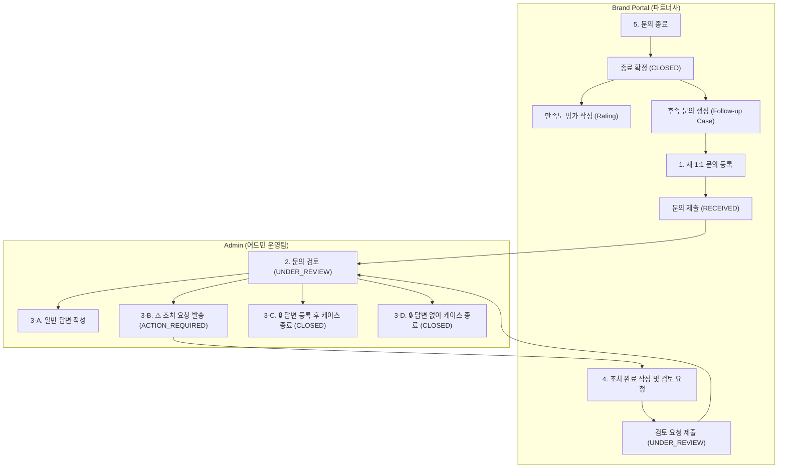
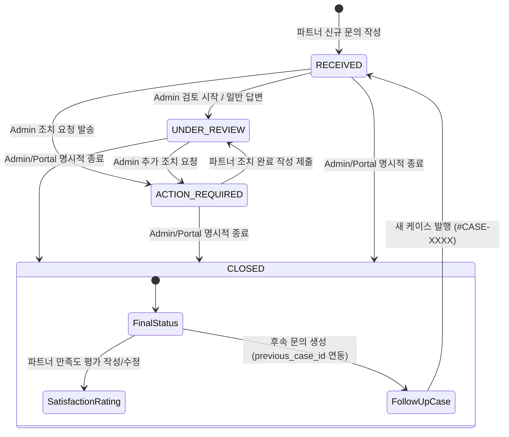

# Support Case 다이어그램 원고 (Diagram Source)

본 문서는 Support Case 시스템의 **전체 프로세스 흐름도(Overall Flow)** 및 **4대 공식 상태 전이도(State Transition Diagram)**에 대한 Mermaid 및 구조화 텍스트 원고입니다.

---

## 1. [Diagram 1] 전체 Support Case 워크플로우 (Overall Workflow Flowchart)

---

## 2. [Diagram 2] 4대 공식 상태 전이도 (Official State Transition Diagram)

